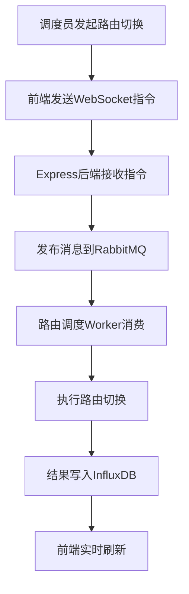
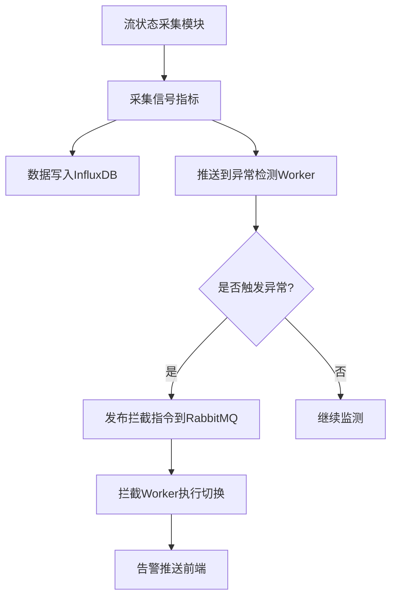

## 1. 产品概述
广电信号流调度监控系统是一套面向广播电视行业的实时信号调度与监控平台，用于管理多路音视频信号流的路由切换与带宽分配，实时监测信号质量、带宽和延迟数据，自动拦截异常信号，保障播控中心信号安全稳定运行。
- 核心目标：实现信号流全链路可视化调度、实时状态监控、异常自动拦截，降低广电播控运维风险
- 目标用户：广电播控中心运维工程师、技术主管、信号调度员

## 2. 核心功能

### 2.1 用户角色
| 角色 | 注册方式 | 核心权限 |
|------|----------|----------|
| 调度员 | 管理员分配账号 | 信号路由切换、带宽分配、实时监控 |
| 运维工程师 | 管理员分配账号 | 状态监控、异常处理、日志查询 |
| 管理员 | 系统内置 | 全部权限、系统配置、用户管理 |

### 2.2 功能模块
1. **信号调度大屏**：全链路信号流拓扑图、实时带宽/延迟仪表盘、信号源状态矩阵、异常告警滚动条
2. **信号路由调度**：信号源-目标路由配置、路由切换操作、路由历史记录、带宽分配策略
3. **流状态采集**：信号流状态实时采集、带宽/延迟/丢包率监测、SMPTE ST 2110 协议信号解析
4. **异常信号拦截**：信号黑场/静帧/静音检测、异常自动拦截与切换、告警规则配置、告警通知
5. **时序数据存储**：运行日志时序存储、历史数据查询、数据聚合统计、存储策略管理

### 2.3 页面详情
| 页面名称 | 模块名称 | 功能描述 |
|----------|----------|----------|
| 调度大屏 | 信号流拓扑图 | 以节点+连线方式展示信号源→路由→目标的全链路，节点颜色表示状态（绿/黄/红），连线粗细表示带宽占用 |
| 调度大屏 | 实时指标仪表盘 | 显示总信号路数、活跃路数、平均带宽、平均延迟、异常计数等核心KPI |
| 调度大屏 | 信号源状态矩阵 | 网格化展示所有信号源，每个格子显示信号名称、状态、码率，点击可展开详情 |
| 调度大屏 | 异常告警滚动条 | 底部滚动展示最新异常告警，包含时间、信号名、异常类型、严重等级 |
| 路由调度 | 路由拓扑编辑器 | 拖拽式编辑信号路由，支持添加/删除/修改信号源与目标间的路由关系 |
| 路由调度 | 路由切换操作面板 | 一键切换信号路由，显示切换前后的路由对比，支持应急切换 |
| 路由调度 | 带宽分配策略 | 配置各信号流的带宽上限与优先级，支持QoS策略模板 |
| 路由调度 | 路由历史记录 | 查看路由切换历史，包含操作人、时间、切换前后状态 |
| 流状态采集 | 信号流实时监控 | 列表/卡片视图展示所有信号流实时状态，支持搜索与筛选 |
| 流状态采集 | 信号质量详情 | 展示单路信号的带宽曲线、延迟曲线、丢包率曲线（时序图） |
| 流状态采集 | 采集任务管理 | 配置采集频率、采集协议、采集目标 |
| 异常拦截 | 异常规则配置 | 配置黑场/静帧/静音/码率异常的检测阈值与触发条件 |
| 异常拦截 | 异常事件列表 | 查看所有异常事件，支持按类型/时间/信号源筛选 |
| 异常拦截 | 拦截策略管理 | 配置异常触发后的自动动作（切换备路、发送告警、记录日志） |
| 时序数据 | 运行日志查询 | 按时间范围、信号源、事件类型查询运行日志 |
| 时序数据 | 数据聚合统计 | 按小时/天/周/月聚合统计数据，生成报表 |
| 时序数据 | 存储策略管理 | 配置数据保留周期、降采样策略、存储配额 |

## 3. 核心流程

### 3.1 信号路由调度流程
调度员在前端发起路由切换指令 → 前端通过WebSocket发送指令到Express后端 → 后端将指令发布到RabbitMQ消息队列 → 路由调度Worker消费消息并执行切换 → 切换结果写入InfluxDB → 前端实时刷新拓扑图状态

### 3.2 异常信号拦截流程
流状态采集模块持续采集信号指标 → 采集数据写入InfluxDB同时推送到异常检测Worker → 异常检测Worker根据规则判断是否触发异常 → 触发异常后发布拦截指令到RabbitMQ → 拦截Worker消费消息执行自动切换 → 告警信息推送前端展示

## 4. 用户界面设计

### 4.1 设计风格
- **主色调**：深空蓝 (#0A1628) 作为背景主色，科技青 (#00E5FF) 作为高亮/强调色，警示红 (#FF3D71) 作为异常告警色
- **辅助色**：信号绿 (#00E096) 表示正常，信号黄 (#FFB800) 表示警告
- **按钮风格**：圆角矩形，微发光边框效果，hover时边框亮度增强
- **字体**：标题使用 Orbitron（科技感显示字体），正文使用 Source Sans 3（清晰可读）
- **布局风格**：暗色大屏风格，模块化卡片布局，数据密集但层次分明
- **图标风格**：线性图标，线条粗细2px，科技感简约风格
- **动画效果**：信号流连线上的流动粒子动画，数据刷新时的渐变过渡，告警时的脉冲闪烁

### 4.2 页面设计概览
| 页面名称 | 模块名称 | UI 元素 |
|----------|----------|---------|
| 调度大屏 | 信号流拓扑图 | 暗色画布背景，SVG节点+连线，连线上流动光点动画，节点状态发光效果，支持缩放拖拽 |
| 调度大屏 | 实时指标仪表盘 | 圆形进度环显示KPI，数字翻牌器效果，微光渐变背景卡片 |
| 调度大屏 | 信号源状态矩阵 | 网格布局，每格带状态指示灯（绿/黄/红圆点），hover展开详情面板 |
| 调度大屏 | 异常告警滚动条 | 底部固定条，红色脉冲边框，文字水平滚动，点击展开详情 |
| 路由调度 | 路由拓扑编辑器 | 拖拽画布，连接锚点高亮，右键上下文菜单，切换确认弹窗 |
| 路由调度 | 带宽分配策略 | 滑块调节带宽，优先级拖拽排序，策略模板选择卡片 |
| 流状态采集 | 信号质量详情 | 时序折线图（带宽/延迟/丢包），时间范围选择器，数据点hover tooltip |
| 异常拦截 | 异常规则配置 | 规则卡片列表，阈值滑块，条件逻辑组合器，启用/禁用开关 |
| 时序数据 | 运行日志查询 | 时间轴筛选器，日志条目列表，关键词搜索框，导出按钮 |

### 4.3 响应式设计
- 桌面优先设计，调度大屏针对1920x1080及以上分辨率优化
- 支持多屏拼接显示（大屏输出模式）
- 1920px以下自适应缩放，最小支持1366x768

### 4.4 视觉氛围
- 深色科技监控风格，模拟广电播控中心大屏
- 信号流连线上的流动粒子模拟数据流动
- 背景使用微妙的网格纹理增加空间感
- 关键数据使用发光效果突出显示
- 告警状态使用脉冲动画引起注意
