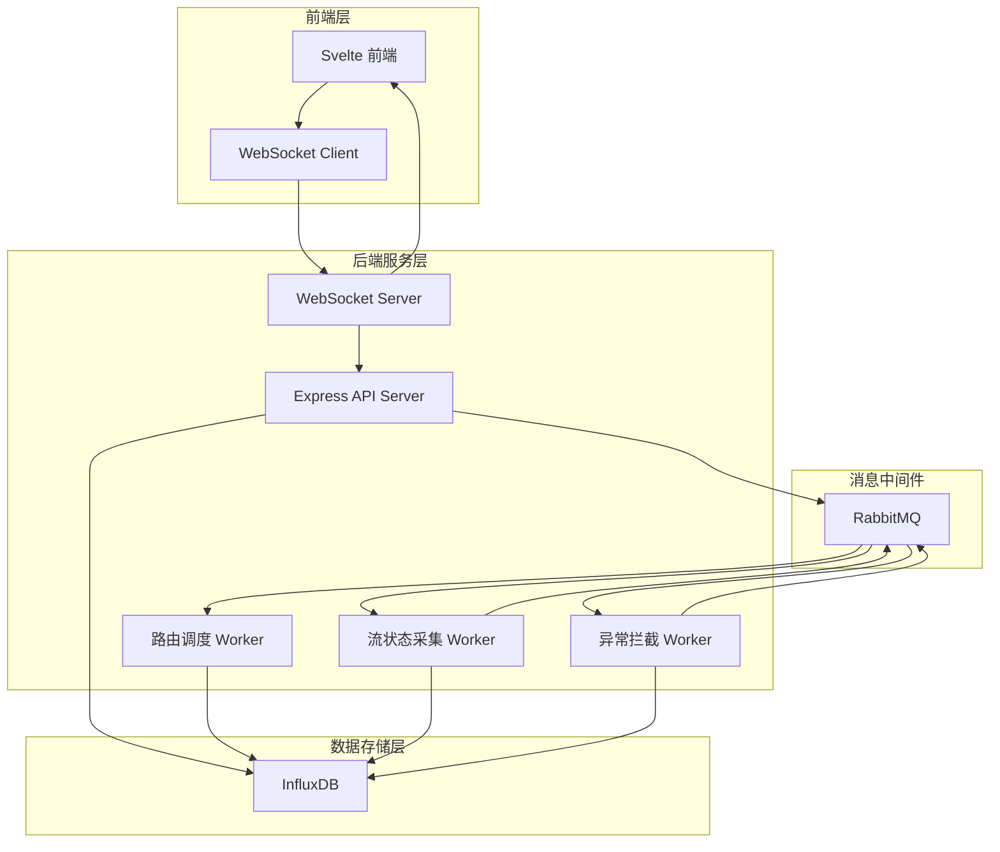
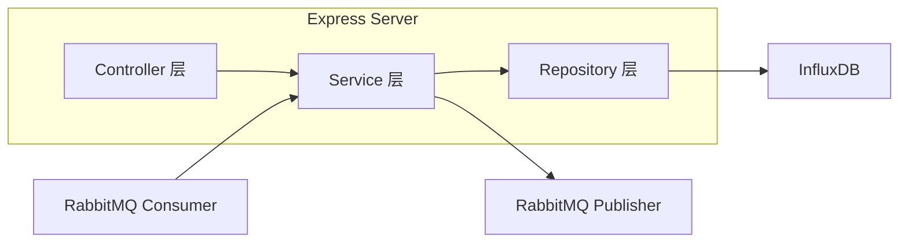
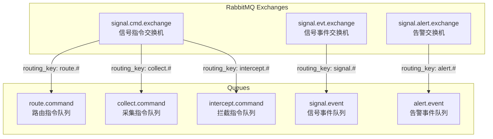
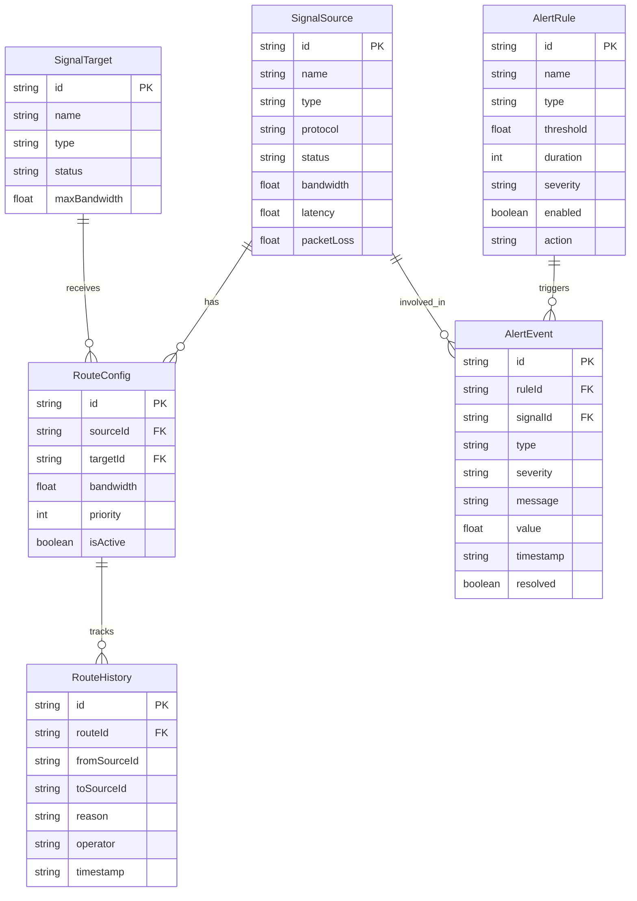

## 1. 架构设计



## 2. 技术说明
- **前端**：Svelte@4 + Vite + TailwindCSS，使用 svelte-charted / canvas 绘制时序图表，WebSocket 实现实时数据推送
- **构建工具**：Vite
- **后端**：Express@4 + amqplib（RabbitMQ客户端）+ @influxdata/influxdb-client
- **消息队列**：RabbitMQ（amqp协议），使用 direct/topic 交换机进行消息路由
- **时序数据库**：InfluxDB 2.x，使用 Flux 查询语言
- **实时通信**：WebSocket（ws库），前端订阅实时状态更新

## 3. 路由定义
| 路由 | 用途 |
|------|------|
| / | 调度大屏主页，展示信号流拓扑与实时指标 |
| /routing | 信号路由调度页面，路由编辑与切换操作 |
| /status | 流状态采集监控页面，信号流列表与详情 |
| /intercept | 异常信号拦截页面，规则配置与事件列表 |
| /timeseries | 时序数据查询页面，日志查询与统计报表 |

## 4. API 定义

### 4.1 信号流相关 API
```typescript
interface SignalSource {
  id: string
  name: string
  type: "video" | "audio" | "data"
  protocol: "ST2110" | "SDI" | "NDI"
  status: "active" | "standby" | "offline" | "error"
  bandwidth: number
  latency: number
  packetLoss: number
  targetIds: string[]
}

interface SignalTarget {
  id: string
  name: string
  type: "encoder" | "decoder" | "router" | "monitor"
  status: "online" | "offline"
  sourceId: string | null
  maxBandwidth: number
}

interface RouteConfig {
  id: string
  sourceId: string
  targetId: string
  bandwidth: number
  priority: number
  isActive: boolean
  createdAt: string
}

interface RouteSwitchRequest {
  routeId: string
  newSourceId: string
  reason: "manual" | "emergency" | "auto-failover"
}

interface RouteSwitchResponse {
  success: boolean
  message: string
  previousState: RouteConfig
  newState: RouteConfig
}
```

### 4.2 异常检测相关 API
```typescript
interface AlertRule {
  id: string
  name: string
  type: "black_frame" | "freeze_frame" | "silence" | "bandwidth_anomaly" | "latency_anomaly" | "packet_loss"
  threshold: number
  duration: number
  severity: "info" | "warning" | "critical"
  enabled: boolean
  action: "alert" | "switch" | "alert_and_switch"
}

interface AlertEvent {
  id: string
  ruleId: string
  signalId: string
  type: string
  severity: "info" | "warning" | "critical"
  message: string
  value: number
  threshold: number
  timestamp: string
  resolved: boolean
}
```

### 4.3 时序数据查询 API
```typescript
interface TimeSeriesQuery {
  measurement: string
  signalId?: string
  startTime: string
  endTime: string
  aggregation?: "mean" | "max" | "min" | "sum"
  groupBy?: "1m" | "5m" | "1h" | "1d"
}

interface TimeSeriesData {
  measurement: string
  tags: Record<string, string>
  values: Array<{ time: string; value: number }>
}
```

### 4.4 REST API 端点
| 方法 | 路径 | 描述 |
|------|------|------|
| GET | /api/signals | 获取所有信号源列表 |
| GET | /api/signals/:id | 获取信号源详情 |
| GET | /api/targets | 获取所有目标设备列表 |
| GET | /api/routes | 获取所有路由配置 |
| POST | /api/routes/:id/switch | 切换信号路由 |
| PUT | /api/routes/:id/bandwidth | 更新带宽分配 |
| GET | /api/status/realtime | 获取实时状态概览 |
| GET | /api/alerts/rules | 获取告警规则列表 |
| POST | /api/alerts/rules | 创建告警规则 |
| PUT | /api/alerts/rules/:id | 更新告警规则 |
| DELETE | /api/alerts/rules/:id | 删除告警规则 |
| GET | /api/alerts/events | 获取异常事件列表 |
| GET | /api/timeseries/query | 查询时序数据 |
| GET | /api/timeseries/stats | 获取聚合统计 |
| GET | /api/dashboard/kpi | 获取大屏KPI数据 |

## 5. 服务架构图





## 6. 数据模型

### 6.1 数据模型定义



### 6.2 InfluxDB Measurement 定义

```
// 信号流状态测量
measurement: signal_status
tags: signalId, signalType, protocol, routeId
fields: bandwidth(float), latency(float), packetLoss(float), status(string)
time: timestamp

// 异常事件测量
measurement: alert_events
tags: alertRuleId, signalId, alertType, severity
fields: value(float), threshold(float), message(string), resolved(boolean)
time: timestamp

// 路由操作日志
measurement: route_operations
tags: routeId, fromSourceId, toSourceId, operator, reason
fields: bandwidth(float), priority(int)
time: timestamp

// 系统运行指标
measurement: system_metrics
tags: module, workerId
fields: cpuUsage(float), memoryUsage(float), messageRate(float), queueDepth(int)
time: timestamp
```
