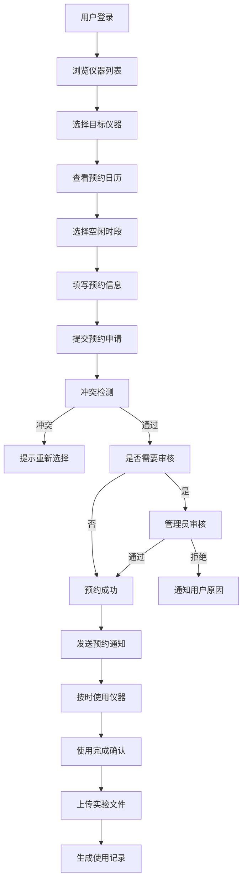

## 1. 产品概述

实验室仪器预约追溯系统是一套面向科研实验室的综合管理平台，解决实验室仪器设备使用效率低下、预约混乱、使用记录不完整、实验数据分散等核心问题。通过数字化手段实现仪器分时预约、使用流程全记录、实验文件统一存储、操作日志可追溯，提升实验室管理水平和科研工作效率。

- **核心价值**：实现仪器资源优化配置，确保实验过程可追溯，保障科研数据安全完整
- **目标用户**：实验室管理员、科研人员、学生、设备维护人员

## 2. 核心功能

### 2.1 用户角色

| 角色 | 注册方式 | 核心权限 |
|------|----------|----------|
| 超级管理员 | 系统初始化 | 用户管理、角色分配、系统配置、仪器全生命周期管理 |
| 实验室管理员 | 管理员邀请 | 仪器管理、预约审核、使用记录查询、数据统计 |
| 科研人员 | 自助注册/审核 | 仪器预约、使用记录、文件上传/下载、查看通知 |
| 普通用户（学生） | 导师邀请 | 授权仪器预约、文件管理、操作记录 |

### 2.2 功能模块

1. **预约工作台**：仪表盘、仪器概览、我的预约、快捷操作入口
2. **仪器预约模块**：仪器列表展示、时段预约、预约审核、预约状态跟踪
3. **使用记录追溯模块**：使用流程记录、操作日志、历史追溯、异常告警
4. **文件存储模块**：实验原始文件上传、版本管理、文件预览、下载审计
5. **消息通知模块**：预约通知、审批通知、系统公告、站内信
6. **权限管控模块**：用户管理、角色分配、权限配置、操作审计

### 2.3 页面详情

| 页面名称 | 模块名称 | 功能描述 |
|----------|----------|----------|
| 登录页 | 身份认证 | 用户名密码登录、记住登录态、密码找回 |
| 预约工作台 | 仪表盘 | 待办事项统计、预约日历、仪器使用率图表、最新通知 |
| 仪器列表页 | 仪器预约 | 仪器分类筛选、仪器状态展示、预约入口、仪器详情 |
| 预约日历页 | 仪器预约 | 可视化日历展示、时段选择、冲突检测、提交预约 |
| 我的预约页 | 仪器预约 | 预约列表、预约状态、取消预约、使用确认 |
| 使用记录页 | 记录追溯 | 按仪器/用户/时间筛选、记录详情、导出报表 |
| 操作日志页 | 记录追溯 | 全量操作记录、筛选查询、审计追踪 |
| 文件库页 | 文件存储 | 文件夹目录、文件列表、上传/下载、预览、搜索 |
| 消息中心页 | 消息通知 | 消息分类、未读标记、消息详情、全部已读 |
| 用户管理页 | 权限管控 | 用户列表、新增/编辑用户、用户状态管理 |
| 角色管理页 | 权限管控 | 角色列表、权限配置、角色分配 |
| 系统设置页 | 权限管控 | 仪器类型配置、通知模板、系统参数 |

## 3. 核心流程

### 3.1 仪器预约流程

用户登录系统 → 浏览可用仪器 → 选择目标仪器 → 查看预约日历 → 选择空闲时段 → 填写预约信息（实验目的、预计时长）→ 提交预约申请 → 系统自动检测冲突 → 等待管理员审核（如需）→ 审核通过 → 预约成功通知 → 按时使用仪器 → 使用完成确认 → 上传实验文件 → 生成使用记录

### 3.2 文件存储流程

实验完成 → 进入文件库 → 选择/创建目录 → 上传实验原始文件 → 系统自动生成版本号 → 提取文件元数据 → 存入MinIO对象存储 → 生成访问记录 → 可在线预览/下载 → 操作留痕

## 4. 用户界面设计

### 4.1 设计风格

- **主色调**：科技蓝 `#165DFF`，代表专业、严谨、可信赖
- **辅助色**：成功绿 `#00B42A`、警告橙 `#FF7D00`、危险红 `#F53F3F`
- **中性色**：深灰 `#1D2129`、中灰 `#4E5969`、浅灰 `#C9CDD4`、背景 `#F2F3F5`
- **按钮风格**：圆角4px，主按钮蓝色填充，次要按钮白色描边，悬停有微交互动画
- **字体**：中文字体 `PingFang SC` / `Microsoft YaHei`，英文数字 `Roboto Mono`
- **字体大小**：标题18px-24px，正文14px，辅助文字12px
- **布局风格**：左侧导航栏 + 顶部面包屑 + 主内容区，卡片式布局，清晰的信息层级
- **图标**：线性图标 `@vicons/ionicons5`，风格统一简洁

### 4.2 页面设计概述

| 页面名称 | 模块名称 | UI 元素 |
|----------|----------|----------|
| 预约工作台 | 仪表盘 | 数据卡片网格、日历组件、折线统计图、通知列表、快捷操作区 |
| 仪器列表页 | 仪器预约 | 分类侧边栏、仪器卡片网格、状态标签、筛选器、搜索框 |
| 预约日历页 | 仪器预约 | 周视图日历、时段色块、预约表单弹窗、冲突提示 |
| 使用记录页 | 记录追溯 | 高级筛选器、数据表格、分页器、导出按钮、详情抽屉 |
| 文件库页 | 文件存储 | 面包屑导航、文件列表、上传拖拽区、进度条、预览模态框 |
| 用户管理页 | 权限管控 | 搜索框、数据表格、操作列、新增/编辑表单弹窗 |

### 4.3 响应式设计

- **桌面优先**：以1920px宽度为设计基准，主要面向实验室桌面端使用
- **平板适配**：≥1024px，左侧导航可折叠，内容区自适应
- **移动端适配**：≥768px，底部导航栏，简化操作流程
- **触摸优化**：按钮最小尺寸44px，表单元素增加内边距

## 5. 非功能性需求

### 5.1 性能要求
- 页面首屏加载时间 ≤ 2s
- 列表查询响应时间 ≤ 500ms
- 支持1000+并发用户访问
- Redis缓存预约时段数据，减少DB查询压力

### 5.2 安全要求
- 基于JWT的身份认证
- RBAC权限控制，细粒度权限检查
- 操作日志完整记录，不可篡改
- 文件传输加密，存储加密
- SQL注入、XSS防护

### 5.3 可追溯性要求
- 所有关键操作留痕（谁、什么时间、做了什么）
- 预约状态变更全程记录
- 文件访问、下载、修改全程审计
- 数据支持导出归档
