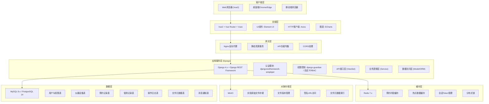
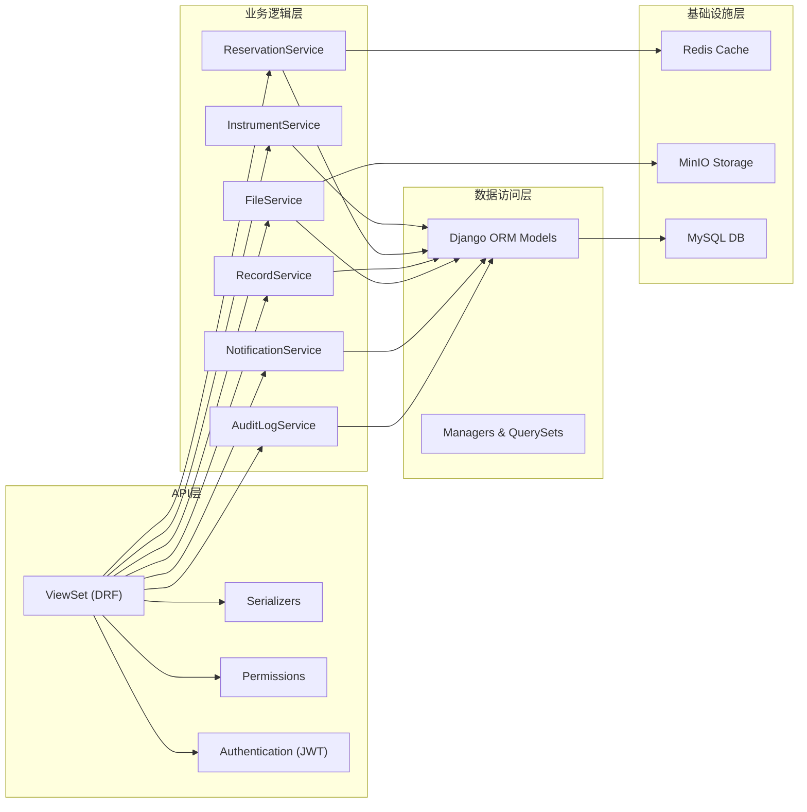
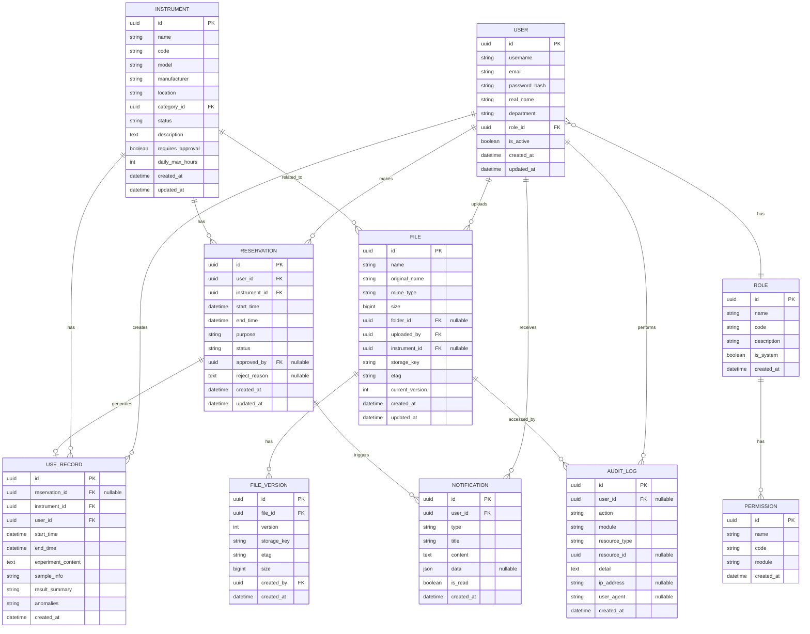

## 1. 架构设计



## 2. 技术栈描述

### 2.1 前端技术栈
- **框架**: Vue 2.7.x (Composition API支持)
- **路由**: Vue Router 3.x
- **状态管理**: Vuex 3.x
- **UI组件库**: Element UI 2.15.x
- **HTTP客户端**: Axios 1.x
- **图表库**: ECharts 5.x
- **日期处理**: dayjs
- **构建工具**: Vue CLI 5.x 或 Vite 2.x (Vue2兼容版)
- **代码规范**: ESLint + Prettier

### 2.2 后端技术栈
- **Web框架**: Django 4.2 LTS
- **API框架**: Django REST Framework 3.14.x
- **认证**: djangorestframework-simplejwt 5.x
- **ORM**: Django ORM
- **数据库**: MySQL 8.0 / PostgreSQL 14
- **缓存**: Redis 7.x + django-redis
- **对象存储**: MinIO + minio-py SDK
- **异步任务**: Celery 5.x (可选，用于消息通知)
- **API文档**: drf-spectacular (OpenAPI 3.0)

### 2.3 基础设施
- **Web服务器**: Nginx 1.24
- **容器化**: Docker + Docker Compose (开发环境)
- **进程管理**: Gunicorn / uWSGI

## 3. 目录结构

### 3.1 项目根目录
```
lab-reservation-system/
├── frontend/                 # Vue2 前端项目
│   ├── public/
│   ├── src/
│   │   ├── api/              # API接口定义
│   │   ├── assets/           # 静态资源
│   │   ├── components/       # 通用组件
│   │   ├── directives/       # 自定义指令
│   │   ├── filters/          # 过滤器
│   │   ├── layout/           # 布局组件
│   │   ├── router/           # 路由配置
│   │   ├── store/            # Vuex状态管理
│   │   ├── styles/           # 全局样式
│   │   ├── utils/            # 工具函数
│   │   ├── views/            # 页面组件
│   │   ├── App.vue
│   │   └── main.js
│   ├── package.json
│   ├── vue.config.js
│   └── babel.config.js
├── backend/                  # Django 后端项目
│   ├── config/               # Django项目配置
│   │   ├── settings/         # 多环境配置
│   │   ├── urls.py
│   │   └── wsgi.py
│   ├── apps/                 # 应用模块
│   │   ├── accounts/         # 用户与权限
│   │   ├── instruments/      # 仪器管理
│   │   ├── reservations/     # 预约管理
│   │   ├── records/          # 使用记录
│   │   ├── files/            # 文件存储
│   │   ├── notifications/    # 消息通知
│   │   └── audit/            # 操作审计
│   ├── common/               # 公共模块
│   │   ├── permissions.py    # 自定义权限
│   │   ├── pagination.py     # 分页器
│   │   ├── exceptions.py     # 异常处理
│   │   ├── mixins.py         # ViewSet Mixins
│   │   └── utils/            # 工具函数
│   ├── manage.py
│   └── requirements.txt
├── docker/                   # Docker相关配置
│   ├── nginx/
│   ├── django/
│   └── docker-compose.yml
├── .trae/documents/          # 项目文档
└── README.md
```

## 4. 路由定义

### 4.1 前端路由
| 路由路径 | 页面名称 | 权限要求 |
|----------|----------|----------|
| `/login` | 登录页 | 公开 |
| `/dashboard` | 预约工作台 | 已登录 |
| `/instruments` | 仪器列表 | 已登录 |
| `/instruments/:id/calendar` | 预约日历 | 已登录 |
| `/my-reservations` | 我的预约 | 已登录 |
| `/records` | 使用记录 | 已登录 |
| `/audit-logs` | 操作日志 | 管理员 |
| `/files` | 文件库 | 已登录 |
| `/messages` | 消息中心 | 已登录 |
| `/system/users` | 用户管理 | 管理员 |
| `/system/roles` | 角色管理 | 管理员 |
| `/system/settings` | 系统设置 | 管理员 |

### 4.2 后端API路由
| 方法 | 路径 | 模块 | 功能描述 |
|------|------|------|----------|
| POST | `/api/auth/login/` | accounts | 用户登录获取Token |
| POST | `/api/auth/refresh/` | accounts | 刷新Token |
| GET | `/api/auth/profile/` | accounts | 获取当前用户信息 |
| GET | `/api/users/` | accounts | 用户列表 |
| POST | `/api/users/` | accounts | 创建用户 |
| PUT | `/api/users/:id/` | accounts | 更新用户 |
| DELETE | `/api/users/:id/` | accounts | 删除用户 |
| GET | `/api/roles/` | accounts | 角色列表 |
| GET | `/api/instruments/` | instruments | 仪器列表 |
| POST | `/api/instruments/` | instruments | 创建仪器 |
| GET | `/api/instruments/:id/` | instruments | 仪器详情 |
| GET | `/api/instruments/:id/slots/` | instruments | 获取仪器可用时段(Redis缓存) |
| GET | `/api/reservations/` | reservations | 预约列表 |
| POST | `/api/reservations/` | reservations | 创建预约 |
| PATCH | `/api/reservations/:id/` | reservations | 更新预约状态 |
| DELETE | `/api/reservations/:id/` | reservations | 取消预约 |
| GET | `/api/reservations/calendar/` | reservations | 日历数据 |
| GET | `/api/records/` | records | 使用记录列表 |
| POST | `/api/records/` | records | 创建使用记录 |
| GET | `/api/records/:id/` | records | 使用记录详情 |
| GET | `/api/audit-logs/` | audit | 操作日志列表 |
| GET | `/api/files/` | files | 文件列表 |
| POST | `/api/files/upload/` | files | 上传文件(预签名) |
| GET | `/api/files/:id/download/` | files | 下载文件(签名URL) |
| GET | `/api/files/:id/preview/` | files | 文件预览 |
| DELETE | `/api/files/:id/` | files | 删除文件 |
| GET | `/api/notifications/` | notifications | 消息列表 |
| PATCH | `/api/notifications/:id/read/` | notifications | 标记已读 |
| POST | `/api/notifications/read-all/` | notifications | 全部已读 |

## 5. 服务器架构



## 6. 数据模型

### 6.1 ER图



### 6.2 DDL (MySQL)

```sql
-- 用户表
CREATE TABLE `users` (
  `id` char(36) NOT NULL,
  `username` varchar(50) NOT NULL UNIQUE,
  `email` varchar(100) NOT NULL UNIQUE,
  `password_hash` varchar(255) NOT NULL,
  `real_name` varchar(50) NOT NULL,
  `department` varchar(100) DEFAULT NULL,
  `role_id` char(36) DEFAULT NULL,
  `is_active` tinyint(1) DEFAULT 1,
  `created_at` datetime(6) NOT NULL,
  `updated_at` datetime(6) NOT NULL,
  PRIMARY KEY (`id`),
  KEY `idx_username` (`username`),
  KEY `idx_email` (`email`),
  KEY `idx_role_id` (`role_id`)
) ENGINE=InnoDB DEFAULT CHARSET=utf8mb4 COLLATE=utf8mb4_unicode_ci;

-- 角色表
CREATE TABLE `roles` (
  `id` char(36) NOT NULL,
  `name` varchar(50) NOT NULL,
  `code` varchar(50) NOT NULL UNIQUE,
  `description` text,
  `is_system` tinyint(1) DEFAULT 0,
  `created_at` datetime(6) NOT NULL,
  PRIMARY KEY (`id`),
  KEY `idx_code` (`code`)
) ENGINE=InnoDB DEFAULT CHARSET=utf8mb4 COLLATE=utf8mb4_unicode_ci;

-- 仪器表
CREATE TABLE `instruments` (
  `id` char(36) NOT NULL,
  `name` varchar(100) NOT NULL,
  `code` varchar(50) NOT NULL UNIQUE,
  `model` varchar(100) DEFAULT NULL,
  `manufacturer` varchar(100) DEFAULT NULL,
  `location` varchar(100) DEFAULT NULL,
  `category_id` char(36) DEFAULT NULL,
  `status` varchar(20) NOT NULL DEFAULT 'available',
  `description` text,
  `requires_approval` tinyint(1) DEFAULT 0,
  `daily_max_hours` int DEFAULT 8,
  `created_at` datetime(6) NOT NULL,
  `updated_at` datetime(6) NOT NULL,
  PRIMARY KEY (`id`),
  KEY `idx_code` (`code`),
  KEY `idx_status` (`status`),
  KEY `idx_category_id` (`category_id`)
) ENGINE=InnoDB DEFAULT CHARSET=utf8mb4 COLLATE=utf8mb4_unicode_ci;

-- 预约表
CREATE TABLE `reservations` (
  `id` char(36) NOT NULL,
  `user_id` char(36) NOT NULL,
  `instrument_id` char(36) NOT NULL,
  `start_time` datetime NOT NULL,
  `end_time` datetime NOT NULL,
  `purpose` text NOT NULL,
  `status` varchar(20) NOT NULL DEFAULT 'pending',
  `approved_by` char(36) DEFAULT NULL,
  `reject_reason` text,
  `created_at` datetime(6) NOT NULL,
  `updated_at` datetime(6) NOT NULL,
  PRIMARY KEY (`id`),
  KEY `idx_user_id` (`user_id`),
  KEY `idx_instrument_id` (`instrument_id`),
  KEY `idx_status` (`status`),
  KEY `idx_time_range` (`start_time`, `end_time`),
  KEY `idx_instrument_time` (`instrument_id`, `start_time`, `end_time`)
) ENGINE=InnoDB DEFAULT CHARSET=utf8mb4 COLLATE=utf8mb4_unicode_ci;

-- 使用记录表
CREATE TABLE `use_records` (
  `id` char(36) NOT NULL,
  `reservation_id` char(36) DEFAULT NULL,
  `instrument_id` char(36) NOT NULL,
  `user_id` char(36) NOT NULL,
  `start_time` datetime NOT NULL,
  `end_time` datetime DEFAULT NULL,
  `experiment_content` text,
  `sample_info` text,
  `result_summary` text,
  `anomalies` text,
  `created_at` datetime(6) NOT NULL,
  PRIMARY KEY (`id`),
  KEY `idx_reservation_id` (`reservation_id`),
  KEY `idx_instrument_id` (`instrument_id`),
  KEY `idx_user_id` (`user_id`),
  KEY `idx_start_time` (`start_time`)
) ENGINE=InnoDB DEFAULT CHARSET=utf8mb4 COLLATE=utf8mb4_unicode_ci;

-- 文件表
CREATE TABLE `files` (
  `id` char(36) NOT NULL,
  `name` varchar(255) NOT NULL,
  `original_name` varchar(255) NOT NULL,
  `mime_type` varchar(100) NOT NULL,
  `size` bigint NOT NULL,
  `folder_id` char(36) DEFAULT NULL,
  `uploaded_by` char(36) NOT NULL,
  `instrument_id` char(36) DEFAULT NULL,
  `storage_key` varchar(500) NOT NULL,
  `etag` varchar(100) DEFAULT NULL,
  `current_version` int NOT NULL DEFAULT 1,
  `created_at` datetime(6) NOT NULL,
  `updated_at` datetime(6) NOT NULL,
  PRIMARY KEY (`id`),
  KEY `idx_uploaded_by` (`uploaded_by`),
  KEY `idx_instrument_id` (`instrument_id`),
  KEY `idx_folder_id` (`folder_id`),
  KEY `idx_created_at` (`created_at`)
) ENGINE=InnoDB DEFAULT CHARSET=utf8mb4 COLLATE=utf8mb4_unicode_ci;

-- 消息通知表
CREATE TABLE `notifications` (
  `id` char(36) NOT NULL,
  `user_id` char(36) NOT NULL,
  `type` varchar(50) NOT NULL,
  `title` varchar(200) NOT NULL,
  `content` text,
  `data` json DEFAULT NULL,
  `is_read` tinyint(1) DEFAULT 0,
  `created_at` datetime(6) NOT NULL,
  PRIMARY KEY (`id`),
  KEY `idx_user_id` (`user_id`),
  KEY `idx_is_read` (`is_read`),
  KEY `idx_created_at` (`created_at`)
) ENGINE=InnoDB DEFAULT CHARSET=utf8mb4 COLLATE=utf8mb4_unicode_ci;

-- 操作日志表
CREATE TABLE `audit_logs` (
  `id` char(36) NOT NULL,
  `user_id` char(36) DEFAULT NULL,
  `action` varchar(50) NOT NULL,
  `module` varchar(50) NOT NULL,
  `resource_type` varchar(50) DEFAULT NULL,
  `resource_id` char(36) DEFAULT NULL,
  `detail` text,
  `ip_address` varchar(45) DEFAULT NULL,
  `user_agent` varchar(500) DEFAULT NULL,
  `created_at` datetime(6) NOT NULL,
  PRIMARY KEY (`id`),
  KEY `idx_user_id` (`user_id`),
  KEY `idx_module_action` (`module`, `action`),
  KEY `idx_created_at` (`created_at`),
  KEY `idx_resource` (`resource_type`, `resource_id`)
) ENGINE=InnoDB DEFAULT CHARSET=utf8mb4 COLLATE=utf8mb4_unicode_ci;

-- 初始化角色数据
INSERT INTO `roles` (`id`, `name`, `code`, `description`, `is_system`, `created_at`) VALUES
(UUID(), '超级管理员', 'super_admin', '拥有系统所有权限', 1, NOW()),
(UUID(), '实验室管理员', 'lab_admin', '管理仪器和审核预约', 1, NOW()),
(UUID(), '科研人员', 'researcher', '可以预约仪器和上传文件', 1, NOW()),
(UUID(), '普通用户', 'user', '基础访问权限', 1, NOW());
```

## 7. Redis 缓存设计

### 7.1 预约时段缓存
```
Key: reservation:slots:{instrument_id}:{date}
Value: JSON Array of time slots
TTL: 1 hour

Data Structure:
[
  {
    "start_time": "09:00",
    "end_time": "10:00",
    "status": "available" | "reserved",
    "reservation_id": "uuid"
  }
]
```

### 7.2 热点仪器信息缓存
```
Key: instrument:hot:{instrument_id}
Value: JSON instrument detail
TTL: 5 minutes
```

### 7.3 用户Token黑名单
```
Key: token:blacklist:{token_hash}
Value: "1"
TTL: Token remaining time
```

### 7.4 分布式锁（预约冲突检测）
```
Key: lock:reservation:{instrument_id}
Value: request_id
TTL: 30 seconds
NX: True
```

## 8. MinIO 存储设计

### 8.1 Bucket 结构
- `lab-files`: 存储实验原始文件
- `lab-thumbnails`: 存储文件缩略图
- `lab-exports`: 存储导出报表

### 8.2 对象命名规则
```
文件: /{instrument_id}/{year}/{month}/{day}/{file_id}_v{version}.{ext}
缩略图: /{instrument_id}/{year}/{month}/{day}/{file_id}_thumb.jpg
```

### 8.3 访问策略
- 所有Bucket设为私有
- 通过预签名URL进行文件上传和下载
- 预签名URL有效期: 15分钟(上传), 1小时(下载)

## 9. API 响应格式

### 9.1 统一响应结构
```json
{
  "code": 200,
  "message": "success",
  "data": {},
  "timestamp": 1234567890
}
```

### 9.2 分页响应
```json
{
  "code": 200,
  "message": "success",
  "data": {
    "items": [],
    "total": 100,
    "page": 1,
    "page_size": 20,
    "total_pages": 5
  },
  "timestamp": 1234567890
}
```

### 9.3 错误响应
```json
{
  "code": 400,
  "message": "参数错误",
  "data": {
    "field": "start_time",
    "detail": "开始时间不能晚于结束时间"
  },
  "timestamp": 1234567890
}
```
