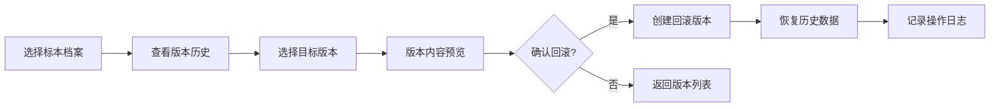
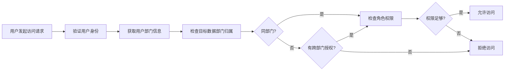

# 科研标本档案全栈 Web 协同管理平台 PRD

## 1. 产品概述

科研标本档案全栈 Web 协同管理平台是一款面向科研机构、博物馆和高校的标本数字化管理系统，解决传统标本管理中档案分散、协作困难、版本混乱、权限不清等核心问题。

- 主要目的：实现标本档案的数字化存储、在线协作、版本管理和权限控制
- 目标用户：科研人员、标本管理员、部门负责人、系统管理员
- 产品价值：提升科研协作效率，保障标本数据安全，支持历史版本追溯

## 2. 核心功能

### 2.1 用户角色

| 角色 | 注册方式 | 核心权限 |
|------|----------|----------|
| 系统管理员 | 后台创建 | 用户管理、部门管理、系统配置、全量数据访问 |
| 部门负责人 | 管理员创建 | 部门人员管理、部门标本审批、部门数据统计 |
| 标本管理员 | 管理员/负责人创建 | 标本档案录入、编辑、文件上传、版本管理 |
| 科研人员 | 自助注册/管理员审批 | 标本查询、在线批注、收藏、下载授权文件 |
| 访客 | 无需注册 | 公开标本浏览、基础搜索 |

### 2.2 功能模块

1. **登录认证模块**：用户登录、单点登录、密码重置、权限验证
2. **标本档案管理**：档案列表、详情查看、在线编辑、分类检索
3. **协同批注系统**：实时多人批注、批注回复、批注解析、版本对比
4. **文件存储模块**：高清附件上传、断点续传、文件预览、云端存储
5. **版本记录模块**：版本历史、版本回溯、变更对比、操作日志
6. **权限管理模块**：用户管理、角色管理、部门隔离、数据访问控制
7. **系统设置**：个人设置、部门配置、系统参数、日志审计

### 2.3 页面详情

| 页面名称 | 模块名称 | 功能描述 |
|----------|----------|----------|
| 登录页 | 身份认证 | 账号密码登录、记住我、忘记密码、SSO入口 |
| 首页仪表盘 | 数据概览 | 标本统计、最近编辑、待办事项、快捷操作 |
| 标本列表页 | 档案管理 | 多条件筛选、搜索、分页、批量操作、导出 |
| 标本详情页 | 档案查看 | 基本信息、文件预览、批注区、版本记录 |
| 标本编辑页 | 档案编辑 | 富文本编辑、字段编辑、文件上传、保存草稿 |
| 批注协同页 | 协同批注 | 实时批注、评论回复、@提及、批注状态管理 |
| 版本历史页 | 版本管理 | 版本列表、版本对比、一键回滚、变更说明 |
| 用户管理页 | 权限管理 | 用户列表、角色分配、部门调整、启用/禁用 |
| 部门管理页 | 组织架构 | 部门树、部门成员、部门权限配置 |
| 个人中心页 | 用户设置 | 个人信息、密码修改、收藏夹、操作记录 |
| 文件管理页 | 存储管理 | 文件列表、存储空间、上传记录、文件分享 |
| 系统日志页 | 审计追踪 | 操作日志、登录日志、异常记录、导出 |

## 3. 核心流程

### 3.1 标本档案创建流程

### 3.2 多人协同批注流程

### 3.3 版本回溯流程

### 3.4 跨部门权限隔离流程

## 4. 用户界面设计

### 4.1 设计风格

**设计理念**：科研专业风 - 简洁、专业、可信赖

- **主色调**：深青色 `#0F4C5C` - 代表专业与信赖
- **辅助色**：琥珀色 `#E36414` - 用于强调操作按钮
- **中性色**： slate 色系 - 确保内容可读性
- **按钮风格**：圆角 6px，轻微阴影，hover 状态有过渡动画
- **字体**：
  - 标题：思源宋体 / Noto Serif SC - 学术感
  - 正文：Inter / 思源黑体 - 良好可读性
- **布局风格**：左侧导航 + 顶部栏 + 内容区，卡片式内容承载
- **图标风格**：Lucide 线性图标，保持一致的 24px 尺寸

### 4.2 页面设计概览

| 页面名称 | 模块名称 | UI 元素 |
|----------|----------|----------|
| 登录页 | 身份认证 | 居中卡片布局、品牌Logo、渐变背景、表单动效 |
| 首页仪表盘 | 数据概览 | 统计卡片网格、趋势图表、最近活动时间线 |
| 标本列表页 | 档案管理 | 高级筛选面板、表格视图/卡片视图切换、虚拟滚动 |
| 标本详情页 | 档案查看 | 双栏布局（信息+预览）、标签页切换、浮动操作栏 |
| 标本编辑页 | 档案编辑 | 分步骤表单、实时校验、草稿自动保存 |
| 批注协同页 | 协同批注 | 侧边批注栏、在线用户指示器、实时通知徽章 |
| 版本历史页 | 版本管理 | 时间线布局、版本对比diff视图、操作确认弹窗 |
| 用户管理页 | 权限管理 | 数据表格、批量操作工具栏、角色分配抽屉 |
| 部门管理页 | 组织架构 | 树形导航、成员列表、权限矩阵 |
| 文件管理页 | 存储管理 | 文件网格、上传队列、存储空间进度条 |

### 4.3 响应式设计

- **桌面优先**：1280px 以上为主要设计目标
- **平板适配**：1024px - 左侧导航收起为图标模式
- **手机适配**：768px 以下 - 底部导航栏、单列布局、简化操作

### 4.4 交互细节

- 页面加载：骨架屏占位，内容渐进式出现
- 表单提交：按钮loading状态，成功/失败提示
- 文件上传：拖拽区域高亮，上传进度条
- 协同编辑：在线用户头像堆叠，光标位置指示
- 版本对比：高亮差异行，折叠/展开变更详情
