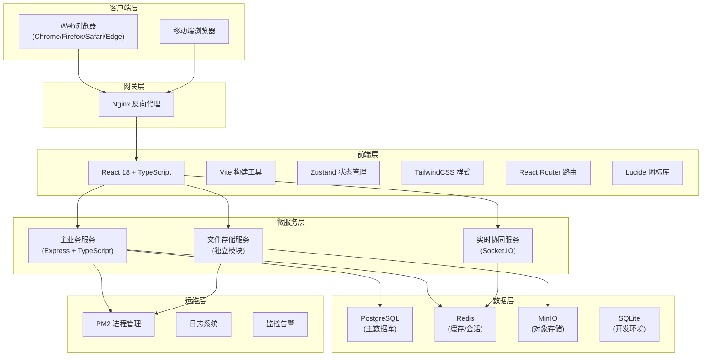
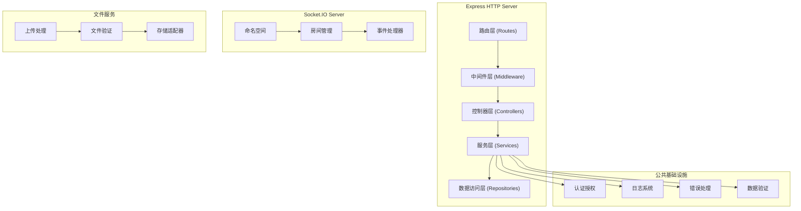
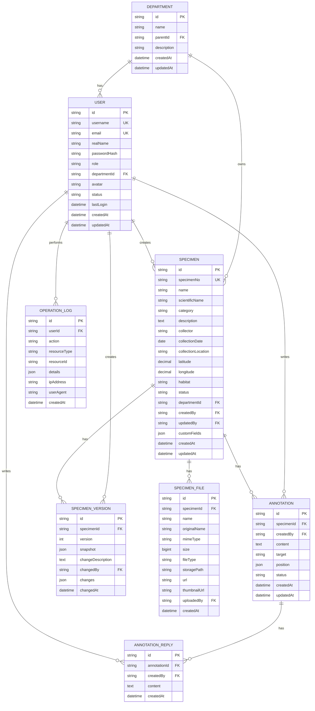

# 科研标本档案全栈 Web 协同管理平台 - 技术架构文档

## 1. 架构设计



## 2. 技术栈说明

### 2.1 前端技术
- **框架**：React@18 + TypeScript@5
- **构建工具**：Vite@5
- **状态管理**：Zustand@4
- **路由**：React Router@6
- **样式方案**：TailwindCSS@3
- **UI组件**：Radix UI + shadcn/ui
- **图标**：Lucide React
- **富文本编辑**：Tiptap
- **实时协作**：Socket.IO Client
- **HTTP客户端**：Axios
- **版本对比**：diff-match-patch

### 2.2 后端技术
- **运行时**：Node.js 20+
- **框架**：Express@4
- **语言**：TypeScript@5
- **ORM**：Prisma@5
- **认证**：JWT + bcrypt
- **文件上传**：Multer
- **实时通信**：Socket.IO@4
- **验证**：Zod
- **日志**：Winston

### 2.3 数据存储
- **主数据库**：PostgreSQL 15（生产）/ SQLite 3（开发）
- **缓存/会话**：Redis 7
- **对象存储**：MinIO（兼容S3）
- **搜索引擎**：PostgreSQL FTS

### 2.4 部署环境
- **服务器操作系统**：CentOS 7/8
- **Web服务器**：Nginx 1.20+
- **进程管理**：PM2 5+
- **包管理器**：pnpm

## 3. 路由定义

### 3.1 前端路由

| 路由路径 | 页面名称 | 权限要求 |
|----------|----------|----------|
| `/login` | 登录页 | 公开 |
| `/` | 首页仪表盘 | 登录用户 |
| `/specimens` | 标本列表页 | 登录用户 |
| `/specimens/:id` | 标本详情页 | 登录用户 |
| `/specimens/:id/edit` | 标本编辑页 | 标本管理员+ |
| `/specimens/:id/annotations` | 协同批注页 | 登录用户 |
| `/specimens/:id/versions` | 版本历史页 | 登录用户 |
| `/files` | 文件管理页 | 登录用户 |
| `/admin/users` | 用户管理页 | 系统管理员 |
| `/admin/departments` | 部门管理页 | 系统管理员/部门负责人 |
| `/admin/logs` | 系统日志页 | 系统管理员 |
| `/profile` | 个人中心 | 登录用户 |
| `/403` | 无权限页面 | 公开 |
| `/404` | 页面不存在 | 公开 |

### 3.2 API 路由前缀

| 前缀 | 服务模块 | 说明 |
|------|----------|------|
| `/api/auth` | 认证模块 | 用户登录、注册、令牌刷新 |
| `/api/users` | 用户模块 | 用户CRUD、角色管理 |
| `/api/departments` | 部门模块 | 部门管理、成员管理 |
| `/api/specimens` | 标本模块 | 标本CRUD、搜索筛选 |
| `/api/annotations` | 批注模块 | 批注CRUD、实时同步 |
| `/api/versions` | 版本模块 | 版本历史、回滚、对比 |
| `/api/files` | 文件模块 | 上传、下载、预览 |
| `/api/logs` | 日志模块 | 操作日志查询 |

## 4. API 定义

### 4.1 通用响应类型

```typescript
interface ApiResponse<T = any> {
  success: boolean;
  data?: T;
  message?: string;
  errors?: string[];
  pagination?: {
    page: number;
    pageSize: number;
    total: number;
    totalPages: number;
  };
}
```

### 4.2 认证接口

```typescript
// POST /api/auth/login
interface LoginRequest {
  username: string;
  password: string;
  rememberMe?: boolean;
}

interface LoginResponse {
  token: string;
  refreshToken: string;
  user: User;
}

// POST /api/auth/refresh
interface RefreshTokenRequest {
  refreshToken: string;
}

interface RefreshTokenResponse {
  token: string;
}
```

### 4.3 用户接口

```typescript
interface User {
  id: string;
  username: string;
  email: string;
  realName: string;
  role: 'admin' | 'department_head' | 'specimen_admin' | 'researcher' | 'guest';
  departmentId: string | null;
  avatar?: string;
  status: 'active' | 'disabled';
  createdAt: string;
  updatedAt: string;
}

// GET /api/users
interface ListUsersRequest {
  page?: number;
  pageSize?: number;
  keyword?: string;
  role?: string;
  departmentId?: string;
  status?: string;
}

// POST /api/users
interface CreateUserRequest {
  username: string;
  email: string;
  realName: string;
  password: string;
  role: string;
  departmentId?: string;
}
```

### 4.4 标本接口

```typescript
interface Specimen {
  id: string;
  specimenNo: string;
  name: string;
  scientificName?: string;
  category: string;
  description?: string;
  collector?: string;
  collectionDate?: string;
  collectionLocation?: string;
  latitude?: number;
  longitude?: number;
  habitat?: string;
  status: 'draft' | 'published' | 'archived';
  departmentId: string;
  createdBy: string;
  updatedBy: string;
  createdAt: string;
  updatedAt: string;
  customFields?: Record<string, any>;
}

// GET /api/specimens
interface ListSpecimensRequest {
  page?: number;
  pageSize?: number;
  keyword?: string;
  category?: string;
  status?: string;
  departmentId?: string;
  collector?: string;
  startDate?: string;
  endDate?: string;
}

// POST /api/specimens
interface CreateSpecimenRequest {
  specimenNo: string;
  name: string;
  scientificName?: string;
  category: string;
  description?: string;
  collector?: string;
  collectionDate?: string;
  collectionLocation?: string;
  latitude?: number;
  longitude?: number;
  habitat?: string;
  customFields?: Record<string, any>;
}
```

### 4.5 文件接口

```typescript
interface SpecimenFile {
  id: string;
  specimenId: string;
  name: string;
  originalName: string;
  mimeType: string;
  size: number;
  fileType: 'image' | 'document' | 'video' | 'other';
  url: string;
  thumbnailUrl?: string;
  uploadedBy: string;
  createdAt: string;
}

// POST /api/files/upload
// Content-Type: multipart/form-data
interface UploadFileResponse {
  id: string;
  name: string;
  originalName: string;
  url: string;
  size: number;
}
```

### 4.6 批注接口

```typescript
interface Annotation {
  id: string;
  specimenId: string;
  createdBy: User;
  content: string;
  target?: string;
  position?: { x: number; y: number };
  status: 'open' | 'resolved' | 'closed';
  replies: AnnotationReply[];
  mentions: string[];
  createdAt: string;
  updatedAt: string;
}

interface AnnotationReply {
  id: string;
  content: string;
  createdBy: User;
  createdAt: string;
}
```

### 4.7 版本接口

```typescript
interface SpecimenVersion {
  id: string;
  specimenId: string;
  version: number;
  snapshot: Partial<Specimen>;
  changeDescription?: string;
  changedBy: User;
  changedAt: string;
  changes: {
    field: string;
    oldValue: any;
    newValue: any;
  }[];
}

// POST /api/versions/:id/rollback
interface RollbackResponse {
  success: boolean;
  newVersionId: string;
}
```

## 5. 服务端架构



## 6. 数据模型

### 6.1 ER 图



### 6.2 DDL 语句

```sql
-- 部门表
CREATE TABLE departments (
  id VARCHAR(36) PRIMARY KEY,
  name VARCHAR(100) NOT NULL,
  parent_id VARCHAR(36),
  description TEXT,
  created_at TIMESTAMP DEFAULT CURRENT_TIMESTAMP,
  updated_at TIMESTAMP DEFAULT CURRENT_TIMESTAMP,
  FOREIGN KEY (parent_id) REFERENCES departments(id)
);

-- 用户表
CREATE TABLE users (
  id VARCHAR(36) PRIMARY KEY,
  username VARCHAR(50) UNIQUE NOT NULL,
  email VARCHAR(100) UNIQUE NOT NULL,
  real_name VARCHAR(50) NOT NULL,
  password_hash VARCHAR(255) NOT NULL,
  role VARCHAR(20) NOT NULL DEFAULT 'researcher',
  department_id VARCHAR(36),
  avatar VARCHAR(255),
  status VARCHAR(20) NOT NULL DEFAULT 'active',
  last_login TIMESTAMP,
  created_at TIMESTAMP DEFAULT CURRENT_TIMESTAMP,
  updated_at TIMESTAMP DEFAULT CURRENT_TIMESTAMP,
  FOREIGN KEY (department_id) REFERENCES departments(id)
);

-- 标本表
CREATE TABLE specimens (
  id VARCHAR(36) PRIMARY KEY,
  specimen_no VARCHAR(50) UNIQUE NOT NULL,
  name VARCHAR(200) NOT NULL,
  scientific_name VARCHAR(200),
  category VARCHAR(100) NOT NULL,
  description TEXT,
  collector VARCHAR(100),
  collection_date DATE,
  collection_location VARCHAR(200),
  latitude DECIMAL(10, 6),
  longitude DECIMAL(10, 6),
  habitat VARCHAR(200),
  status VARCHAR(20) NOT NULL DEFAULT 'draft',
  department_id VARCHAR(36) NOT NULL,
  created_by VARCHAR(36) NOT NULL,
  updated_by VARCHAR(36) NOT NULL,
  custom_fields JSON,
  created_at TIMESTAMP DEFAULT CURRENT_TIMESTAMP,
  updated_at TIMESTAMP DEFAULT CURRENT_TIMESTAMP,
  FOREIGN KEY (department_id) REFERENCES departments(id),
  FOREIGN KEY (created_by) REFERENCES users(id),
  FOREIGN KEY (updated_by) REFERENCES users(id)
);

-- 标本文件表
CREATE TABLE specimen_files (
  id VARCHAR(36) PRIMARY KEY,
  specimen_id VARCHAR(36) NOT NULL,
  name VARCHAR(255) NOT NULL,
  original_name VARCHAR(255) NOT NULL,
  mime_type VARCHAR(100) NOT NULL,
  size BIGINT NOT NULL,
  file_type VARCHAR(20) NOT NULL,
  storage_path VARCHAR(500) NOT NULL,
  url VARCHAR(500) NOT NULL,
  thumbnail_url VARCHAR(500),
  uploaded_by VARCHAR(36) NOT NULL,
  created_at TIMESTAMP DEFAULT CURRENT_TIMESTAMP,
  FOREIGN KEY (specimen_id) REFERENCES specimens(id) ON DELETE CASCADE,
  FOREIGN KEY (uploaded_by) REFERENCES users(id)
);

-- 批注表
CREATE TABLE annotations (
  id VARCHAR(36) PRIMARY KEY,
  specimen_id VARCHAR(36) NOT NULL,
  created_by VARCHAR(36) NOT NULL,
  content TEXT NOT NULL,
  target VARCHAR(255),
  position JSON,
  status VARCHAR(20) NOT NULL DEFAULT 'open',
  mentions JSON,
  created_at TIMESTAMP DEFAULT CURRENT_TIMESTAMP,
  updated_at TIMESTAMP DEFAULT CURRENT_TIMESTAMP,
  FOREIGN KEY (specimen_id) REFERENCES specimens(id) ON DELETE CASCADE,
  FOREIGN KEY (created_by) REFERENCES users(id)
);

-- 批注回复表
CREATE TABLE annotation_replies (
  id VARCHAR(36) PRIMARY KEY,
  annotation_id VARCHAR(36) NOT NULL,
  created_by VARCHAR(36) NOT NULL,
  content TEXT NOT NULL,
  created_at TIMESTAMP DEFAULT CURRENT_TIMESTAMP,
  FOREIGN KEY (annotation_id) REFERENCES annotations(id) ON DELETE CASCADE,
  FOREIGN KEY (created_by) REFERENCES users(id)
);

-- 标本版本表
CREATE TABLE specimen_versions (
  id VARCHAR(36) PRIMARY KEY,
  specimen_id VARCHAR(36) NOT NULL,
  version INT NOT NULL,
  snapshot JSON NOT NULL,
  change_description TEXT,
  changed_by VARCHAR(36) NOT NULL,
  changes JSON,
  changed_at TIMESTAMP DEFAULT CURRENT_TIMESTAMP,
  FOREIGN KEY (specimen_id) REFERENCES specimens(id) ON DELETE CASCADE,
  FOREIGN KEY (changed_by) REFERENCES users(id),
  UNIQUE(specimen_id, version)
);

-- 操作日志表
CREATE TABLE operation_logs (
  id VARCHAR(36) PRIMARY KEY,
  user_id VARCHAR(36),
  action VARCHAR(50) NOT NULL,
  resource_type VARCHAR(50),
  resource_id VARCHAR(36),
  details JSON,
  ip_address VARCHAR(50),
  user_agent TEXT,
  created_at TIMESTAMP DEFAULT CURRENT_TIMESTAMP,
  FOREIGN KEY (user_id) REFERENCES users(id) ON DELETE SET NULL
);

-- 索引
CREATE INDEX idx_specimens_department ON specimens(department_id);
CREATE INDEX idx_specimens_category ON specimens(category);
CREATE INDEX idx_specimens_status ON specimens(status);
CREATE INDEX idx_specimens_no ON specimens(specimen_no);
CREATE INDEX idx_files_specimen ON specimen_files(specimen_id);
CREATE INDEX idx_annotations_specimen ON annotations(specimen_id);
CREATE INDEX idx_versions_specimen ON specimen_versions(specimen_id);
CREATE INDEX idx_logs_user ON operation_logs(user_id);
CREATE INDEX idx_logs_created ON operation_logs(created_at);
```

## 7. 目录结构

```
specimen-management-platform/
├── .trae/
│   └── documents/
│       ├── PRD.md
│       └── Technical-Architecture.md
├── frontend/
│   ├── src/
│   │   ├── components/
│   │   │   ├── common/
│   │   │   ├── layout/
│   │   │   └── specimen/
│   │   ├── pages/
│   │   ├── hooks/
│   │   ├── stores/
│   │   ├── services/
│   │   ├── types/
│   │   ├── utils/
│   │   ├── App.tsx
│   │   └── main.tsx
│   ├── package.json
│   ├── vite.config.ts
│   └── tailwind.config.js
├── backend/
│   ├── src/
│   │   ├── modules/
│   │   │   ├── auth/
│   │   │   ├── user/
│   │   │   ├── department/
│   │   │   ├── specimen/
│   │   │   ├── annotation/
│   │   │   ├── version/
│   │   │   ├── file/
│   │   │   └── log/
│   │   ├── common/
│   │   │   ├── middleware/
│   │   │   ├── guards/
│   │   │   ├── decorators/
│   │   │   └── interceptors/
│   │   ├── shared/
│   │   │   ├── services/
│   │   │   ├── repositories/
│   │   │   └── utils/
│   │   ├── config/
│   │   ├── prisma/
│   │   ├── app.ts
│   │   └── server.ts
│   ├── package.json
│   └── tsconfig.json
├── file-service/
│   ├── src/
│   └── package.json
├── shared/
│   └── types/
├── migrations/
├── deploy/
│   ├── nginx/
│   └── pm2/
└── README.md
```

## 8. 部署配置

### 8.1 CentOS 环境要求

```bash
# 安装 Node.js 20
curl -fsSL https://rpm.nodesource.com/setup_20.x | sudo bash -
sudo yum install -y nodejs

# 安装 pnpm
npm install -g pnpm

# 安装 PostgreSQL
sudo yum install -y postgresql-server postgresql-contrib

# 安装 Redis
sudo yum install -y redis

# 安装 MinIO (可选)
wget https://dl.min.io/server/minio/release/linux-amd64/minio
chmod +x minio
```

### 8.2 Nginx 配置要点

- 反向代理前端静态资源
- 反向代理 API 请求到 Node.js 服务
- WebSocket 升级配置（用于实时协同）
- 文件上传大小限制（500MB）
- Gzip 压缩
- HTTPS 配置

### 8.3 PM2 生态系统配置

```javascript
// ecosystem.config.js
module.exports = {
  apps: [
    {
      name: 'specimen-main',
      script: 'dist/server.js',
      instances: 'max',
      exec_mode: 'cluster',
      env: { NODE_ENV: 'production', PORT: 3000 }
    },
    {
      name: 'specimen-file',
      script: 'dist/file-server.js',
      instances: 2,
      env: { NODE_ENV: 'production', PORT: 3001 }
    }
  ]
};
```
