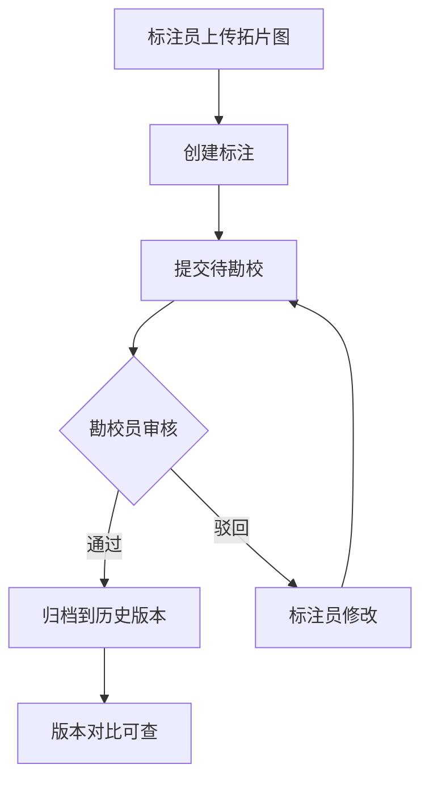
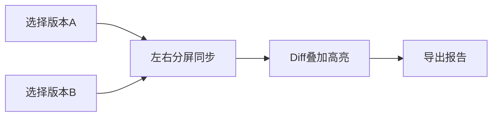

## 1. 产品概述

古籍拓片数字化勘校全栈 Web 协作系统，为古籍研究者、图书馆数字化部门提供拓片高清图像在线标注、多人分角色协同勘校、历史版本对比、勘校记录云端存档的全流程解决方案。目标是将传统纸质拓片的手工勘校流程数字化、在线化，提升文物数字化工作效率与质量保障。

- **目标用户**：古籍数字化项目组、图书馆特藏部门、文博机构数字化团队
- **核心价值**：高清图在线标注无需下载；多角色协同流程化；版本历史可追溯；勘校数据云端持久化

## 2. 核心功能

### 2.1 用户角色

| 角色 | 注册方式 | 核心权限 |
|------|----------|----------|
| 系统管理员 | 平台预置 | 用户管理、项目管理、全部读写权限 |
| 标注员 | 管理员邀请 | 上传拓片、在图像上创建/编辑标注、提交勘校 |
| 勘校员 | 管理员邀请 | 审核标注、填写勘校意见、标记通过/驳回 |
| 访客 | 公开浏览 | 浏览项目列表和标注结果（只读） |

### 2.2 功能模块

1. **登录/注册页面**：邮箱+密码登录，角色区分路由
2. **项目概览仪表盘**：项目卡片网格、筛选搜索、最近活动时间线
3. **拓片图像标注页面**：Canvas 高清图查看、矩形/多边形/文字标注工具、标注列表侧栏
4. **勘校记录页面**：标注与勘校意见对照列表、状态流转、筛选与搜索
5. **版本对比页面**：左右分屏、历史版本叠加 Diff、时间轴选择
6. **用户管理页面（管理员）**：用户列表、角色分配、项目权限配置

### 2.3 页面详情

| 页面名称 | 模块名称 | 功能描述 |
|----------|----------|----------|
| 登录页面 | 登录表单 | 邮箱/密码登录、角色选择入口、注册引导 |
| 登录页面 | 注册表单 | 邮箱注册、角色申请、管理员审批通知 |
| 仪表盘 | 项目卡片网格 | 项目缩略图、标题、状态标签、参与人数、最近更新时间 |
| 仪表盘 | 筛选搜索栏 | 按状态/角色/关键词筛选、关键词搜索 |
| 仪表盘 | 最近活动时间线 | 最近标注/勘校操作记录 |
| 图像标注页 | Canvas 画布区 | 高清拓片图显示、缩放/平移、全屏切换 |
| 图像标注页 | 标注工具栏 | 矩形框选、多边形区域、文字注释、颜色选择、撤销/重做 |
| 图像标注页 | 标注列表面板 | 标注项列表、点击定位、编辑/删除、状态标记 |
| 图像标注页 | 协作聊天面板 | 同项目成员在线对话、@提及 |
| 勘校记录页 | 记录列表 | 标注+勘校对照、状态标签、操作人/时间 |
| 勘校记录页 | 详情抽屉 | 完整标注信息、勘校意见、审核操作按钮 |
| 版本对比页 | 左右分屏 | 两版本高清图并排、同步缩放平移 |
| 版本对比页 | 时间轴 | 历史版本滑块选择、版本说明 |
| 版本对比页 | Diff 叠加 | 差异区域高亮叠加层 |
| 用户管理页 | 用户列表 | 用户卡片、角色标签、最近活动 |
| 用户管理页 | 权限配置 | 项目分配、角色调整、启停用 |

## 3. 核心流程

**标注勘校流程**：标注员上传拓片图 → 在图上创建标注（矩形/多边形/文字） → 提交待勘校 → 勘校员审核 → 通过则归档到历史版本 / 驳回则标注员修改后重新提交。

**版本对比流程**：用户进入版本对比页 → 选择两个历史版本 → 左右分屏同步查看 → 叠加 Diff 高亮差异 → 导出对比报告。

## 4. 用户界面设计

### 4.1 设计风格

- **主色调**：深墨青 `#1a2e2a`，宣纸米白 `#f5f0e6`，朱砂红 `#c44536`
- **辅助色**：青铜绿 `#7a9e7e`，绢黄 `#d4c5a0`
- **按钮风格**：圆角 4px，悬停微浮起阴影
- **字体**：标题用 "Noto Serif SC" 宋体风格，正文用 "Noto Sans SC"
- **布局风格**：侧边栏导航 + 主内容区卡片式布局
- **图标风格**：Lucide 图标，统一 18px 大小，线条粗细 1.5px

### 4.2 页面设计概览

| 页面名称 | 模块名称 | UI 元素 |
|----------|----------|----------|
| 登录页面 | 登录表单 | 米白背景、墨青输入框、朱砂登录按钮、宋体标题 |
| 仪表盘 | 项目卡片网格 | 宣纸纹理卡片、悬停上浮、状态徽标、缩略图封面 |
| 图像标注页 | Canvas 画布区 | 深色背景画布、工具栏浮层、标注层半透明叠加 |
| 图像标注页 | 标注列表面板 | 右侧抽屉、列表项点击高亮定位 |
| 勘校记录页 | 记录列表 | 斑马纹表格、状态色块标签、审核操作按钮 |
| 版本对比页 | 左右分屏 | 两画布并排、中间分割条可拖拽、同步联动 |
| 用户管理页 | 用户列表 | 头像+信息卡片、角色标签、行内操作按钮 |

### 4.3 响应式设计

- 桌面优先（1200px+），主内容区最大宽度 1440px
- 平板适配（768-1199px）：侧边栏可折叠为图标模式
- 移动端适配（<768px）：底部 Tab 导航、单列卡片布局、画布全屏模式
- Canvas 标注区域：根据容器自适应缩放，保持宽高比
- 触摸优化：工具栏按钮最小 44px 触控区域，双指缩放平移
