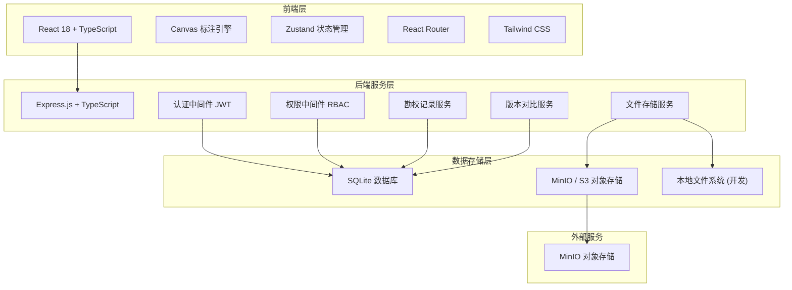
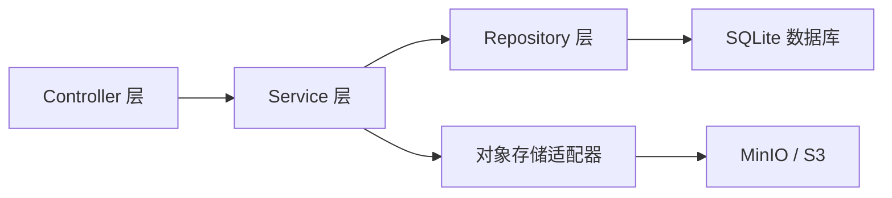
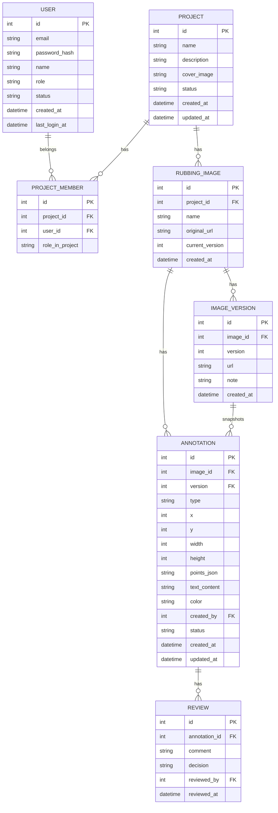

## 1. 架构设计



## 2. 技术说明

- **前端**：React@18 + TypeScript + Tailwind CSS@3 + Vite
- **状态管理**：Zustand
- **路由**：React Router DOM@6
- **图标**：Lucide React
- **Canvas 标注**：原生 Canvas API 封装
- **后端**：Express@4 + TypeScript
- **认证**：JWT (jsonwebtoken)
- **密码加密**：bcryptjs
- **文件上传**：multer
- **数据库**：SQLite (better-sqlite3)
- **对象存储**：MinIO (开发模式) / S3 兼容 (生产模式)
- **初始化工具**：vite-init

## 3. 路由定义

| 路由 | 用途 | 权限 |
|------|------|------|
| /login | 登录页面 | 公开 |
| /register | 注册页面 | 公开 |
| /dashboard | 项目仪表盘 | 登录用户 |
| /projects/:id/annotate | 图像标注页面 | 标注员/勘校员 |
| /projects/:id/reviews | 勘校记录页面 | 标注员/勘校员 |
| /projects/:id/versions | 版本对比页面 | 登录用户 |
| /admin/users | 用户管理页面 | 管理员 |
| / | 重定向到 /dashboard | - |

## 4. API 定义

### 4.1 认证接口

```typescript
// POST /api/auth/login
interface LoginRequest {
  email: string;
  password: string;
}
interface LoginResponse {
  token: string;
  user: { id: number; email: string; role: string; name: string };
}

// POST /api/auth/register
interface RegisterRequest {
  email: string;
  password: string;
  name: string;
  role: 'annotator' | 'reviewer';
}
interface RegisterResponse {
  message: string;
  userId: number;
}

// GET /api/auth/me
interface MeResponse {
  id: number;
  email: string;
  role: string;
  name: string;
}
```

### 4.2 项目接口

```typescript
// GET /api/projects
interface ProjectListResponse {
  projects: Array<{
    id: number;
    name: string;
    description: string;
    status: 'active' | 'archived';
    coverImage: string;
    memberCount: number;
    updatedAt: string;
  }>;
}

// POST /api/projects
interface CreateProjectRequest {
  name: string;
  description: string;
  coverImage: File;
}
interface CreateProjectResponse {
  id: number;
  name: string;
}

// GET /api/projects/:id
interface ProjectDetailResponse {
  id: number;
  name: string;
  description: string;
  images: Array<{ id: number; url: string; name: string; versions: number }>;
  members: Array<{ id: number; name: string; role: string }>;
}
```

### 4.3 拓片文件接口

```typescript
// POST /api/projects/:id/images
// multipart/form-data: file, name
interface UploadImageResponse {
  id: number;
  url: string;
  name: string;
  version: number;
}

// GET /api/projects/:id/images/:imageId
interface GetImageResponse {
  id: number;
  url: string;
  name: string;
  annotations: Annotation[];
  versions: Array<{ version: number; url: string; createdAt: string }>;
}

// GET /api/projects/:id/images/:imageId/versions/:version
interface GetImageVersionResponse {
  url: string;
  version: number;
  createdAt: string;
  annotations: Annotation[];
}
```

### 4.4 标注接口

```typescript
interface Annotation {
  id: number;
  type: 'rect' | 'polygon' | 'text';
  x: number;
  y: number;
  width?: number;
  height?: number;
  points?: Array<{ x: number; y: number }>;
  text?: string;
  color: string;
  createdBy: number;
  createdAt: string;
  status: 'draft' | 'pending' | 'approved' | 'rejected';
}

// POST /api/images/:imageId/annotations
interface CreateAnnotationRequest {
  type: 'rect' | 'polygon' | 'text';
  x: number;
  y: number;
  width?: number;
  height?: number;
  points?: Array<{ x: number; y: number }>;
  text?: string;
  color: string;
}
interface CreateAnnotationResponse {
  annotation: Annotation;
}

// PUT /api/annotations/:id
interface UpdateAnnotationRequest {
  x?: number;
  y?: number;
  width?: number;
  height?: number;
  text?: string;
  color?: string;
  status?: 'draft' | 'pending' | 'approved' | 'rejected';
}

// DELETE /api/annotations/:id
interface DeleteAnnotationResponse {
  message: string;
}

// GET /api/images/:imageId/annotations
interface ListAnnotationsResponse {
  annotations: Annotation[];
}
```

### 4.5 勘校接口

```typescript
interface Review {
  id: number;
  annotationId: number;
  comment: string;
  decision: 'approved' | 'rejected';
  reviewedBy: number;
  reviewedAt: string;
}

// POST /api/annotations/:annotationId/reviews
interface CreateReviewRequest {
  comment: string;
  decision: 'approved' | 'rejected';
}
interface CreateReviewResponse {
  review: Review;
  annotation: Annotation;
}

// GET /api/projects/:id/reviews
interface ListReviewsResponse {
  reviews: Array<{
    id: number;
    annotation: Annotation;
    comment: string;
    decision: string;
    reviewedBy: { id: number; name: string };
    reviewedAt: string;
  }>;
}
```

### 4.6 版本接口

```typescript
// POST /api/images/:imageId/versions
interface CreateVersionRequest {
  note: string;
}
interface CreateVersionResponse {
  version: number;
  url: string;
  note: string;
  createdAt: string;
}

// GET /api/images/:imageId/versions
interface ListVersionsResponse {
  versions: Array<{
    version: number;
    url: string;
    note: string;
    createdAt: string;
    annotationCount: number;
  }>;
}

// GET /api/images/:imageId/versions/:v1/diff/:v2
interface VersionDiffResponse {
  added: Annotation[];
  removed: Annotation[];
  modified: Array<{ old: Annotation; new: Annotation }>;
}
```

### 4.7 用户管理接口

```typescript
// GET /api/admin/users
interface ListUsersResponse {
  users: Array<{
    id: number;
    email: string;
    name: string;
    role: string;
    status: 'active' | 'disabled';
    lastLoginAt: string;
  }>;
}

// PUT /api/admin/users/:id
interface UpdateUserRequest {
  role?: 'admin' | 'annotator' | 'reviewer' | 'viewer';
  status?: 'active' | 'disabled';
  projects?: number[];
}
```

## 5. 服务器架构图



### 目录结构

```
api/
  src/
    controllers/
      authController.ts
      projectController.ts
      imageController.ts
      annotationController.ts
      reviewController.ts
      versionController.ts
      userController.ts
    services/
      authService.ts
      projectService.ts
      imageService.ts
      annotationService.ts
      reviewService.ts
      versionService.ts
      userService.ts
      storageService.ts
    repositories/
      userRepository.ts
      projectRepository.ts
      imageRepository.ts
      annotationRepository.ts
      reviewRepository.ts
      versionRepository.ts
    middleware/
      authMiddleware.ts
      roleMiddleware.ts
    db/
      index.ts
      schema.ts
    routes/
      index.ts
    config/
      index.ts
    app.ts
    server.ts
```

## 6. 数据模型

### 6.1 数据模型定义



### 6.2 数据定义语言

```sql
-- 用户表
CREATE TABLE IF NOT EXISTS users (
    id INTEGER PRIMARY KEY AUTOINCREMENT,
    email TEXT UNIQUE NOT NULL,
    password_hash TEXT NOT NULL,
    name TEXT NOT NULL,
    role TEXT NOT NULL DEFAULT 'viewer',
    status TEXT NOT NULL DEFAULT 'active',
    created_at DATETIME DEFAULT CURRENT_TIMESTAMP,
    last_login_at DATETIME
);

-- 项目表
CREATE TABLE IF NOT EXISTS projects (
    id INTEGER PRIMARY KEY AUTOINCREMENT,
    name TEXT NOT NULL,
    description TEXT,
    cover_image TEXT,
    status TEXT NOT NULL DEFAULT 'active',
    created_at DATETIME DEFAULT CURRENT_TIMESTAMP,
    updated_at DATETIME DEFAULT CURRENT_TIMESTAMP
);

-- 项目成员关联表
CREATE TABLE IF NOT EXISTS project_members (
    id INTEGER PRIMARY KEY AUTOINCREMENT,
    project_id INTEGER NOT NULL,
    user_id INTEGER NOT NULL,
    role_in_project TEXT NOT NULL DEFAULT 'annotator',
    FOREIGN KEY (project_id) REFERENCES projects(id),
    FOREIGN KEY (user_id) REFERENCES users(id),
    UNIQUE(project_id, user_id)
);

-- 拓片图表
CREATE TABLE IF NOT EXISTS rubbing_images (
    id INTEGER PRIMARY KEY AUTOINCREMENT,
    project_id INTEGER NOT NULL,
    name TEXT NOT NULL,
    original_url TEXT NOT NULL,
    current_version INTEGER NOT NULL DEFAULT 1,
    created_at DATETIME DEFAULT CURRENT_TIMESTAMP,
    FOREIGN KEY (project_id) REFERENCES projects(id)
);

-- 图像版本表
CREATE TABLE IF NOT EXISTS image_versions (
    id INTEGER PRIMARY KEY AUTOINCREMENT,
    image_id INTEGER NOT NULL,
    version INTEGER NOT NULL,
    url TEXT NOT NULL,
    note TEXT,
    created_at DATETIME DEFAULT CURRENT_TIMESTAMP,
    FOREIGN KEY (image_id) REFERENCES rubbing_images(id),
    UNIQUE(image_id, version)
);

-- 标注表
CREATE TABLE IF NOT EXISTS annotations (
    id INTEGER PRIMARY KEY AUTOINCREMENT,
    image_id INTEGER NOT NULL,
    version INTEGER NOT NULL,
    type TEXT NOT NULL,
    x INTEGER NOT NULL,
    y INTEGER NOT NULL,
    width INTEGER,
    height INTEGER,
    points_json TEXT,
    text_content TEXT,
    color TEXT NOT NULL DEFAULT '#c44536',
    created_by INTEGER NOT NULL,
    status TEXT NOT NULL DEFAULT 'draft',
    created_at DATETIME DEFAULT CURRENT_TIMESTAMP,
    updated_at DATETIME DEFAULT CURRENT_TIMESTAMP,
    FOREIGN KEY (image_id) REFERENCES rubbing_images(id),
    FOREIGN KEY (created_by) REFERENCES users(id)
);

-- 勘校记录表
CREATE TABLE IF NOT EXISTS reviews (
    id INTEGER PRIMARY KEY AUTOINCREMENT,
    annotation_id INTEGER NOT NULL,
    comment TEXT NOT NULL,
    decision TEXT NOT NULL,
    reviewed_by INTEGER NOT NULL,
    reviewed_at DATETIME DEFAULT CURRENT_TIMESTAMP,
    FOREIGN KEY (annotation_id) REFERENCES annotations(id),
    FOREIGN KEY (reviewed_by) REFERENCES users(id)
);

-- 初始管理员账户
INSERT OR IGNORE INTO users (email, password_hash, name, role, status)
VALUES ('admin@rubbing.com', '$2a$10$...hashed_password...', '系统管理员', 'admin', 'active');
```

## 7. 对象存储服务对接

### 存储适配器设计

```typescript
interface StorageAdapter {
  upload(file: Buffer, key: string, metadata?: Record<string, string>): Promise<string>;
  getUrl(key: string): string;
  delete(key: string): Promise<void>;
  list(prefix: string): Promise<string[]>;
}
```

- **开发模式**：使用本地文件系统存储，文件保存在 `uploads/` 目录
- **生产模式**：使用 MinIO 或 S3 兼容对象存储服务
- **文件命名规则**：`projects/{projectId}/images/{imageId}/v{version}/{filename}`
- **图片格式支持**：JPEG、PNG、WebP、TIFF（通过服务端转换为 WebP 展示）
- **缩略图生成**：上传时自动生成多种尺寸缩略图（256px、512px、1024px）
