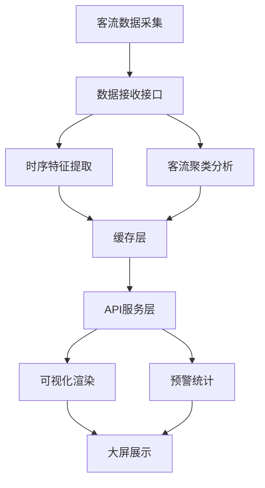

## 1. 产品概述
轨道交通客流时序特征分析可视化平台，面向轨道交通运营管理部门，提供全线站点客流实时监控、时序特征提取、客流聚类分析、可视化渲染及预警统计功能。
- 解决传统客流数据分散、分析效率低、预警不及时的问题
- 目标用户：轨道交通运营调度人员、数据分析人员、管理决策者
- 核心价值：通过时序特征提取和聚类分析，发现客流规律，辅助运营决策

## 2. 核心功能

### 2.1 功能模块
1. **数据接收模块**：客流数据接口，支持实时/历史数据接入
2. **时序特征提取**：从客流数据中提取趋势、周期、异常等特征
3. **客流聚类分析**：对站点进行聚类，识别客流模式
4. **可视化渲染**：热力图、趋势图、站点分布可视化
5. **预警统计模块**：高客流时段统计、预警阈值设置与告警

### 2.2 页面详情
| 页面名称 | 模块名称 | 功能描述 |
|-----------|-------------|---------------------|
| 大屏主页面 | 总览仪表盘 | 全线客流概览、实时客流统计、预警指标展示 |
| 时序分析页 | 特征提取 | 客流趋势图、周期性分析、异常检测标记 |
| 聚类分析页 | 客流聚类 | 站点聚类结果展示、聚类特征对比 |
| 热力图页 | 可视化渲染 | 站点客流热力图、时段热力分布 |
| 预警统计页 | 预警管理 | 高客流时段统计、预警记录、阈值配置 |

## 3. 核心流程
数据从采集接口进入系统，经过时序特征提取和聚类分析处理后，存储至缓存层。前端通过API获取数据，进行可视化渲染和预警展示。用户可交互操作查看不同维度的客流分析结果。

## 4. 用户界面设计

### 4.1 设计风格
- **主色调**：深蓝(#0a1628)、科技蓝(#1e88e5)、警示红(#ef5350)
- **辅助色**：青绿(#26c6da)、橙色(#ffa726)
- **按钮风格**：圆角科技感，带渐变边框光效
- **字体**：使用系统无衬线字体，标题24-32px，正文14-16px
- **布局风格**：大屏网格布局，数据卡片式展示
- **图标风格**：线性科技感图标

### 4.2 页面设计概览
| 页面名称 | 模块名称 | UI元素 |
|-----------|-------------|-------------|
| 大屏主页面 | 总览仪表盘 | 深色背景、数据卡片、实时数字、趋势小图 |
| 时序分析页 | 特征提取 | 折线图、区域图、异常标记点 |
| 聚类分析页 | 客流聚类 | 散点图、聚类着色、特征雷达图 |
| 热力图页 | 可视化渲染 | 站点网格热力图、色阶图例 |
| 预警统计页 | 预警管理 | 告警列表、阈值滑块、统计图表 |

### 4.3 响应式设计
- 桌面端优先，适配1920x1080及以上大屏分辨率
- 支持16:9和4:3屏幕比例
- 响应式网格布局，适配不同屏幕尺寸
