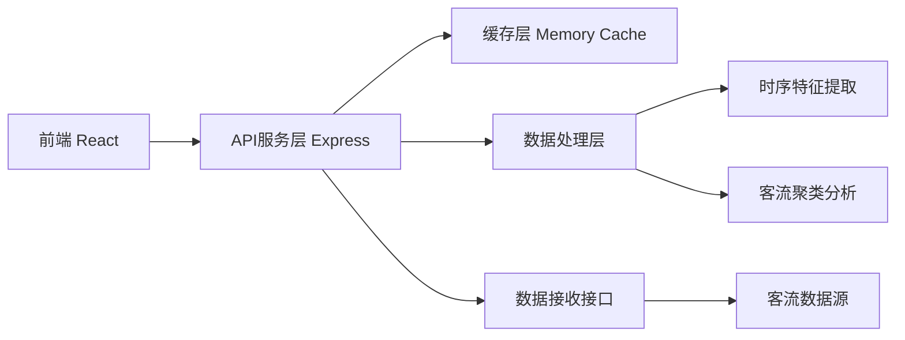
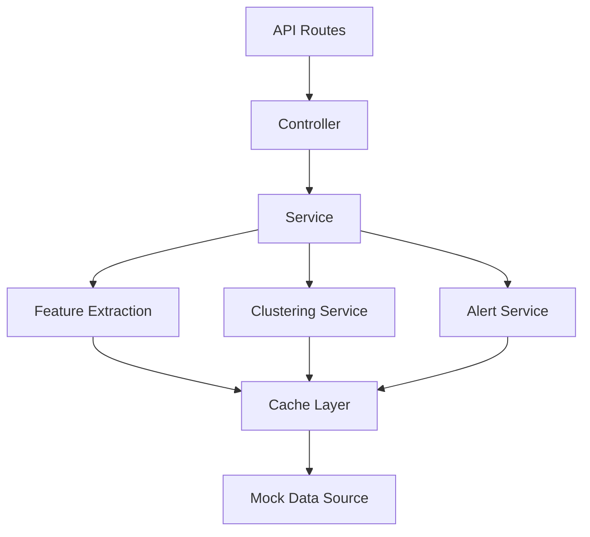
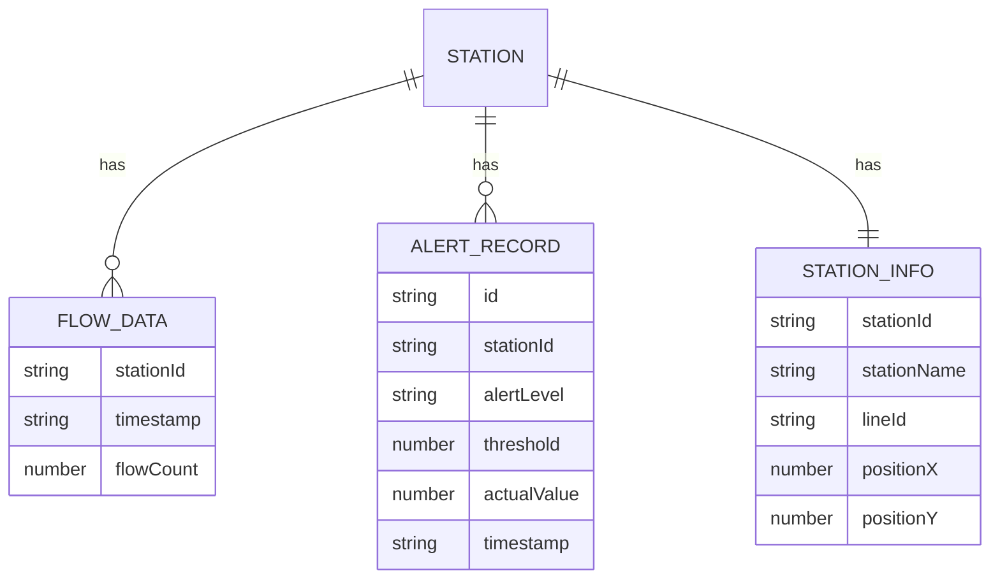

## 1. 架构设计



## 2. 技术说明
- **前端**：React@18 + TypeScript + Vite + TailwindCSS + Recharts
- **后端**：Express@4 + TypeScript
- **缓存**：Node.js 内存缓存 (node-cache)
- **图表库**：Recharts
- **状态管理**：Zustand

## 3. 路由定义
| 路由 | 用途 |
|-------|---------|
| / | 大屏主页面 - 总览仪表盘 |
| /timeseries | 时序分析页 - 特征提取展示 |
| /clustering | 聚类分析页 - 客流聚类结果 |
| /heatmap | 热力图页 - 可视化渲染 |
| /alerts | 预警统计页 - 预警管理 |

## 4. API定义

### 4.1 类型定义
```typescript
interface StationFlow {
  stationId: string;
  stationName: string;
  timestamp: string;
  flowCount: number;
  lineId: string;
}

interface TimeSeriesFeature {
  stationId: string;
  trend: number[];
  periodicity: number;
  anomalies: number[];
  peakHours: number[];
}

interface ClusterResult {
  stationId: string;
  clusterId: number;
  features: number[];
  distanceToCentroid: number;
}

interface AlertRecord {
  id: string;
  stationId: string;
  alertLevel: 'warning' | 'danger';
  threshold: number;
  actualValue: number;
  timestamp: string;
}

interface StationInfo {
  stationId: string;
  stationName: string;
  lineId: string;
  position: { x: number; y: number };
}
```

### 4.2 接口列表
| 接口 | 方法 | 描述 |
|-------|------|------|
| /api/stations | GET | 获取所有站点信息 |
| /api/flow/realtime | GET | 获取实时客流数据 |
| /api/flow/history | GET | 获取历史客流数据 |
| /api/flow/timeseries-features | GET | 获取时序特征 |
| /api/clustering/results | GET | 获取聚类结果 |
| /api/alerts | GET | 获取预警记录 |
| /api/alerts/thresholds | GET/PUT | 获取/设置预警阈值 |
| /api/stats/peak-hours | GET | 获取高峰时段统计 |

## 5. 服务器架构



## 6. 数据模型

### 6.1 数据模型定义


### 6.2 模拟数据说明
系统使用模拟数据生成器，模拟全线30个站点，每5分钟生成一次客流数据，数据包含进站/出站客流。历史数据存储24小时滚动窗口。
