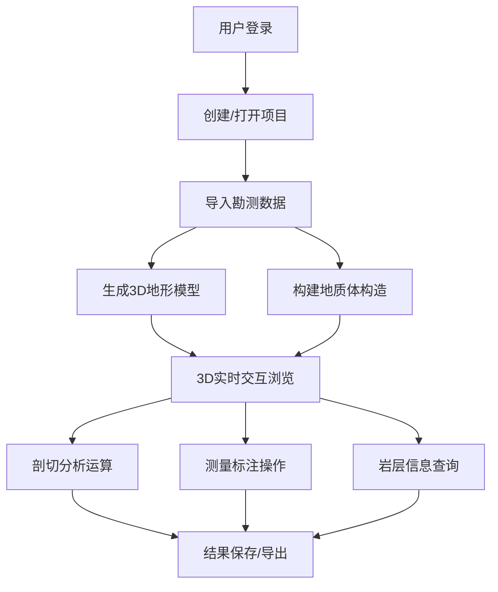

# 山地地形地质体三维建模与剖切分析平台 - 产品需求文档

## 1. 产品概述

山地地形地质体三维建模与剖切分析平台是一个专业的地质勘测3D可视化系统，基于地质勘测数据生成三维山地模型和地质岩层构造，支持任意平面剖切分析、距离角度测量、岩层信息查询，实现前后端联调与3D实时交互。

- **核心目的**：为地质勘测、工程设计、矿产勘探等领域提供直观的三维可视化分析工具
- **目标用户**：地质工程师、勘测人员、科研工作者、工程设计师
- **产品价值**：将复杂的地质数据转化为直观的3D模型，提升地质分析效率和准确性

## 2. 核心功能

### 2.1 用户角色

| 角色 | 注册方式 | 核心权限 |
|------|---------|---------|
| 地质工程师 | 账号登录 | 地形建模、地质构造分析、剖切运算、数据查询、测量标注 |
| 访客用户 | 无需注册 | 浏览公开项目、查看3D模型（只读权限） |

### 2.2 功能模块

1. **主工作台**：3D场景展示、工具栏、侧边控制面板、信息面板
2. **地形建模模块**：DEM数据导入、地形网格生成、地形纹理映射
3. **地质体构造模块**：岩层数据导入、地质界面构建、断层构造模拟
4. **三维剖切运算**：任意平面剖切、剖面分析、剖切结果导出
5. **数据查询接口**：岩层信息查询、属性数据检索、数据库对接
6. **测量标注模块**：距离测量、角度测量、高度差计算、点位标注

### 2.3 页面详情

| 页面名称 | 模块名称 | 功能描述 |
|---------|---------|---------|
| 主工作台 | 3D场景视图 | 实时渲染3D地形与地质体模型，支持旋转、缩放、平移交互 |
| 主工作台 | 顶部工具栏 | 提供建模、剖切、测量、查询等功能切换按钮 |
| 主工作台 | 左侧控制面板 | 图层管理、模型显示控制、透明度调节 |
| 主工作台 | 右侧信息面板 | 选中对象属性、测量结果、查询数据展示 |
| 主工作台 | 底部状态栏 | 坐标信息、相机参数、操作提示 |
| 数据管理 | 数据导入 | 支持DEM、CSV、JSON等格式勘测数据导入 |
| 数据管理 | 项目管理 | 项目创建、保存、加载、导出 |

## 3. 核心流程

### 3.1 主要工作流程

1. 用户登录系统，创建或打开地质项目
2. 导入地形DEM数据和地质岩层勘测数据
3. 系统自动生成三维地形模型和地质体构造
4. 用户进行3D交互浏览（旋转、缩放、平移）
5. 选择剖切工具，定义剖切平面进行剖切分析
6. 使用测量工具进行距离、角度、高度测量
7. 通过查询接口获取岩层详细属性信息
8. 保存分析结果或导出剖切图像/数据

## 4. 用户界面设计

### 4.1 设计风格

- **主色调**：深蓝色系（#1e3a5f）代表专业与科技感
- **辅助色**：地质色阶（棕色#8B4513、土黄#DAA520、灰色#708090）
- **强调色**：青绿色（#00CED1）用于交互元素和选中状态
- **按钮样式**：圆角矩形，微立体效果，悬停有过渡动画
- **字体**：标题使用 Noto Sans SC Bold，正文使用 Noto Sans SC Regular
- **布局风格**：深色科技风，中心3D场景为主，四周环绕功能面板
- **图标风格**：线性简约图标，统一24px尺寸，配合功能语义

### 4.2 页面设计概述

| 页面名称 | 模块名称 | UI元素 |
|---------|---------|--------|
| 主工作台 | 3D场景视图 | 全屏深色背景，地形模型带高程着色，地质体半透明显示，环境光照模拟 |
| 主工作台 | 顶部工具栏 | 固定高度导航栏，图标+文字按钮，分组排列，激活状态高亮 |
| 主工作台 | 左侧面板 | 可折叠抽屉式面板，树形图层列表，滑块控件 |
| 主工作台 | 右侧面板 | 标签页式信息展示，数据表格，属性卡片 |
| 主工作台 | 底部状态栏 | 半透明背景，左右分布信息，实时更新 |

### 4.3 响应式设计

- **桌面优先**：针对1920x1080及以上分辨率优化，充分利用大屏空间
- **平板适配**：面板可自动隐藏，通过手势调用工具栏
- **触控优化**：支持双指缩放、旋转，按钮尺寸适配触控操作

### 4.4 3D场景指导

- **环境与氛围**：深空灰背景，模拟户外自然光，添加柔和环境光
- **光照设置**：主光源45度俯角，辅助光补光，地形接收阴影
- **相机设置**：轨道控制器，默认透视视角，限制俯仰角度
- **构图与焦点**：地形模型居中，剖切平面高亮显示，标注点醒目
- **交互与动画**：模型加载淡入效果，剖切动画过渡，选中对象呼吸灯效果
- **后处理效果**：柔和抗锯齿，适度泛光，提升视觉质感
- **性能优化**：LOD层级细节，实例化渲染，保持60fps帧率

## 5. 非功能需求

### 5.1 性能要求

- 3D场景帧率不低于30fps
- 模型加载时间不超过5秒
- 剖切运算响应时间不超过1秒
- 支持百万级三角面模型渲染

### 5.2 兼容性要求

- 支持Chrome、Firefox、Edge现代浏览器
- 支持WebGL 2.0渲染
- 响应式布局适配不同屏幕尺寸
