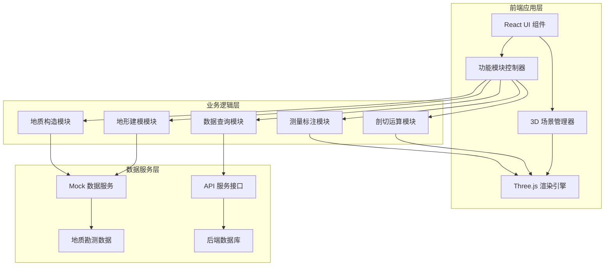
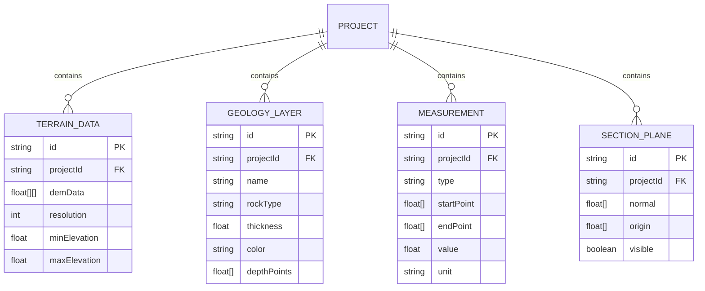
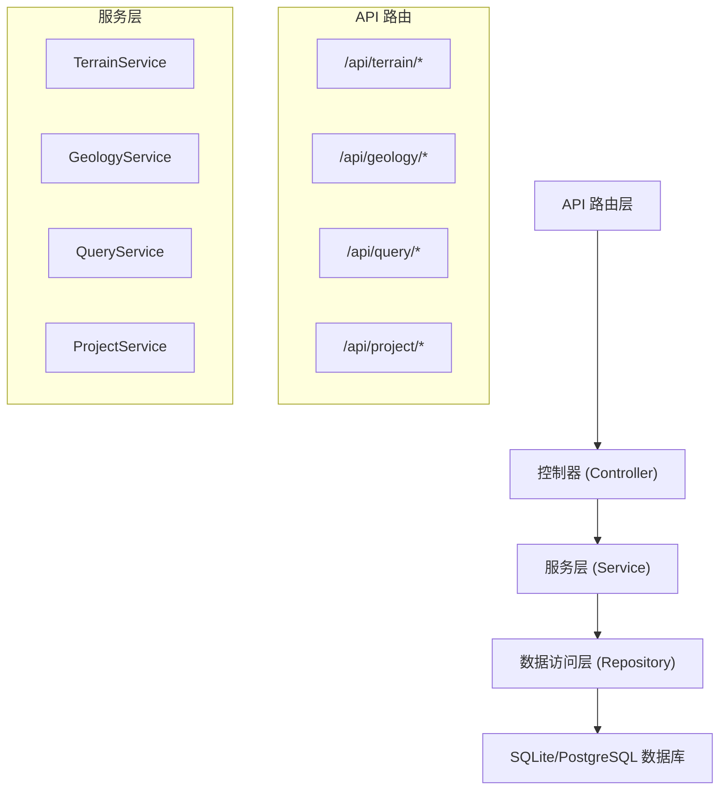

# 山地地形地质体三维建模与剖切分析平台 - 技术架构文档

## 1. 架构设计



## 2. 技术描述

### 2.1 核心技术栈

- **前端框架**: React@18 + TypeScript
- **构建工具**: Vite@5
- **样式方案**: TailwindCSS@3 + CSS Modules
- **3D渲染**: Three.js + @react-three/fiber + @react-three/drei
- **后处理**: @react-three/postprocessing
- **状态管理**: Zustand
- **数据可视化**: @ant-design/charts
- **UI组件库**: Ant Design

### 2.2 后端服务（可选）

- **后端框架**: Express@4 (Node.js)
- **数据库**: SQLite (开发环境) / PostgreSQL (生产环境)
- **API协议**: RESTful API

### 2.3 初始化工具

使用 Vite 初始化 React + TypeScript 项目：
```bash
npm create vite@latest geo-3d-platform -- --template react-ts
```

## 3. 项目目录结构

```
geo-3d-platform/
├── src/
│   ├── components/          # UI组件
│   │   ├── Toolbar/        # 顶部工具栏
│   │   ├── LeftPanel/      # 左侧控制面板
│   │   ├── RightPanel/     # 右侧信息面板
│   │   └── StatusBar/      # 底部状态栏
│   ├── modules/            # 功能模块
│   │   ├── TerrainModeling/    # 地形建模模块
│   │   ├── GeologyStructure/   # 地质体构造模块
│   │   ├── SectionAnalysis/    # 三维剖切运算
│   │   ├── DataQuery/          # 数据查询接口
│   │   └── Measurement/        # 测量标注模块
│   ├── store/              # 状态管理
│   ├── services/           # API服务
│   ├── utils/              # 工具函数
│   ├── types/              # TypeScript类型定义
│   ├── App.tsx
│   └── main.tsx
├── server/                 # 后端服务（可选）
├── public/                 # 静态资源
└── package.json
```

## 4. 路由定义

| 路由 | 页面/组件 | 功能说明 |
|------|----------|---------|
| / | MainWorkspace | 主工作台 - 3D场景与控制面板 |
| /projects | ProjectList | 项目列表页 |
| /data-import | DataImport | 数据导入页 |
| /settings | Settings | 系统设置页 |

## 5. 核心数据模型

### 5.1 数据模型定义



### 5.2 TypeScript 类型定义

```typescript
// 地形数据
interface TerrainData {
  id: string;
  demData: number[][];
  resolution: number;
  bounds: {
    minX: number;
    maxX: number;
    minY: number;
    maxY: number;
    minZ: number;
    maxZ: number;
  };
}

// 地质岩层
interface GeologyLayer {
  id: string;
  name: string;
  rockType: string;
  description: string;
  thickness: number;
  color: string;
  depth: number;
  properties: Record<string, any>;
}

// 剖切平面
interface SectionPlane {
  id: string;
  name: string;
  normal: [number, number, number];
  origin: [number, number, number];
  visible: boolean;
}

// 测量结果
interface Measurement {
  id: string;
  type: 'distance' | 'angle' | 'height';
  points: [number, number, number][];
  value: number;
  unit: string;
  label: string;
}
```

## 6. API 接口定义

### 6.1 地形数据接口

```typescript
// 获取地形数据
GET /api/terrain/:projectId
Response: TerrainData

// 导入地形数据
POST /api/terrain/import
Request: FormData
Response: { success: boolean; terrainId: string }
```

### 6.2 地质层数据接口

```typescript
// 获取项目所有地质层
GET /api/geology/:projectId/layers
Response: GeologyLayer[]

// 添加地质层
POST /api/geology/:projectId/layers
Request: Omit<GeologyLayer, 'id'>
Response: GeologyLayer

// 更新地质层
PUT /api/geology/layers/:layerId
Request: Partial<GeologyLayer>
Response: GeologyLayer
```

### 6.3 查询接口

```typescript
// 根据坐标查询岩层信息
GET /api/query/rock-info?x=:x&y=:y&z=:z
Response: {
  layerName: string;
  rockType: string;
  depth: number;
  properties: Record<string, any>;
}

// 查询指定范围内的地质数据
POST /api/query/region
Request: { bounds: BoundingBox }
Response: { layers: GeologyLayer[]; terrainData: TerrainData }
```

## 7. 后端服务架构



## 8. 性能优化策略

1. **3D 渲染优化**
   - 使用 LOD (Level of Detail) 技术
   - 几何体实例化渲染
   - 视锥体剔除
   - 纹理压缩

2. **数据加载优化**
   - 地形数据分块加载
   - Web Worker 处理计算密集型任务
   - 数据缓存策略

3. **剖切运算优化**
   - 使用 WebGL 着色器实现 GPU 加速剖切
   - 空间索引加速相交计算

## 9. 开发与部署

- **开发环境**: Node.js 18+
- **代码规范**: ESLint + Prettier
- **版本控制**: Git
- **构建命令**: `npm run build`
- **开发命令**: `npm run dev`
- **预览命令**: `npm run preview`
