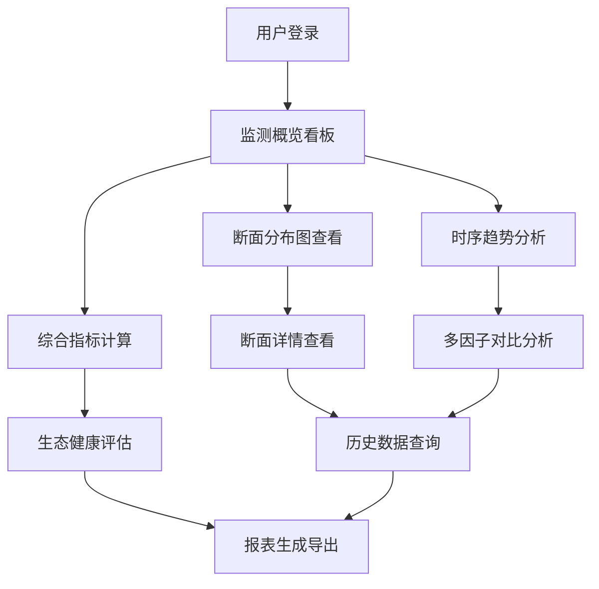

## 1. 产品概述

流域水生态环境多因子监测数据分析可视化系统，用于对接流域监测后端服务，实现溶解氧、PH值、藻类密度等多源监测数据的融合分析与可视化展示，为水环境管理提供科学决策支持。

- 主要目的：实现流域水生态监测数据的统一接入、清洗融合、指标计算与可视化分析
- 解决问题：多源监测数据分散、数据质量参差不齐、分析手段单一、缺乏直观展示
- 目标用户：环保部门管理人员、水环境监测人员、科研分析人员
- 产品价值：提升水环境监测效率，支撑精准治污决策，保障流域水生态安全

## 2. 核心功能

### 2.1 用户角色

| 角色 | 注册方式 | 核心权限 |
|------|----------|----------|
| 管理员 | 系统分配 | 数据接入配置、用户管理、系统设置 |
| 监测人员 | 账号登录 | 数据查询、图表分析、报表导出 |
| 访客 | 无需登录 | 公开数据浏览、基础图表查看 |

### 2.2 功能模块

1. **数据接入模块**：后端服务对接、多因子数据接入、实时数据同步
2. **数据清洗模块**：多因子融合、异常值检测、缺失值处理、数据标准化
3. **指标计算模块**：水质综合指数、富营养化指数、生态健康评估
4. **可视化分析模块**：监测概览、断面分布图、时序趋势图、多因子对比图
5. **报表导出模块**：统计报表生成、多格式导出、报表模板管理
6. **历史数据查询模块**：海量数据分页、条件筛选、时间范围查询

### 2.3 页面详情

| 页面名称 | 模块名称 | 功能描述 |
|----------|----------|----------|
| 监测概览 | 数据看板 | 关键指标卡片、实时数据更新、告警提示 |
| 监测概览 | 统计概览 | 整体水质统计、断面达标率、趋势摘要 |
| 断面分布 | 地图展示 | 流域断面分布、点位标注、颜色编码 |
| 断面分布 | 断面详情 | 单断面多因子数据、历史对比、评级展示 |
| 趋势分析 | 时序图表 | 单因子趋势、多因子对比、滑动窗口分析 |
| 趋势分析 | 周期分析 | 日/周/月/季周期统计、同比环比分析 |
| 指标计算 | 综合评估 | 水质指数计算、富营养化评价、健康评级 |
| 指标计算 | 因子权重 | 权重配置、算法参数调整 |
| 数据查询 | 分页列表 | 海量数据分页、高级筛选、快速检索 |
| 数据查询 | 详情查看 | 原始数据溯源、数据质量标记 |
| 报表中心 | 报表生成 | 自定义报表、统计维度选择 |
| 报表中心 | 导出管理 | Excel/PDF导出、历史报表管理 |

## 3. 核心流程

用户登录系统后，首先查看监测概览了解整体水质状况；可通过断面分布图直观查看各监测点位的空间分布和实时状态；点击具体断面查看详情及历史趋势；利用趋势分析模块进行多因子对比和周期分析；通过指标计算模块进行综合水质评价；查询历史数据时支持分页浏览和条件筛选；最终可生成并导出各类统计报表。

## 4. 用户界面设计

### 4.1 设计风格
- **主色调**：深蓝(#1e3a5f) - 代表水域、专业、可信
- **辅助色**：青蓝(#0ea5e9) - 交互元素、高亮提示
- **状态色**：绿色(#10b981)优/黄色(#f59e0b)良/橙色(#f97316)中/红色(#ef4444)差
- **按钮风格**：圆角矩形，轻微阴影，hover状态有颜色渐变和缩放效果
- **字体**：标题使用思源黑体Bold，正文使用思源宋体Regular
- **布局风格**：卡片式布局，顶部导航+左侧菜单+主内容区
- **图标风格**：线性图标，与水生态主题相关，统一24px尺寸

### 4.2 页面设计概览

| 页面名称 | 模块名称 | UI元素 |
|----------|----------|--------|
| 监测概览 | 数据看板 | 渐变卡片、数字动效、状态指示灯、环形进度条 |
| 断面分布 | 地图展示 | 流域底图、热力图层、点位标记、信息弹窗、图例 |
| 趋势分析 | 时序图表 | ECharts折线图、区域填充、交互式tooltip、缩放滑块 |
| 指标计算 | 综合评估 | 雷达图、仪表盘、评分卡片、分级色阶展示 |
| 数据查询 | 分页列表 | 筛选面板、数据表格、分页控件、行高亮效果 |
| 报表中心 | 导出管理 | 表单控件、进度条、文件列表、下载动画 |

### 4.3 响应式设计
- **桌面端优先**：1920px为主设计尺寸，适配1440px、1280px
- **平板适配**：900px-1280px，菜单可折叠，图表自适应
- **移动端**：<900px，底部导航，单栏布局，简化图表

### 4.4 交互动效
- 页面加载：元素渐入动画，卡片依次浮现
- 数据更新：数字滚动动画，指标闪烁提示
- 图表交互：悬停高亮，平滑过渡，缩放动画
- 按钮反馈：点击缩放，颜色渐变，阴影变化
