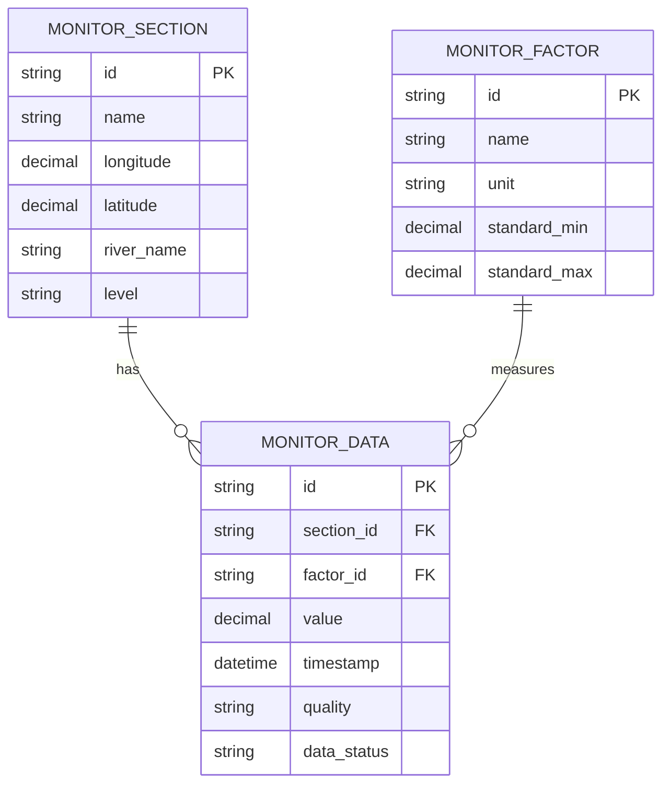

## 1. 架构设计


## 2. 技术选型说明

- **前端框架**: React@18 + TypeScript + Vite
- **状态管理**: Zustand
- **UI组件库**: Ant Design@5
- **图表库**: ECharts@5
- **地图可视化**: Leaflet + @react-leaflet
- **数据处理**: Lodash + Day.js
- **表格导出**: xlsx + jspdf
- **HTTP请求**: Axios
- **样式方案**: Tailwind CSS@3
- **代码规范**: ESLint + Prettier

## 3. 目录结构

```
src/
├── api/              # 数据接入接口
│   ├── index.ts      # API入口
│   ├── request.ts    # 请求封装
│   └── mock/         # Mock数据
├── modules/          # 业务模块
│   ├── dataClean/    # 多因子融合清洗模块
│   ├── indicator/    # 生态指标计算模块
│   └── export/       # 报表导出模块
├── components/       # 组件
│   ├── charts/       # 图表组件
│   ├── map/          # 地图组件
│   └── common/       # 通用组件
├── pages/            # 页面
│   ├── Dashboard/
│   ├── SectionMap/
│   ├── TrendAnalysis/
│   ├── IndicatorCalc/
│   ├── DataQuery/
│   └── ReportCenter/
├── store/            # 状态管理
├── types/            # 类型定义
├── utils/            # 工具函数
└── App.tsx
```

## 4. 路由定义

| 路由路径 | 页面名称 | 说明 |
|----------|----------|------|
| / | 监测概览 | 数据看板首页 |
| /dashboard | 监测概览 | 关键指标展示 |
| /section-map | 断面分布 | 流域断面地图 |
| /trend | 趋势分析 | 时序趋势图表 |
| /indicator | 指标计算 | 综合指标评估 |
| /data-query | 数据查询 | 分页数据查询 |
| /report | 报表中心 | 报表生成导出 |

## 5. API接口定义

### 5.1 监测数据接口

```typescript
// 监测因子类型
interface MonitorFactor {
  id: string;
  name: string;        // 因子名称：溶解氧、PH值、藻类密度等
  unit: string;        // 单位
  standardMin: number; // 标准最小值
  standardMax: number; // 标准最大值
}

// 监测断面
interface MonitorSection {
  id: string;
  name: string;
  longitude: number;
  latitude: number;
  riverName: string;
  level: string;       // 断面级别
}

// 监测数据
interface MonitorData {
  id: string;
  sectionId: string;
  sectionName: string;
  factorId: string;
  factorName: string;
  value: number;
  unit: string;
  timestamp: string;
  quality: 'excellent' | 'good' | 'moderate' | 'poor';
  dataStatus: 'valid' | 'invalid' | 'estimated';
}

// 分页查询参数
interface QueryParams {
  page: number;
  pageSize: number;
  sectionId?: string;
  factorId?: string;
  startTime?: string;
  endTime?: string;
  quality?: string;
}

// 分页响应
interface PageResult<T> {
  list: T[];
  total: number;
  page: number;
  pageSize: number;
}
```

### 5.2 API列表

| 接口 | 方法 | 说明 |
|------|------|------|
| /api/monitor/sections | GET | 获取监测断面列表 |
| /api/monitor/factors | GET | 获取监测因子列表 |
| /api/monitor/realtime | GET | 获取实时监测数据 |
| /api/monitor/history | GET | 历史数据分页查询 |
| /api/monitor/trend | GET | 获取趋势数据 |
| /api/indicator/wqi | POST | 计算水质综合指数 |
| /api/indicator/ei | POST | 计算富营养化指数 |
| /api/report/generate | POST | 生成统计报表 |
| /api/report/export | GET | 导出报表文件 |

## 6. 核心模块设计

### 6.1 多因子融合清洗模块

```typescript
// src/modules/dataClean/index.ts
class DataCleaner {
  // 异常值检测：3σ原则
  detectOutliers(data: number[]): boolean[];
  
  // 缺失值处理：线性插值/均值填充
  fillMissingValues(data: (number | null)[], method: 'linear' | 'mean' | 'nearest'): number[];
  
  // 数据标准化：Z-score归一化
  normalize(data: number[]): number[];
  
  // 多因子数据融合
  fuseMultiFactor(data: MonitorData[][]): FusedData[];
}
```

### 6.2 生态指标计算模块

```typescript
// src/modules/indicator/index.ts
class IndicatorCalculator {
  // 水质综合指数(WQI)
  calculateWQI(factorValues: Record<string, number>): number;
  
  // 富营养化指数(TLI)
  calculateTLI(chla: number, tp: number, tn: number, cod: number, sd: number): number;
  
  // 水质等级评定
  getWaterQualityLevel(score: number): WaterQualityLevel;
  
  // 生态健康评估
  evaluateEcoHealth(indicators: EcoIndicators): HealthLevel;
}
```

### 6.3 报表导出模块

```typescript
// src/modules/export/index.ts
class ReportExporter {
  // 导出Excel
  exportToExcel(data: any[], options: ExportOptions): Promise<Blob>;
  
  // 导出PDF
  exportToPDF(content: string, options: PDFOptions): Promise<Blob>;
  
  // 生成统计报表
  generateReport(params: ReportParams): Promise<ReportData>;
  
  // 下载文件
  downloadFile(blob: Blob, filename: string): void;
}
```

## 7. 数据模型

### 7.1 ER图



## 8. 性能优化策略

1. **虚拟滚动**：历史数据表格使用虚拟滚动，支持百万级数据渲染
2. **数据分页**：后端分页+前端缓存，减少单次请求数据量
3. **图表懒加载**：图表组件按需加载，延迟渲染非可视区域图表
4. **数据缓存**：接口数据本地缓存，相同请求减少网络开销
5. **Web Worker**：大数据量计算在Worker线程执行，避免阻塞UI
6. **按需打包**：路由级代码分割，减小首屏加载体积
