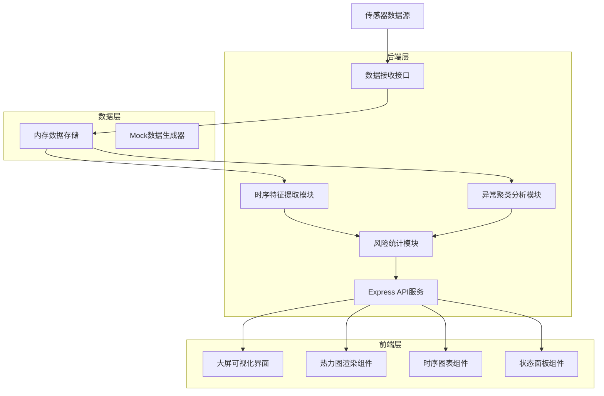
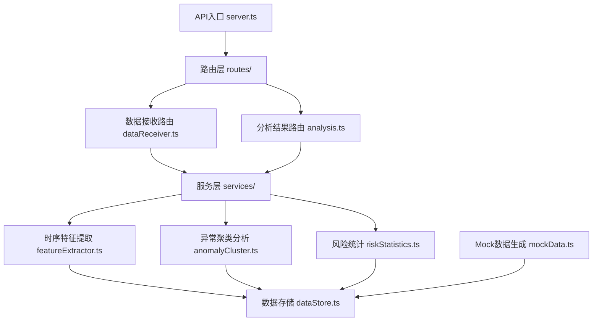
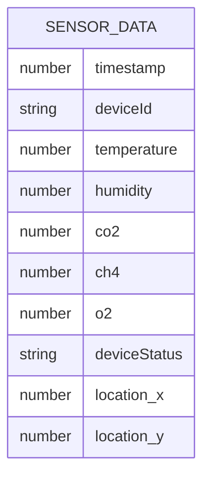
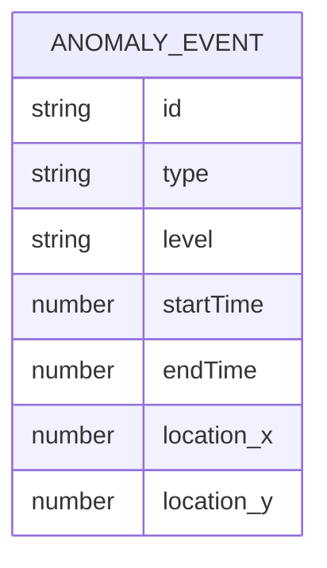

## 1. 架构设计



## 2. 技术描述

### 2.1 前端技术栈

| 技术 | 版本 | 用途 |
|------|------|------|
| React | 18.x | UI框架 |
| TypeScript | 5.x | 类型安全 |
| Vite | 5.x | 构建工具 |
| TailwindCSS | 3.x | 样式框架 |
| Zustand | 4.x | 状态管理 |
| ECharts | 5.x | 图表库 |
| Lucide React | 0.400.x | 图标库 |

### 2.2 后端技术栈

| 技术 | 版本 | 用途 |
|------|------|------|
| Express | 4.x | Web框架 |
| TypeScript | 5.x | 类型安全 |
| Node.js | 18+ | 运行环境 |

## 3. 后端模块划分



## 4. 目录结构

```
project/
├── src/                          # 前端源码
│   ├── components/              # 组件
│   │   ├── dashboard/       # 大屏组件
│   │   ├── charts/          # 图表组件
│   │   └── common/          # 通用组件
│   ├── store/              # 状态管理
│   ├── utils/              # 工具函数
│   ├── pages/              # 页面
│   ├── services/           # API服务
│   └── types/            # 类型定义
├── api/                  # 后端源码
│   ├── routes/          # 路由
│   ├── services/        # 业务逻辑
│   ├── data/           # 数据存储
│   ├── utils/          # 工具函数
│   └── types/          # 类型定义
└── shared/               # 共享类型
```

## 5. API 接口定义

### 5.1 数据接收接口

```typescript
// POST /api/data/receive
interface SensorData {
  timestamp: number;
  deviceId: string;
  location: { x: number; y: number; z: number };
  temperature: number;
  humidity: number;
  gasConcentration: {
    co2: number;
    ch4: number;
    o2: number;
  };
  deviceStatus: 'normal' | 'warning' | 'error';
}

// Response
interface ReceiveResponse {
  success: boolean;
  message: string;
}
```

### 5.2 实时数据接口

```typescript
// GET /api/data/realtime
interface RealtimeDataResponse {
  latestData: SensorData[];
  timestamp: number;
}
```

### 5.3 特征提取接口

```typescript
// GET /api/analysis/features
interface FeatureData {
  mean: number;
  std: number;
  max: number;
  min: number;
  trend: 'rising' | 'stable' | 'falling';
  volatility: number;
}

interface FeaturesResponse {
  temperature: FeatureData;
  humidity: FeatureData;
  co2: FeatureData;
  ch4: FeatureData;
}
```

### 5.4 异常聚类接口

```typescript
// GET /api/analysis/anomalies
interface AnomalyCluster {
  id: string;
  type: 'temperature' | 'humidity' | 'gas' | 'device';
  level: 'low' | 'medium' | 'high' | 'critical';
  startTime: number;
  endTime: number;
  dataPoints: Array<{x: number; y: number; value: number}>;
  location: { x: number; y: number };
}

interface AnomaliesResponse {
  clusters: AnomalyCluster[];
  totalCount: number;
}
```

### 5.5 风险统计接口

```typescript
// GET /api/analysis/risk
interface RiskStatistics {
  hourlyRisk: Array<{ hour: number; level: number; count: number }>;
  levelDistribution: {
    low: number;
    medium: number;
    high: number;
    critical: number;
  };
  topRiskLocations: Array<{
    location: string;
    riskCount: number;
    avgLevel: number;
  }>;
}
```

## 6. 数据模型

### 6.1 时序数据点



### 6.2 异常事件


