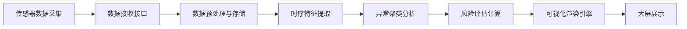

## 1. 产品概述

城市地下综合管廊运行状态时序分析可视化平台，面向城市管廊运维管理人员，实现管廊内多维度时序数据的实时采集、特征分析、异常检测与可视化展示，为管廊安全运行提供智能决策支持。

## 2. 核心功能

### 2.1 功能模块

| 模块名称 | 核心功能 |
|---------|---------|
| 数据接收接口 | 接收温湿度、气体浓度、设备运行状态等时序数据 |
| 时序特征提取 | 提取数据统计特征、趋势特征、周期性特征 |
| 异常聚类分析 | 基于DBSCAN算法的异常模式识别与聚类 |
| 热力图/态势图 | 管廊空间热力分布与运行态势可视化 |
| 风险统计模块 | 风险时段统计、风险等级评估与预警 |

### 2.2 页面详情

| 页面名称 | 模块名称 | 功能描述 |
|---------|---------|---------|
| 监控大屏 | 概览面板 | 管廊整体运行状态、关键指标实时展示 |
| 监控大屏 | 热力图区域 | 管廊空间温湿度/气体浓度热力分布 |
| 监控大屏 | 时序图表 | 多维度时序数据趋势曲线 |
| 监控大屏 | 异常聚类 | 异常事件聚类分析结果展示 |
| 监控大屏 | 风险统计 | 风险时段分布、风险等级统计 |
| 监控大屏 | 设备状态 | 管廊内设备运行状态实时监控 |

## 3. 核心流程

## 4. 用户界面设计

### 4.1 设计风格

- **主色调**：深空蓝(#0a1628)作为背景，科技蓝(#00d4ff)作为主强调色，警示橙(#ff6b35)和危险红(#ff3366)用于风险等级标识
- **布局**：网格化大屏布局，1920x1080分辨率适配，采用24列栅格系统
- **字体**：使用JetBrains Mono等宽字体展示数据，Inter字体用于标题和说明文字
- **视觉效果**：深色科技风背景，渐变边框，发光效果，数据可视化元素采用半透明玻璃质感

### 4.2 页面设计概览

| 页面区域 | 模块名称 | UI元素 |
|---------|---------|---------|
| 顶部栏 | 系统标题 | 系统名称、当前时间、运行状态指示 |
| 左侧面板 | 实时数据 | 温湿度、气体浓度数值卡片，带趋势箭头 |
| 中央区域 | 热力图/态势图 | Canvas渲染的管廊空间热力分布图 |
| 右侧面板 | 异常聚类 | 异常事件列表、聚类分布饼图 |
| 底部区域 | 风险统计 | 风险时段柱状图、设备状态网格 |
| 中下部 | 时序曲线 | ECharts多维度趋势图表 |

### 4.3 大屏适配

- 采用固定1920x1080分辨率设计，使用transform: scale()进行等比缩放适配不同屏幕
- 支持全屏显示模式
- 数据自动刷新频率可配置（默认5秒）
