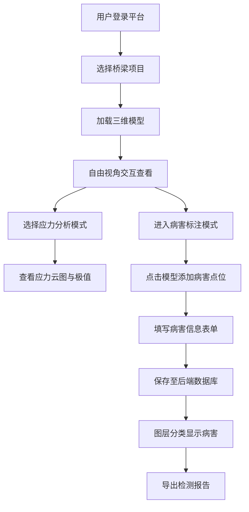

## 1. 产品概述

桥梁主体结构三维检测与病害标注3D交互平台，面向桥梁检测工程师与运维管理人员，提供基于WebGL的桥梁三维模型可视化、结构应力分析、病害点位标注与分层管理功能。通过对接后端桥梁检测数据库，实现检测数据的直观展示与高效管理。

- **核心目标**：将传统的二维检测报告升级为三维交互式平台，提升病害识别效率与决策准确性
- **目标用户**：桥梁检测工程师、结构分析师、运维管理人员

## 2. 核心功能

### 2.1 用户角色

| 角色 | 登录方式 | 核心权限 |
|------|----------|----------|
| 检测工程师 | 账号登录 | 模型查看、应力分析、病害标注、图层管理 |
| 管理员 | 账号登录 | 全部功能 + 用户管理、数据导出 |
| 访客 | 无需登录 | 模型查看、病害浏览（只读） |

### 2.2 功能模块

1. **三维模型加载模块**：支持多种3D格式桥梁模型导入、加载进度显示、模型属性查看
2. **结构应力计算模块**：应力云图渲染、应力极值标注、截面应力分析
3. **视角交互控制**：自由旋转、平移、缩放、预设视角快速切换
4. **后端检测数据接口**：检测数据CRUD、模型数据同步、历史版本管理
5. **病害图层管理模块**：病害点位标注、图层分类显示、病害详情查看、统计分析

### 2.3 页面详情

| 页面名称 | 模块名称 | 功能描述 |
|---------|----------|----------|
| 主工作台 | 3D视图区 | 桥梁三维模型渲染、交互操作、应力云图叠加 |
| 主工作台 | 左侧面板 | 图层管理器、模型树、预设视角列表 |
| 主工作台 | 右侧面板 | 属性查看器、病害标注表单、应力分析结果 |
| 主工作台 | 底部工具栏 | 视图控制、测量工具、截图导出 |
| 数据管理页 | 检测数据列表 | 检测记录查询、筛选、导入导出 |
| 数据管理页 | 病害统计面板 | 病害类型分布、严重程度统计、趋势分析 |

## 3. 核心流程

## 4. 用户界面设计

### 4.1 设计风格

- **主色调**：深科技蓝 (#0EA5E9) 作为主色，搭配琥珀橙 (#F59E0B) 用于应力高值警示
- **背景**：深色工业风 (#0F172A)，降低视觉疲劳，突出3D模型
- **按钮风格**：圆角8px，悬停时轻微上浮效果，激活状态发光边框
- **字体**：Space Grotesk 作为标题字体，Inter 作为正文字体
- **布局**：三栏式专业工作台布局，中央3D视图为主，两侧功能面板可折叠

### 4.2 页面设计概述

| 页面名称 | 模块名称 | UI元素 |
|---------|----------|--------|
| 主工作台 | 3D视图区 | 全画布WebGL渲染器，右上角视角立方体，左下角操作提示 |
| 主工作台 | 左侧面板 | 可折叠树状结构，图层开关带颜色标识，拖拽排序 |
| 主工作台 | 右侧面板 | 分段式信息卡片，表单标签页布局，数据可视化图表 |
| 主工作台 | 底部工具栏 | 图标按钮组，工具提示，快捷键提示 |
| 数据管理页 | 数据表格 | 斑马纹行，悬停高亮，批量操作复选框，分页器 |

### 4.3 响应式

- 桌面端优先设计，最小支持1280px宽度
- 平板端折叠侧面板为抽屉式，通过按钮唤起
- 移动端仅提供简化的模型查看功能

### 4.4 3D场景设计

- **环境**：深色渐变天空盒，柔光环境光 + 平行主光源
- **光照**：三光源布局，模拟专业检测照明，减少阴影干扰
- **相机**：透视相机，初始视角为45°等轴测视图
- **后期处理**：轻微泛光效果突出应力云图，FXAA抗锯齿
- **交互**：鼠标左键旋转、右键平移、滚轮缩放，双击模型自动居中
- **动画**：模型加载时淡入效果，应力云图切换时平滑过渡
