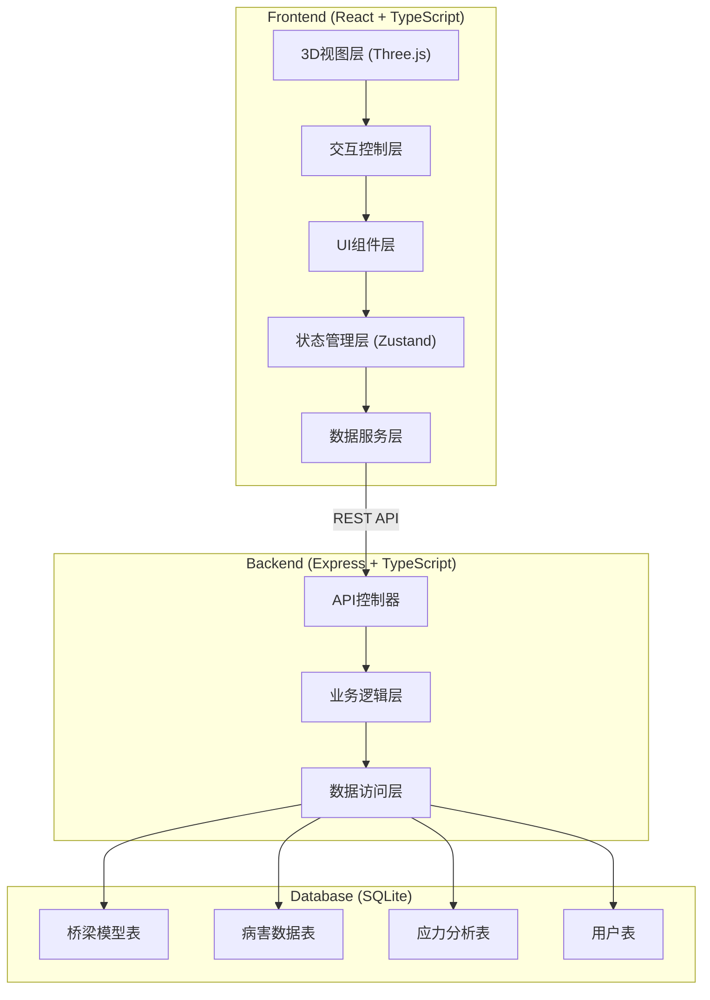
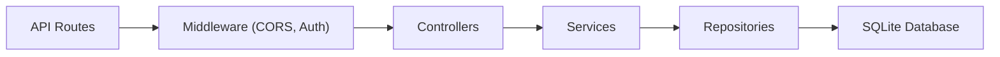
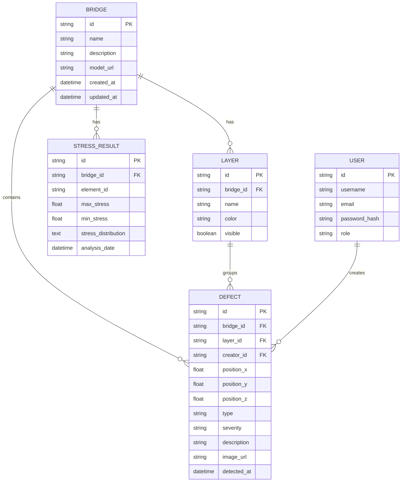

## 1. 架构设计



## 2. 技术描述

- **前端**: React@18 + TypeScript + Vite + TailwindCSS@3
- **3D渲染**: Three.js + @react-three/fiber + @react-three/drei + @react-three/postprocessing
- **状态管理**: Zustand
- **路由**: React Router DOM@6
- **图表可视化**: Recharts
- **后端**: Express@4 + TypeScript
- **数据库**: SQLite3 + better-sqlite3
- **API风格**: RESTful API
- **HTTP客户端**: Axios

## 3. 路由定义

| 路由 | 用途 |
|------|------|
| / | 主工作台 - 3D视图与交互 |
| /data-management | 检测数据管理页面 |
| /login | 用户登录页面 |

## 4. API 定义

```typescript
// 桥梁模型
interface BridgeModel {
  id: string;
  name: string;
  description: string;
  modelUrl: string;
  createdAt: string;
  updatedAt: string;
}

// 病害数据
interface DefectData {
  id: string;
  bridgeId: string;
  position: { x: number; y: number; z: number };
  type: 'crack' | 'corrosion' | 'deformation' | 'spalling';
  severity: 'low' | 'medium' | 'high' | 'critical';
  description: string;
  imageUrl?: string;
  detectedAt: string;
  layerId: string;
}

// 图层
interface Layer {
  id: string;
  name: string;
  color: string;
  visible: boolean;
  bridgeId: string;
}

// 应力分析结果
interface StressResult {
  id: string;
  bridgeId: string;
  elementId: string;
  maxStress: number;
  minStress: number;
  stressDistribution: number[];
  analysisDate: string;
}

// API Endpoints:
// GET    /api/bridges              - 获取桥梁列表
// GET    /api/bridges/:id          - 获取桥梁详情
// GET    /api/bridges/:id/defects  - 获取桥梁病害列表
// POST   /api/defects              - 新增病害
// PUT    /api/defects/:id          - 更新病害
// DELETE /api/defects/:id          - 删除病害
// GET    /api/bridges/:id/stress   - 获取应力分析结果
// GET    /api/bridges/:id/layers   - 获取图层列表
// POST   /api/layers               - 新增图层
// PUT    /api/layers/:id           - 更新图层
```

## 5. 服务端架构



## 6. 数据模型

### 6.1 ER图



### 6.2 DDL

```sql
CREATE TABLE bridges (
  id TEXT PRIMARY KEY,
  name TEXT NOT NULL,
  description TEXT,
  model_url TEXT NOT NULL,
  created_at DATETIME DEFAULT CURRENT_TIMESTAMP,
  updated_at DATETIME DEFAULT CURRENT_TIMESTAMP
);

CREATE TABLE layers (
  id TEXT PRIMARY KEY,
  bridge_id TEXT NOT NULL REFERENCES bridges(id),
  name TEXT NOT NULL,
  color TEXT NOT NULL,
  visible BOOLEAN DEFAULT 1,
  created_at DATETIME DEFAULT CURRENT_TIMESTAMP
);

CREATE TABLE users (
  id TEXT PRIMARY KEY,
  username TEXT UNIQUE NOT NULL,
  email TEXT UNIQUE NOT NULL,
  password_hash TEXT NOT NULL,
  role TEXT NOT NULL DEFAULT 'engineer',
  created_at DATETIME DEFAULT CURRENT_TIMESTAMP
);

CREATE TABLE defects (
  id TEXT PRIMARY KEY,
  bridge_id TEXT NOT NULL REFERENCES bridges(id),
  layer_id TEXT REFERENCES layers(id),
  creator_id TEXT REFERENCES users(id),
  position_x REAL NOT NULL,
  position_y REAL NOT NULL,
  position_z REAL NOT NULL,
  type TEXT NOT NULL,
  severity TEXT NOT NULL,
  description TEXT,
  image_url TEXT,
  detected_at DATETIME DEFAULT CURRENT_TIMESTAMP,
  created_at DATETIME DEFAULT CURRENT_TIMESTAMP
);

CREATE TABLE stress_results (
  id TEXT PRIMARY KEY,
  bridge_id TEXT NOT NULL REFERENCES bridges(id),
  element_id TEXT NOT NULL,
  max_stress REAL NOT NULL,
  min_stress REAL NOT NULL,
  stress_distribution TEXT NOT NULL,
  analysis_date DATETIME DEFAULT CURRENT_TIMESTAMP
);
```
