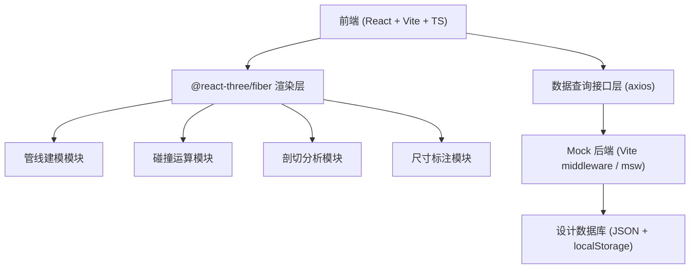
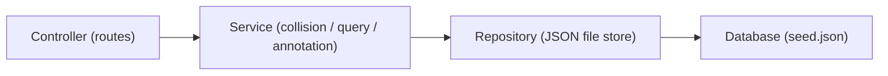
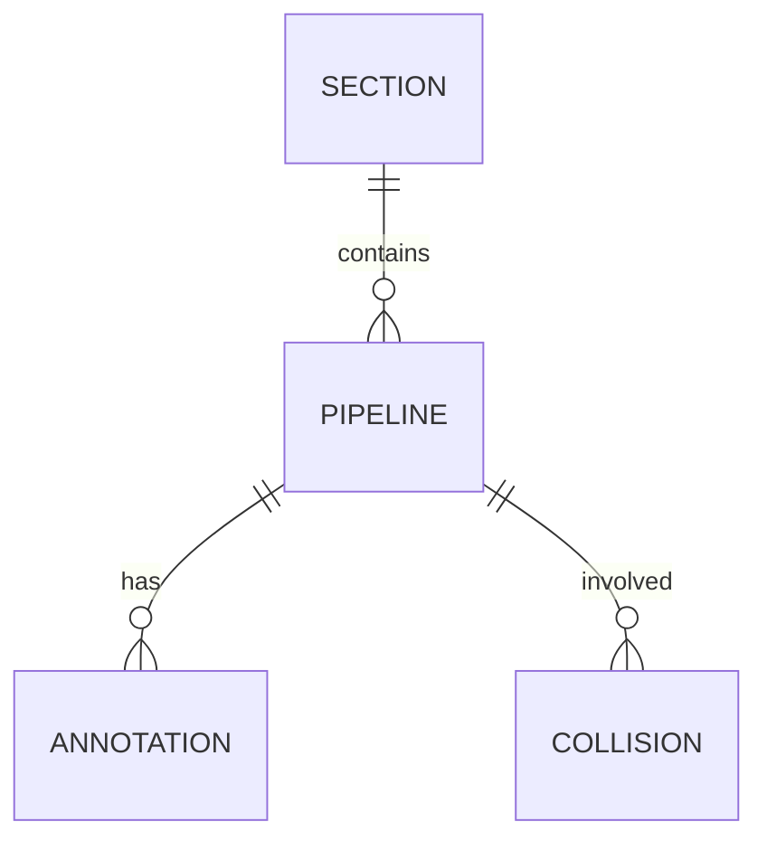

# 地下管廊管线布设三维碰撞检测可视化平台 - 技术架构

## 1. 架构设计


## 2. 技术说明
- 前端：React 18 + TypeScript + Vite 5
- 3D 引擎：three 0.160+、@react-three/fiber、@react-three/drei、@react-three/postprocessing
- 状态管理：zustand
- 样式：TailwindCSS 3
- HTTP：axios（对接 mock API）
- Mock 后端：Vite plugin middleware 提供 `/api/*` 接口
- 数据：JSON 种子数据 + 内存索引

## 3. 路由定义
| 路由 | 用途 |
|------|------|
| / | 三维主场景（建模/剖切/标注/碰撞检测一体化） |
| /query | 设计数据查询页面 |
| /reports | 碰撞报告列表 |

## 4. API 定义
```typescript
// GET /api/pipelines?type=&section=
interface Pipeline { id: string; code: string; type: PipelineType; material: string; diameter: number; startPoint: [number,number,number]; endPoint: [number,number,number]; elevation: number; depth: number; pressure: number; installedAt: string; }

// GET /api/pipelines/:id
// GET /api/sections
interface Section { id: string; name: string; length: number; }

// POST /api/collision/detect
// Body: { pipelineIds: string[]; threshold: number; }
// Response: { conflicts: Collision[]; }
interface Collision { id: string; a: string; b: string; point: [number,number,number]; distance: number; level: 'warning' | 'danger'; }

// POST /api/annotations
interface Annotation { id: string; type: 'distance'|'diameter'|'elevation'; points: [number,number,number][]; value: number; unit: string; }
```

## 5. 服务端架构


## 6. 数据模型
### 6.1 实体关系


### 6.2 数据结构
```json
{
  "sections": [{"id":"s1","name":"K0+000 ~ K0+100","length":100}],
  "pipelines": [
    {"id":"p1","code":"WS-001","type":"water_supply","material":"PE","diameter":300,
     "startPoint":[0,1.2,-5],"endPoint":[100,1.2,-5],"elevation":-2.5,"depth":2.5,
     "pressure":0.8,"installedAt":"2024-06-01","sectionId":"s1"}
  ]
}
```
