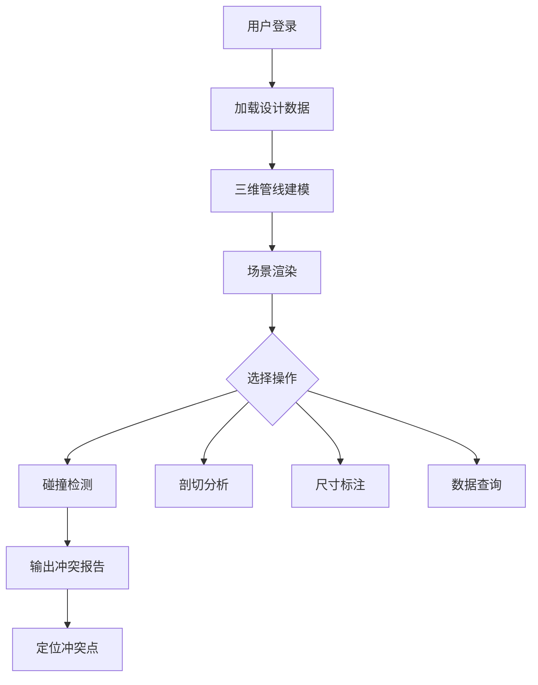

# 地下管廊管线布设三维碰撞检测可视化平台 - 产品需求文档 (PRD)

## 1. 产品概述
面向城市地下综合管廊的设计与运维人员，提供基于 Web 的三维管线可视化、碰撞检测与剖切分析平台。
- 核心解决管线三维建模、空间冲突自动检测、任意位置剖切查看、尺寸测量、设计数据查询五大核心问题。
- 价值：降低设计返工率，辅助运维检修，提升地下管网数字化管理水平。

## 2. 核心功能

### 2.1 用户角色
| 角色 | 注册方式 | 核心权限 |
|------|----------|----------|
| 设计工程师 | 账号登录 | 管线建模、碰撞检测、剖切分析、尺寸标注、数据查询 |
| 运维人员 | 账号登录 | 查看模型、查询数据、导出报告 |
| 系统管理员 | 后台创建 | 账号管理、数据维护 |

### 2.2 功能模块
1. **主页（3D 场景）**: 三维管廊场景、管线模型渲染、工具栏、状态栏。
2. **管线建模模块**: 基于设计数据批量/手工生成管线，支持电力/给水/排水/燃气/通信等类型。
3. **碰撞检测模块**: 自动计算管线间空间距离，高亮冲突点，输出冲突报告。
4. **剖切分析模块**: 支持任意平面（X/Y/Z/自定义方向）剖切，观察管线内部结构。
5. **尺寸标注模块**: 点选测量两点距离、管线直径、相对标高。
6. **数据查询模块**: 按管线编号/类型/区段查询设计数据，显示属性面板。

### 2.3 页面详情
| 页面名称 | 模块名称 | 功能描述 |
|----------|----------|----------|
| 三维主场景 | 管线模型渲染 | 基于 three.js 渲染管廊墙体、支架、管线、阀门、检查井 |
| 三维主场景 | 工具栏 | 建模、剖切、标注、测量、碰撞检测按钮 |
| 三维主场景 | 属性面板 | 显示被选中对象的设计属性（编号、类型、材质、标高、埋深等） |
| 三维主场景 | 状态栏 | 显示坐标、FPS、碰撞数量、当前剖切位置 |
| 碰撞检测结果 | 冲突列表 | 列出所有冲突，点击定位到三维视图 |
| 数据查询 | 管线查询 | 按多条件过滤并在场景中高亮 |

## 3. 核心流程
用户登录进入主场景 → 加载设计数据 → 系统自动生成管线模型 → 可执行碰撞检测（自动/手动）→ 点击冲突条目定位 → 使用剖切工具查看横断面 → 使用标注工具测量尺寸 → 调用查询接口查看设计详情。

## 4. 用户界面设计

### 4.1 设计风格
- 主色：深钢蓝 `#0b1e3f`，辅色：科技青 `#00d4ff`、警告橙 `#ff8a00`、冲突红 `#ff3b3b`
- 按钮样式：圆角 6px、带图标、悬停发光
- 字体：标题使用 `Orbitron`（科技感），正文使用 `HarmonyOS Sans` / `PingFang SC`
- 布局：顶部工具栏 + 左侧树状目录 + 中央 3D 画布 + 右侧属性面板 + 底部状态栏
- 图标风格：线条几何、单色科技感

### 4.2 页面设计概览
| 页面 | 模块 | UI 元素 |
|------|------|---------|
| 三维主场景 | 工具栏 | 图标按钮、分段器、下拉菜单 |
| 三维主场景 | 3D 画布 | 全尺寸 Canvas、网格辅助、轨道控制器 |
| 三维主场景 | 属性面板 | 卡片化布局、标签 + 值、颜色徽标 |
| 碰撞结果 | 列表 | 表格、状态徽标、点击联动 |

### 4.3 响应式
桌面优先，兼容 1280px 以上；侧边栏可折叠，工具栏在窄屏自动换行。

### 4.4 3D 场景指引
- 环境：深色地下感背景，带微弱蓝色雾效
- 光照：主方向光 + 环境光 + 点光源模拟管廊灯具
- 相机：透视相机，近 0.1 远 5000，初始俯视 45°
- 交互：轨道控制、鼠标悬停高亮、点击选中
- 后期：抗锯齿、SSAO（可选）、轻微辉光
- 性能预算：单场景三角面 ≤ 200 万
