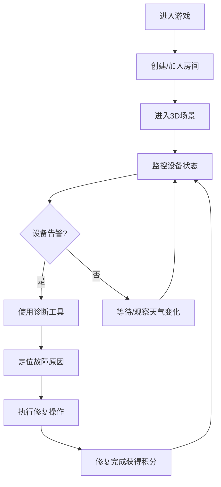

## 1. 产品概述

山地野外气象站设备运维模拟仿真游戏，玩家扮演气象设备运维工程师，在虚拟山地环境中监测和修复受恶劣天气影响的气象设备。游戏模拟风雨、霜冻、雷电等极端天气对设备的侵蚀和损坏，玩家需要实时监控设备状态、排查故障原因并执行修复操作。支持局域网多人联机协作，提升运维团队协作能力。

## 2. 核心功能

### 2.1 用户角色

| 角色 | 加入方式 | 核心权限 |
|------|----------|----------|
| 玩家 | 输入昵称加入游戏 | 查看设备状态、执行故障排查、修复设备、完成任务 |
| 主机玩家 | 创建房间 | 管理游戏房间、调整环境参数、发起任务 |

### 2.2 功能模块

1. **游戏主界面**：3D山地场景渲染、气象设备展示、天气效果模拟
2. **设备监控面板**：设备状态实时显示、故障告警、参数曲线
3. **故障排查系统**：故障诊断工具、检测流程、原因分析
4. **任务进度模块**：任务列表、完成度统计、团队协作追踪
5. **多人联机系统**：房间管理、玩家状态同步、协作修复

### 2.3 页面详情

| 页面名称 | 模块名称 | 功能描述 |
|-----------|-------------|---------------------|
| 主菜单 | 房间管理 | 创建/加入房间、昵称设置、游戏说明 |
| 游戏主场景 | 3D渲染 | 山地环境、气象站设备、天气特效 |
| 设备监控 | 状态面板 | 多设备状态总览、告警提示、数据图表 |
| 故障排查 | 诊断工具 | 检测按钮、故障定位、修复指南 |
| 任务中心 | 进度追踪 | 任务列表、完成统计、奖励系统 |

## 3. 核心流程

玩家进入游戏后，首先创建或加入游戏房间。进入场景后可以看到山地环境中的气象站设备，天气系统实时模拟风雨、霜冻等环境变化。设备会随着时间和天气影响产生不同类型的故障，玩家需要通过监控面板发现告警，使用诊断工具排查故障原因，然后执行修复操作。完成任务获得积分，多人模式下玩家可以分工协作。

## 4. 用户界面设计

### 4.1 设计风格

- **主色调**：深灰蓝(#1a2332)作为主背景，配合科技蓝(#2196f3)作为主题色，警示红(#f44336)用于故障告警
- **辅助色**：成功绿(#4caf50)、警告黄(#ff9800)、信息蓝(#03a9f4)
- **按钮风格**：扁平化带轻微阴影，圆角4px，悬停时颜色加深并上浮
- **字体**：主字体使用 JetBrains Mono（等宽科技感），标题使用 Orbitron（未来感）
- **布局风格**：面板式布局，左侧设备列表，中间3D场景，右侧监控数据
- **图标风格**：线性图标，使用 Lucide React 图标库

### 4.2 页面设计概述

| 页面名称 | 模块名称 | UI元素 |
|-----------|-------------|-------------|
| 主菜单 | 房间管理 | 玻璃拟态卡片、渐变按钮、粒子背景动画 |
| 游戏主场景 | 3D渲染 | 山地地形、气象站模型、动态天气粒子、光晕效果 |
| 设备监控 | 状态面板 | 数据卡片、状态指示灯、实时曲线图、告警通知条 |
| 故障排查 | 诊断工具 | 工具选择栏、检测进度条、故障分析面板、修复按钮 |
| 任务中心 | 进度追踪 | 任务列表卡片、进度条、积分显示、成就徽章 |

### 4.3 响应式

桌面端优先设计，支持1080p及以上分辨率。面板布局支持拖拽调整，关键数据面板可折叠。

### 4.4 3D场景指导

- **环境**：山地地形，有草坡、岩石、小路，使用雾效营造山地氛围
- **光照**：动态光照系统，根据天气变化调整光照强度和颜色
- **相机**：第三人称视角，可围绕设备旋转缩放，支持第一人称切换
- **交互元素**：可点击的气象设备，高亮显示故障设备
- **动画**：风扇旋转、风向标转动、雨滴粒子、雪花飘落、霜冻覆盖效果
- **后期处理**：泛光、景深、色彩校正，增强沉浸感
