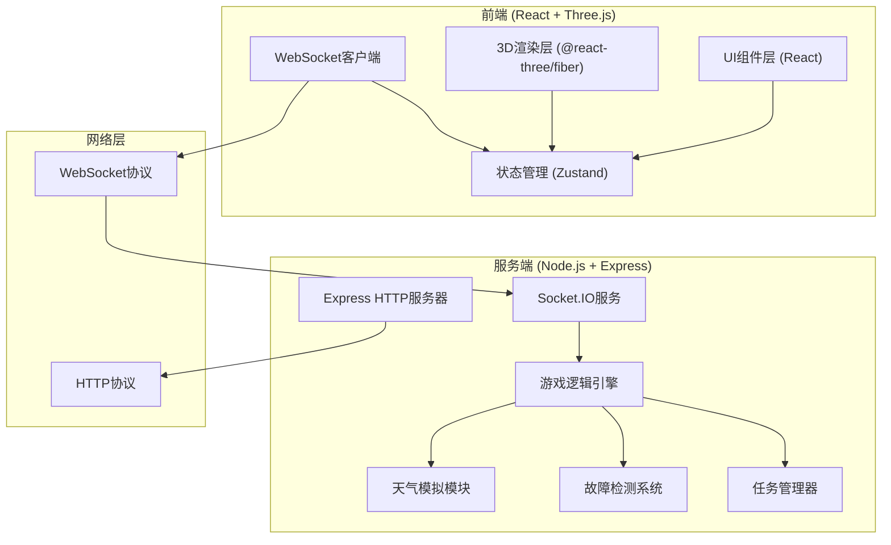
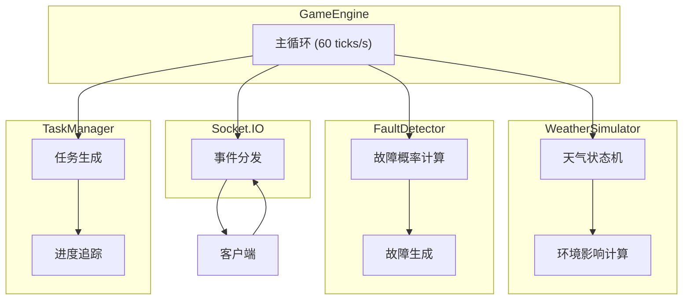
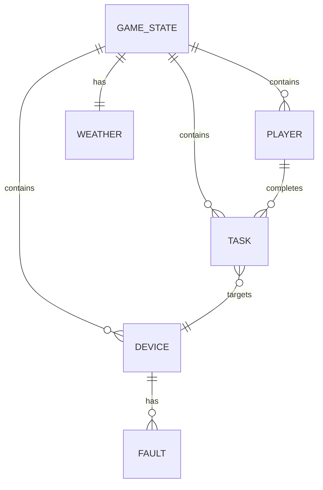

## 1. 架构设计



## 2. 技术描述

- **前端**：React@18 + TypeScript + Vite + TailwindCSS@3
- **3D渲染**：three.js + @react-three/fiber + @react-three/drei + @react-three/postprocessing
- **状态管理**：zustand
- **后端**：Express@4 + TypeScript
- **实时通信**：Socket.IO
- **图标**：lucide-react

## 3. 目录结构

```
e:\trae2\70
├── src/                          # 前端代码
│   ├── components/              # React组件
│   │   ├── ui/                  # 基础UI组件
│   │   ├── game/                # 游戏相关组件
│   │   ├── panels/              # 面板组件
│   │   └── three/               # 3D组件
│   ├── pages/                   # 页面
│   ├── hooks/                   # React Hooks
│   ├── store/                   # Zustand状态
│   ├── utils/                   # 工具函数
│   ├── types/                   # 类型定义
│   └── App.tsx
├── server/                      # 服务端代码
│   ├── game/                    # 游戏逻辑
│   │   ├── WeatherSimulator.ts  # 天气模拟器
│   │   ├── FaultDetector.ts     # 故障检测器
│   │   ├── TaskManager.ts       # 任务管理器
│   │   └── GameEngine.ts        # 游戏引擎
│   ├── types/                   # 共享类型
│   ├── socket.ts                # Socket.IO处理
│   └── server.ts                # 服务器入口
├── shared/                      # 前后端共享
│   └── types.ts
├── .trae/documents/            # 项目文档
├── package.json
├── vite.config.ts
├── tsconfig.json
└── tailwind.config.js
```

## 4. 路由定义

| 路由 | 页面用途 |
|-------|---------|
| / | 主菜单页面 |
| /game | 游戏主场景 |
| /lobby | 房间大厅 |

## 5. API 定义

### 5.1 共享类型定义

```typescript
// 天气类型
export type WeatherType = 'sunny' | 'cloudy' | 'rainy' | 'stormy' | 'snowy' | 'frosty';

// 设备类型
export type DeviceType = 'anemometer' | 'wind_vane' | 'thermometer' | 'hygrometer' | 'barometer' | 'rain_gauge';

// 故障类型
export type FaultType = 'sensor_drift' | 'connection_loss' | 'power_failure' | 'mechanical_jam' | 'icing' | 'water_damage';

// 设备状态
export interface Device {
  id: string;
  type: DeviceType;
  name: string;
  status: 'normal' | 'warning' | 'fault' | 'repairing';
  health: number;
  value: number;
  position: [number, number, number];
  faults: FaultType[];
}

// 玩家信息
export interface Player {
  id: string;
  name: string;
  score: number;
  isHost: boolean;
  currentTask: string | null;
}

// 任务信息
export interface Task {
  id: string;
  type: 'repair' | 'inspect' | 'calibrate';
  targetDeviceId: string;
  description: string;
  reward: number;
  progress: number;
  assignedPlayerId: string | null;
  completed: boolean;
}

// 游戏状态
export interface GameState {
  weather: WeatherType;
  weatherIntensity: number;
  timeOfDay: number;
  devices: Device[];
  players: Player[];
  tasks: Task[];
  gameTime: number;
}
```

### 5.2 Socket.IO 事件

**客户端 → 服务端**
- `join_room`: 加入房间
- `leave_room`: 离开房间
- `start_diagnosis`: 开始诊断设备
- `perform_repair`: 执行修复操作
- `accept_task`: 接受任务
- `complete_task`: 完成任务

**服务端 → 客户端**
- `game_state_update`: 游戏状态更新
- `device_fault`: 设备故障通知
- `weather_change`: 天气变化通知
- `task_assigned`: 任务分配
- `player_joined`: 玩家加入
- `player_left`: 玩家离开
- `score_update`: 分数更新

## 6. 服务端架构



## 7. 数据模型

### 7.1 核心数据模型



### 7.2 游戏状态数据结构

```typescript
// 游戏引擎配置
export interface GameConfig {
  tickRate: number;
  weatherChangeProbability: number;
  faultBaseProbability: number;
  weatherFaultMultiplier: Record<WeatherType, number>;
}

// 天气配置
export const WEATHER_CONFIG: Record<WeatherType, {
  name: string;
  color: string;
  faultMultiplier: number;
  healthDecayRate: number;
}> = {
  sunny: { name: '晴朗', color: '#87CEEB', faultMultiplier: 0.5, healthDecayRate: 0.1 },
  cloudy: { name: '多云', color: '#708090', faultMultiplier: 0.8, healthDecayRate: 0.2 },
  rainy: { name: '雨天', color: '#4A5568', faultMultiplier: 1.5, healthDecayRate: 0.5 },
  stormy: { name: '暴风雨', color: '#2D3748', faultMultiplier: 2.5, healthDecayRate: 1.0 },
  snowy: { name: '下雪', color: '#E2E8F0', faultMultiplier: 1.8, healthDecayRate: 0.7 },
  frosty: { name: '霜冻', color: '#A0AEC0', faultMultiplier: 2.0, healthDecayRate: 0.8 },
};
```
