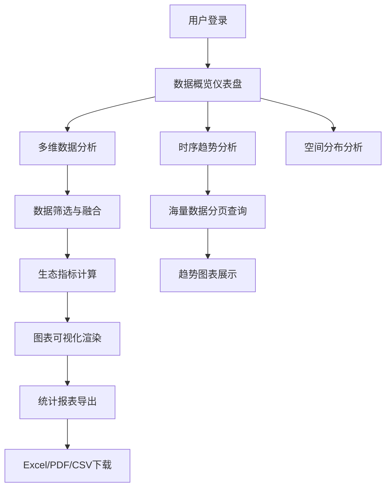

## 1. 产品概述

湖泊水生态浮游生物监测数据分析可视化系统，面向水环境监测人员、科研人员和管理者，提供浮游生物种群数据与环境因子的综合分析能力。通过对接后端监测服务，实现多源数据融合、生态指标计算、多维图表可视化和统计报表导出，支持海量历史数据的高效查询与分析。

- 解决湖泊水生态监测数据分散、分析效率低的问题
- 为水环境评估和决策提供数据支撑

## 2. 核心功能

### 2.1 用户角色

| 角色 | 注册方式 | 核心权限 |
|------|----------|----------|
| 监测人员 | 账号登录 | 数据查询、图表浏览、报表导出 |
| 科研人员 | 账号登录 | 高级分析、指标计算、自定义查询 |
| 管理员 | 账号登录 | 系统配置、用户管理、数据管理 |

### 2.2 功能模块

1. **数据概览仪表盘**：关键指标卡片、实时监测状态、数据分布概览
2. **多维数据分析**：种群密度分析、营养盐关联分析、水温影响分析
3. **时序趋势分析**：历史数据趋势、季节变化对比、异常检测
4. **空间分布分析**：监测点位分布、区域差异对比
5. **统计报表中心**：自定义报表、模板导出、批量下载

### 2.3 页面详情

| 页面名称 | 模块名称 | 功能描述 |
|---------|---------|----------|
| 数据概览 | 指标卡片 | 显示种群密度、营养盐浓度、水温等关键指标 |
| 数据概览 | 数据接入状态 | 显示各监测点位数据接入状态和更新时间 |
| 多维分析 | 数据筛选器 | 支持按时间、点位、物种、指标等多维度筛选 |
| 多维分析 | 种群密度图表 | 柱状图、饼图展示不同物种密度分布 |
| 多维分析 | 关联分析散点图 | 展示浮游生物密度与营养盐、水温的相关性 |
| 时序趋势 | 趋势折线图 | 展示指标随时间变化趋势，支持多指标对比 |
| 时序趋势 | 分页查询 | 支持海量历史数据分页加载和查询 |
| 空间分布 | 点位地图 | 展示监测点位空间分布和数据热力 |
| 报表中心 | 报表生成 | 支持自定义选择指标和时间范围生成报表 |
| 报表中心 | 导出功能 | 支持Excel、PDF、CSV等多格式导出 |

## 3. 核心流程

用户登录系统后，首先查看数据概览仪表盘了解整体监测情况。可进入多维分析页面，通过筛选器选择关注的时间范围、监测点位和指标类型，系统自动融合多源数据并计算生态指标，通过多种图表形式展示分析结果。用户可切换到时序趋势页面查看历史变化趋势，或进入空间分布页面了解区域差异。分析完成后，可在报表中心选择所需指标和格式，生成并导出统计报表。

## 4. 用户界面设计

### 4.1 设计风格
- **主色调**：深海蓝 (#1e3a5f) - 体现水环境监测的专业性
- **辅助色**：水绿色 (#2dd4bf)、浅蓝 (#60a5fa) - 呼应水生态主题
- **强调色**：橙红 (#f97316) - 用于异常数据警示
- **按钮风格**：圆角设计，轻微阴影，悬停时有浮起效果
- **字体**：中文使用 Noto Sans SC，英文使用 Inter，清晰易读
- **布局风格**：卡片式布局，顶部导航，侧边栏功能菜单
- **图标风格**：线性图标，统一24px尺寸，颜色与主题一致

### 4.2 页面设计概览

| 页面名称 | 模块名称 | UI元素 |
|---------|---------|--------|
| 数据概览 | 指标卡片 | 渐变背景，数字动画，图标装饰，悬停放大效果 |
| 数据概览 | 状态面板 | 进度条，状态指示灯，最后更新时间 |
| 多维分析 | 筛选器栏 | 下拉选择，日期范围选择器，应用/重置按钮 |
| 多维分析 | 图表区域 | 网格布局，图表标题栏，图例交互，数据提示框 |
| 时序趋势 | 分页控制 | 页码导航，每页条数选择，跳转输入框 |
| 报表中心 | 导出面板 | 格式选择，指标复选框，预览按钮，下载按钮 |

### 4.3 响应式设计
- **桌面优先**：针对1920px宽度优化，采用12列网格布局
- **平板适配**：1024px以下侧边栏收起，图表单列展示
- **移动端**：768px以下顶部导航折叠，卡片垂直堆叠，优化触摸交互

### 4.4 数据可视化设计
- **图表库**：ECharts 5.x，支持丰富的交互效果
- **配色方案**：使用渐变色彩增强视觉层次，支持色盲友好模式
- **动画效果**：数据加载时的渐进式动画，图表切换的平滑过渡
- **交互特性**：缩放、拖拽、数据筛选、图例开关、数据导出
