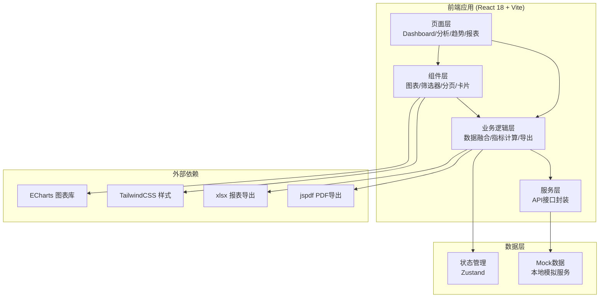
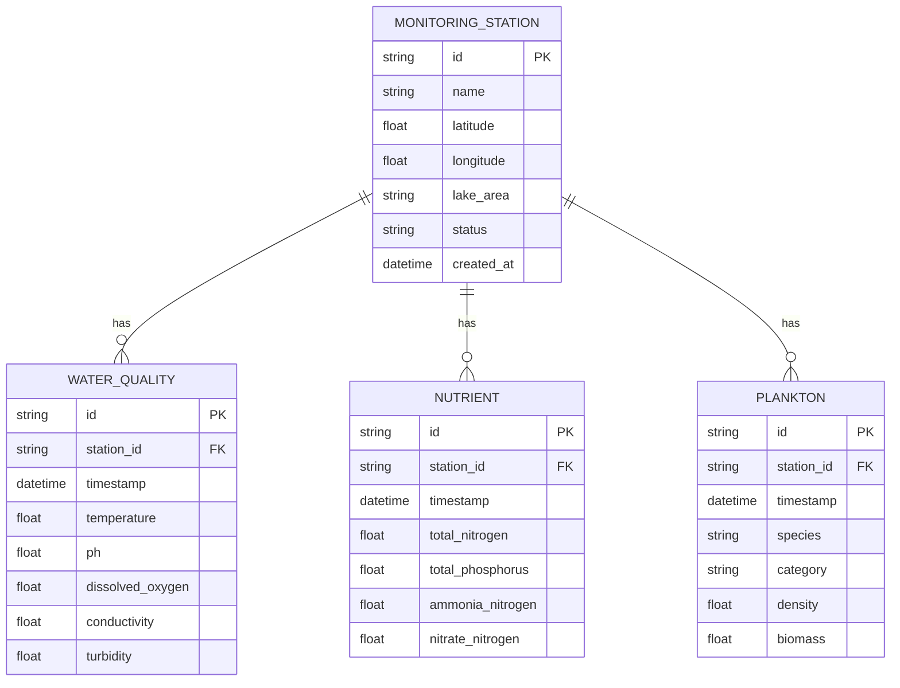

## 1. 架构设计



## 2. 技术描述

- **前端框架**: React@18 + TypeScript@5
- **构建工具**: Vite@5
- **样式方案**: TailwindCSS@3 + PostCSS
- **状态管理**: Zustand@4 (轻量级状态管理)
- **图表库**: ECharts@5
- **路由**: React Router@6
- **UI组件**: 自定义组件 + Lucide React图标
- **报表导出**: xlsx + jspdf
- **日期处理**: dayjs
- **后端对接**: Axios + TypeScript类型定义
- **Mock数据**: 本地JSON模拟 + MSW (可选)

## 3. 目录结构

```
src/
├── api/                    # 数据接入接口层
│   ├── index.ts           # API入口
│   ├── monitoring.ts      # 监测数据接口
│   ├── plankton.ts        # 浮游生物数据接口
│   └── types.ts           # API类型定义
├── services/               # 业务服务层
│   ├── dataFusion.ts      # 多维度数据融合
│   ├── ecoIndex.ts        # 生态指标计算
│   └── reportExport.ts    # 统计报表导出
├── components/             # 组件层
│   ├── charts/            # 图表组件
│   │   ├── BarChart.tsx
│   │   ├── LineChart.tsx
│   │   ├── PieChart.tsx
│   │   ├── ScatterChart.tsx
│   │   └── index.ts
│   ├── common/            # 通用组件
│   │   ├── DataCard.tsx
│   │   ├── FilterBar.tsx
│   │   ├── Pagination.tsx
│   │   └── StatusBadge.tsx
│   └── layout/            # 布局组件
│       ├── Header.tsx
│       ├── Sidebar.tsx
│       └── MainLayout.tsx
├── pages/                  # 页面层
│   ├── Dashboard.tsx      # 数据概览
│   ├── MultiAnalysis.tsx  # 多维数据分析
│   ├── TrendAnalysis.tsx  # 时序趋势分析
│   ├── SpatialMap.tsx     # 空间分布
│   └── ReportCenter.tsx   # 报表中心
├── store/                  # 状态管理
│   ├── useDataStore.ts
│   └── useFilterStore.ts
├── types/                  # 类型定义
│   ├── index.ts
│   ├── monitoring.ts
│   └── plankton.ts
├── utils/                  # 工具函数
│   ├── format.ts
│   └── validate.ts
├── mock/                   # Mock数据
│   ├── monitoringData.ts
│   ├── planktonData.ts
│   └── stations.ts
├── App.tsx
├── main.tsx
└── index.css
```

## 4. 路由定义

| 路由 | 页面名称 | 用途 |
|------|---------|------|
| / | 数据概览仪表盘 | 展示关键指标和数据概览 |
| /analysis | 多维数据分析 | 种群密度、营养盐、水温多维分析 |
| /trend | 时序趋势分析 | 历史数据趋势、分页查询 |
| /spatial | 空间分布分析 | 监测点位分布、区域对比 |
| /report | 报表中心 | 报表生成与导出 |

## 5. API接口定义

### 5.1 监测数据接口

```typescript
// 监测点位信息
interface MonitoringStation {
  id: string;
  name: string;
  location: { lat: number; lng: number };
  lakeArea: string;
  status: 'online' | 'offline' | 'maintenance';
  lastUpdate: string;
}

// 水质监测数据
interface WaterQualityData {
  id: string;
  stationId: string;
  timestamp: string;
  temperature: number;      // 水温 (°C)
  ph: number;              // pH值
  dissolvedOxygen: number; // 溶解氧 (mg/L)
  conductivity: number;    // 电导率 (μS/cm)
  turbidity: number;       // 浊度 (NTU)
}

// 营养盐数据
interface NutrientData {
  id: string;
  stationId: string;
  timestamp: string;
  totalNitrogen: number;   // 总氮 (mg/L)
  totalPhosphorus: number; // 总磷 (mg/L)
  ammoniaNitrogen: number; // 氨氮 (mg/L)
  nitrateNitrogen: number; // 硝酸盐氮 (mg/L)
}

// 浮游生物数据
interface PlanktonData {
  id: string;
  stationId: string;
  timestamp: string;
  species: string;         // 物种名称
  category: 'phytoplankton' | 'zooplankton'; // 类别
  density: number;         // 密度 (cells/L or ind/L)
  biomass: number;         // 生物量 (mg/L)
}

// 分页查询参数
interface PaginationParams {
  page: number;
  pageSize: number;
  startTime?: string;
  endTime?: string;
  stationId?: string;
}

// 分页响应
interface PaginatedResponse<T> {
  data: T[];
  total: number;
  page: number;
  pageSize: number;
  totalPages: number;
}
```

### 5.2 API方法

```typescript
// 获取监测点位列表
getStations(): Promise<MonitoringStation[]>

// 获取水质数据（分页）
getWaterQualityData(params: PaginationParams): Promise<PaginatedResponse<WaterQualityData>>

// 获取营养盐数据（分页）
getNutrientData(params: PaginationParams): Promise<PaginatedResponse<NutrientData>>

// 获取浮游生物数据（分页）
getPlanktonData(params: PaginationParams): Promise<PaginatedResponse<PlanktonData>>

// 获取融合后的监测数据
getFusedMonitoringData(params: PaginationParams): Promise<PaginatedResponse<FusedData>>

// 批量导出数据
exportMonitoringData(params: ExportParams): Promise<Blob>
```

## 6. 数据模型

### 6.1 数据模型关系图



### 6.2 核心数据模型定义

```typescript
// 融合后的数据模型
interface FusedMonitoringData {
  stationId: string;
  stationName: string;
  timestamp: string;
  waterQuality: WaterQualityData;
  nutrient: NutrientData;
  plankton: PlanktonData[];
}

// 生态指标计算结果
interface EcoIndexResult {
  stationId: string;
  period: { start: string; end: string };
  
  // 浮游生物多样性指数
  shannonIndex: number;      // Shannon-Wiener多样性指数
  simpsonIndex: number;      // Simpson多样性指数
  evennessIndex: number;     // Pielou均匀度指数
  margalefIndex: number;     // Margalef丰富度指数
  
  // 营养状态指数
  trophicLevelIndex: number; // 综合营养状态指数
  trophicLevel: 'oligotrophic' | 'mesotrophic' | 'eutrophic' | 'hypertrophic';
  
  // 水质评价
  waterQualityLevel: 'excellent' | 'good' | 'moderate' | 'poor' | 'bad';
  
  // 浮游生物密度统计
  totalPhytoplanktonDensity: number;
  totalZooplanktonDensity: number;
  dominantSpecies: string[];
}

// 报表配置
interface ReportConfig {
  title: string;
  period: { start: string; end: string };
  stations: string[];
  indicators: {
    waterQuality: boolean;
    nutrients: boolean;
    plankton: boolean;
    ecoIndex: boolean;
  };
  format: 'excel' | 'pdf' | 'csv';
  includeCharts: boolean;
}
```

## 7. 核心模块说明

### 7.1 监测数据接入接口模块
- 文件位置: `src/api/`
- 封装所有后端API调用
- 统一处理请求/响应拦截
- 提供TypeScript类型安全
- 支持Mock数据切换

### 7.2 多维度数据融合模块
- 文件位置: `src/services/dataFusion.ts`
- 按时间戳和监测点融合多源数据
- 处理数据缺失和异常值
- 提供数据清洗和标准化功能
- 支持异步数据流处理

### 7.3 生态指标计算模块
- 文件位置: `src/services/ecoIndex.ts`
- 计算Shannon-Wiener等多样性指数
- 计算综合营养状态指数
- 水质等级评价
- 优势物种分析

### 7.4 多维图表渲染模块
- 文件位置: `src/components/charts/`
- 封装ECharts常用图表
- 支持响应式布局
- 提供统一的交互接口
- 支持图表主题切换

### 7.5 统计报表导出模块
- 文件位置: `src/services/reportExport.ts`
- 支持Excel、PDF、CSV格式
- 可配置报表模板
- 支持批量数据导出
- 包含图表导出功能
