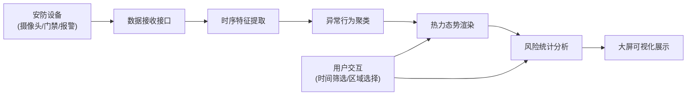

## 1. 产品概述

城市综合安防点位运行时序分析可视化平台，面向城市安防管理部门，提供多源安防设备数据接入、时序特征分析、异常行为检测、热力态势感知和风险统计研判的一体化大屏展示系统。

- 解决城市安防数据分散、异常发现滞后、态势感知不直观的问题
- 实现摄像头、门禁、报警设备等多源数据的统一接入与智能分析
- 为应急指挥、日常防控提供数据支撑和决策依据

## 2. 核心功能

### 2.1 用户角色

| 角色 | 注册方式 | 核心权限 |
|------|----------|----------|
| 指挥中心管理员 | 系统账号登录 | 大屏监控、数据查询、风险研判、系统配置 |
| 安防值班人员 | 系统账号登录 | 实时监控、异常告警查看、事件上报 |

### 2.2 功能模块

1. **实时监控大屏**：综合态势总览、热力图渲染、设备状态监控
2. **时序分析面板**：多维度时序图表、特征提取展示、趋势预测
3. **异常检测中心**：异常聚类分析、告警事件列表、异常轨迹追踪
4. **风险统计报表**：风险时段统计、设备健康度分析、区域风险评估

### 2.3 页面详情

| 页面名称 | 模块名称 | 功能描述 |
|----------|----------|----------|
| 监控大屏主页 | 态势总览区 | 实时设备在线率、告警统计、关键指标KPI展示 |
| 监控大屏主页 | 热力态势图 | 区域人流/告警密度热力渲染，支持时间轴回放 |
| 监控大屏主页 | 实时数据流 | 摄像头、门禁、报警设备实时数据滚动展示 |
| 时序分析页 | 时序图表 | 多设备数据叠加展示、时间范围选择、特征标注 |
| 时序分析页 | 特征提取 | 峰值检测、波动率、周期性特征可视化展示 |
| 异常检测页 | 聚类分析 | 异常事件聚类结果可视化、异常模式识别 |
| 异常检测页 | 告警列表 | 实时告警推送、级别筛选、处置状态跟踪 |
| 风险统计页 | 时段统计 | 24小时风险分布、高峰时段识别、历史同比 |
| 风险统计页 | 区域评估 | 各辖区风险评分、趋势对比、风险预测 |

## 3. 核心流程

**数据处理流程说明：**
1. 多源安防设备通过HTTP/WebSocket实时推送时序数据
2. 数据接收接口进行数据清洗、格式统一和持久化存储
3. 时序特征提取模块计算统计特征、频域特征和时域特征
4. 异常聚类模块基于DBSCAN算法识别异常模式和事件聚类
5. 热力态势图模块将数据密度映射为可视化热力图层
6. 风险统计模块进行多维度聚合分析和风险评级
7. 大屏展示层整合所有分析结果进行综合可视化呈现

## 4. 用户界面设计

### 4.1 设计风格

- **主色调**：深空蓝 #0a1628，营造专业科技感
- **辅助色**：科技青 #00d4ff，用于数据高亮和交互元素
- **告警色**：危险红 #ff4757、警告橙 #ffa502、正常绿 #2ed573
- **背景**：深色渐变背景配合科技网格纹理，适合大屏长时间观看
- **字体**：数字展示使用等宽字体，增强科技感；标题使用粗体无衬线字体
- **布局**：网格化布局，模块间有清晰的分割线和呼吸空间
- **动效**：数据流式滚动、热力图呼吸动效、告警闪烁提示

### 4.2 页面设计概述

| 页面名称 | 模块名称 | UI元素 |
|----------|----------|--------|
| 监控大屏 | 顶部状态栏 | 系统标题、当前时间、在线设备数、天气信息、3D边框装饰 |
| 监控大屏 | 左侧面板 | 设备类型分布、实时告警列表、滚动数据窗口 |
| 监控大屏 | 中央区域 | 城市地图热力图、动态数据点、区域边界高亮 |
| 监控大屏 | 右侧面板 | 时序趋势图、风险等级雷达图、TOP5风险区域 |
| 监控大屏 | 底部面板 | 24小时风险曲线、设备健康度进度条 |
| 时序分析 | 图表区 | ECharts折线图/面积图、多Y轴展示、特征标注线 |
| 时序分析 | 特征面板 | 特征卡片网格、数值动画、趋势箭头 |
| 异常检测 | 聚类图 | 散点图聚类可视化、不同颜色区分异常类型 |
| 风险统计 | 报表区 | 热力日历图、时段柱状图、区域排名柱状图 |

### 4.3 大屏适配

- 基础分辨率：1920×1080，支持2K/4K大屏自适应
- 响应式设计：使用rem/vw单位，按屏幕宽度等比缩放
- 字体优化：大屏远距离观看，最小字号不小于14px，数字字体加粗
- 色彩优化：高对比度配色，避免低饱和度色彩，确保远距离可读性
- 刷新率：关键数据区域5秒刷新，非关键区域30秒刷新

### 4.4 交互设计

- 鼠标悬停显示详细数据tooltip
- 点击热力区域下钻查看详细信息
- 时间轴滑块支持历史数据回放
- 快捷键支持全屏切换、页面跳转
- 告警声音提示（可配置开关）
