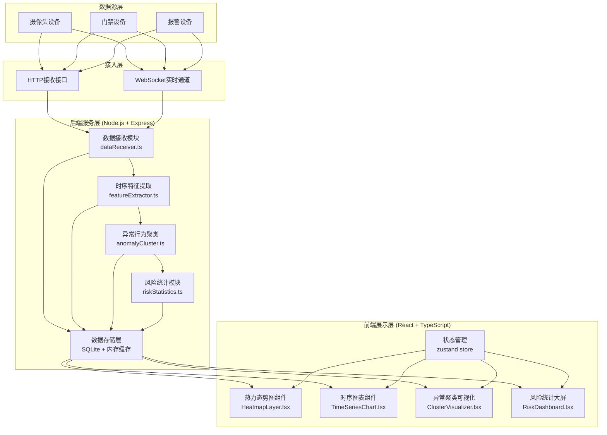
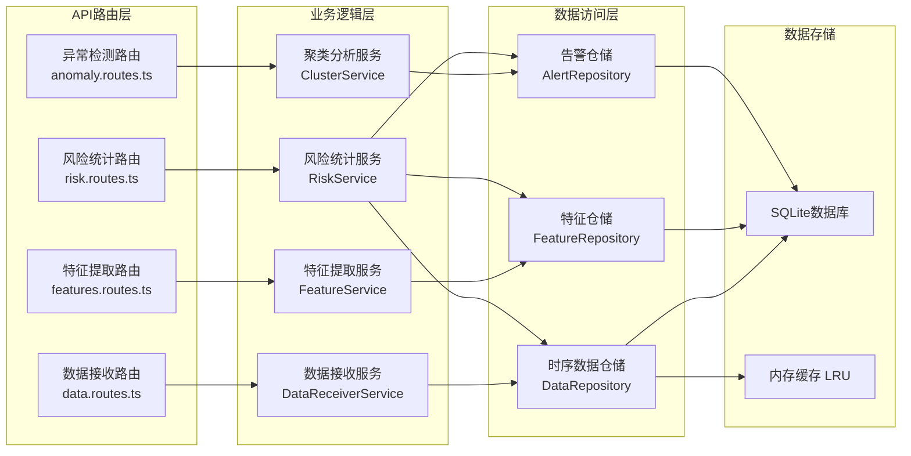
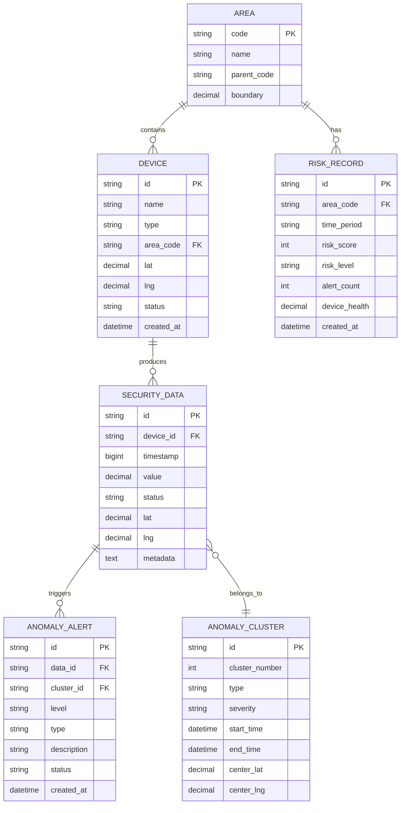

## 1. 架构设计



## 2. 技术描述

- **前端技术栈**：React@18 + TypeScript + Vite + TailwindCSS@3
- **状态管理**：Zustand，用于全局安防数据状态管理
- **图表库**：ECharts@5，用于时序图表、热力图、聚类散点图渲染
- **UI组件**：Lucide React 图标库，自定义大屏样式组件
- **后端技术栈**：Express@4 + TypeScript + Node.js
- **数据存储**：SQLite3 用于时序数据持久化，Node.js 内存缓存用于热点数据
- **实时通信**：WebSocket + SSE 实现数据实时推送
- **算法库**：ml-kmeans 聚类算法，自定义时序特征提取算法
- **项目模板**：react-express-ts（前后端一体化）

## 3. 路由定义

| 路由类型 | 路由路径 | 用途 |
|----------|----------|------|
| 前端路由 | / | 监控大屏主页 |
| 前端路由 | /timeseries | 时序分析页面 |
| 前端路由 | /anomaly | 异常检测页面 |
| 前端路由 | /risk | 风险统计页面 |
| API接口 | POST /api/data/receive | 接收安防设备时序数据 |
| API接口 | GET /api/data/realtime | 获取实时数据流 |
| API接口 | GET /api/data/history | 获取历史时序数据 |
| API接口 | GET /api/features/extract | 获取时序特征提取结果 |
| API接口 | GET /api/anomaly/clusters | 获取异常聚类分析结果 |
| API接口 | GET /api/anomaly/alerts | 获取告警事件列表 |
| API接口 | GET /api/risk/statistics | 获取风险统计数据 |
| API接口 | GET /api/risk/heatmap | 获取热力图数据 |
| API接口 | GET /api/devices/status | 获取设备状态列表 |
| WebSocket | /ws/realtime | 实时数据推送通道 |

## 4. API 接口定义

### 4.1 数据类型定义

```typescript
// 安防设备时序数据
interface SecurityData {
  id: string;
  deviceId: string;
  deviceType: 'camera' | 'access' | 'alarm';
  timestamp: number;
  location: {
    lat: number;
    lng: number;
    area: string;
  };
  value: number;
  status: 'normal' | 'warning' | 'danger';
  metadata?: Record<string, any>;
}

// 时序特征
interface TimeSeriesFeatures {
  deviceId: string;
  period: 'hour' | 'day' | 'week';
  mean: number;
  std: number;
  max: number;
  min: number;
  peakCount: number;
  volatility: number;
  trend: 'up' | 'down' | 'stable';
  features: number[];
}

// 异常聚类结果
interface AnomalyCluster {
  id: string;
  clusterId: number;
  dataPoints: SecurityData[];
  center: { lat: number; lng: number };
  anomalyType: 'intrusion' | 'gathering' | 'fault' | 'other';
  severity: 'low' | 'medium' | 'high';
  startTime: number;
  endTime: number;
}

// 风险统计
interface RiskStatistics {
  area: string;
  timeRange: string;
  riskScore: number;
  riskLevel: 'safe' | 'caution' | 'danger';
  alertCount: number;
  deviceHealth: number;
  trend: number[];
}

// 热力图数据点
interface HeatmapPoint {
  lat: number;
  lng: number;
  value: number;
  timestamp?: number;
}
```

### 4.2 接口请求响应

**POST /api/data/receive**
```typescript
// 请求
{
  deviceId: string;
  deviceType: 'camera' | 'access' | 'alarm';
  timestamp: number;
  location: { lat: number; lng: number; area: string };
  value: number;
  status: 'normal' | 'warning' | 'danger';
}

// 响应
{
  success: boolean;
  message: string;
  dataId: string;
}
```

**GET /api/risk/heatmap**
```typescript
// 请求参数
{
  timeRange: '1h' | '6h' | '24h' | '7d';
  area?: string;
  deviceType?: string;
}

// 响应
{
  points: HeatmapPoint[];
  maxValue: number;
  updateTime: number;
}
```

## 5. 服务器架构



## 6. 数据模型

### 6.1 ER图



### 6.2 DDL语句

```sql
-- 区域表
CREATE TABLE IF NOT EXISTS areas (
  code TEXT PRIMARY KEY,
  name TEXT NOT NULL,
  parent_code TEXT,
  boundary TEXT,
  FOREIGN KEY (parent_code) REFERENCES areas(code)
);

-- 设备表
CREATE TABLE IF NOT EXISTS devices (
  id TEXT PRIMARY KEY,
  name TEXT NOT NULL,
  type TEXT NOT NULL CHECK(type IN ('camera', 'access', 'alarm')),
  area_code TEXT NOT NULL,
  lat REAL NOT NULL,
  lng REAL NOT NULL,
  status TEXT NOT NULL DEFAULT 'online',
  created_at DATETIME DEFAULT CURRENT_TIMESTAMP,
  FOREIGN KEY (area_code) REFERENCES areas(code)
);

-- 时序数据表
CREATE TABLE IF NOT EXISTS security_data (
  id TEXT PRIMARY KEY,
  device_id TEXT NOT NULL,
  timestamp BIGINT NOT NULL,
  value REAL NOT NULL,
  status TEXT NOT NULL DEFAULT 'normal',
  lat REAL NOT NULL,
  lng REAL NOT NULL,
  metadata TEXT,
  FOREIGN KEY (device_id) REFERENCES devices(id)
);

CREATE INDEX IF NOT EXISTS idx_data_timestamp ON security_data(timestamp DESC);
CREATE INDEX IF NOT EXISTS idx_data_device ON security_data(device_id, timestamp DESC);

-- 异常聚类表
CREATE TABLE IF NOT EXISTS anomaly_clusters (
  id TEXT PRIMARY KEY,
  cluster_number INTEGER NOT NULL,
  type TEXT NOT NULL,
  severity TEXT NOT NULL,
  start_time BIGINT NOT NULL,
  end_time BIGINT NOT NULL,
  center_lat REAL NOT NULL,
  center_lng REAL NOT NULL
);

-- 异常告警表
CREATE TABLE IF NOT EXISTS anomaly_alerts (
  id TEXT PRIMARY KEY,
  data_id TEXT NOT NULL,
  cluster_id TEXT,
  level TEXT NOT NULL,
  type TEXT NOT NULL,
  description TEXT,
  status TEXT NOT NULL DEFAULT 'pending',
  created_at DATETIME DEFAULT CURRENT_TIMESTAMP,
  FOREIGN KEY (data_id) REFERENCES security_data(id),
  FOREIGN KEY (cluster_id) REFERENCES anomaly_clusters(id)
);

-- 风险记录表
CREATE TABLE IF NOT EXISTS risk_records (
  id TEXT PRIMARY KEY,
  area_code TEXT NOT NULL,
  time_period TEXT NOT NULL,
  risk_score INTEGER NOT NULL,
  risk_level TEXT NOT NULL,
  alert_count INTEGER NOT NULL DEFAULT 0,
  device_health REAL NOT NULL,
  created_at DATETIME DEFAULT CURRENT_TIMESTAMP,
  FOREIGN KEY (area_code) REFERENCES areas(code)
);

-- 初始化区域数据
INSERT OR IGNORE INTO areas (code, name, parent_code) VALUES 
('A01', '东城区', NULL),
('A02', '西城区', NULL),
('A03', '朝阳区', NULL),
('A04', '海淀区', NULL),
('A05', '丰台区', NULL);

-- 初始化设备数据
INSERT OR IGNORE INTO devices (id, name, type, area_code, lat, lng, status) VALUES 
('CAM001', '东大街摄像头', 'camera', 'A01', 39.92, 116.41, 'online'),
('CAM002', '西站北广场', 'camera', 'A02', 39.90, 116.32, 'online'),
('CAM003', '国贸商圈', 'camera', 'A03', 39.91, 116.46, 'online'),
('CAM004', '中关村路口', 'camera', 'A04', 39.98, 116.31, 'online'),
('CAM005', '南站出口', 'camera', 'A05', 39.87, 116.38, 'online'),
('ACC001', '市政府门禁', 'access', 'A01', 39.92, 116.40, 'online'),
('ACC002', '金融街入口', 'access', 'A02', 39.91, 116.35, 'online'),
('ACC003', '科技园门禁', 'access', 'A04', 39.97, 116.33, 'online'),
('ALM001', '东单报警器', 'alarm', 'A01', 39.91, 116.42, 'online'),
('ALM002', '西单报警器', 'alarm', 'A02', 39.91, 116.37, 'online'),
('ALM003', 'CBD报警器', 'alarm', 'A03', 39.92, 116.45, 'online'),
('ALM004', '五道口报警器', 'alarm', 'A04', 39.99, 116.34, 'online');
```
