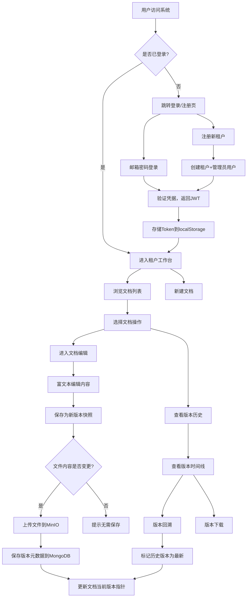

## 1. 产品概述

跨租户文档版本协同管控应用，面向企业多租户场景，提供文档在线编辑、多版本快照保存、历史版本回溯等核心能力。通过租户隔离机制确保数据安全，MinIO 存储文档实体文件，MongoDB 存储版本元数据，实现前后端、服务端与对象存储跨系统联调。
- 解决多租户环境下文档版本管理混乱、协作冲突、历史追溯困难的问题
- 目标用户：企业团队、项目组、知识管理场景中的文档协作参与者

## 2. 核心功能

### 2.1 用户角色

| 角色 | 注册方式 | 核心权限 |
|------|----------|----------|
| 租户管理员 | 注册时自动创建 | 管理租户内文档、用户，全量文档操作权限 |
| 普通用户 | 管理员邀请（二期） | 浏览和编辑所属租户的文档 |

### 2.2 功能模块

1. **登录/注册页面**：租户注册、邮箱登录、JWT 鉴权
2. **租户工作台**：文档列表、搜索过滤、新建文档、快捷操作
3. **文档编辑页**：富文本在线编辑、自动保存、手动保存版本快照
4. **版本历史页**：版本列表时间线、版本对比、版本回溯、版本下载

### 2.3 页面详情

| 页面名称 | 模块名称 | 功能描述 |
|----------|----------|----------|
| 登录/注册页 | 注册表单 | 填写租户ID、租户名称、用户名、邮箱、密码完成注册 |
| 登录/注册页 | 登录表单 | 邮箱+密码登录，获取JWT令牌，存储到本地 |
| 租户工作台 | 顶部导航栏 | 显示当前租户信息、用户头像、退出登录 |
| 租户工作台 | 文档列表 | 展示当前租户所有文档，支持搜索和筛选 |
| 租户工作台 | 新建文档 | 弹窗输入文档名称和描述，创建新文档 |
| 租户工作台 | 文档操作 | 重命名、删除文档，进入编辑或版本历史 |
| 文档编辑页 | 富文本编辑器 | 基于 Quill 的富文本编辑，支持格式化、插入图片等 |
| 文档编辑页 | 保存操作 | 保存当前内容为新版本快照，填写变更说明 |
| 文档编辑页 | 版本信息栏 | 显示当前版本号、最新版本号、创建时间 |
| 版本历史页 | 版本时间线 | 按时间倒序展示所有版本，标识最新版本 |
| 版本历史页 | 版本详情 | 查看版本元数据：版本号、文件名、大小、变更说明、创建者 |
| 版本历史页 | 版本回溯 | 选择历史版本回溯为当前版本 |
| 版本历史页 | 版本下载 | 下载指定版本的文件 |

## 3. 核心流程

**用户注册与登录流程**：用户填写租户信息注册 → 系统创建租户和管理员用户 → 返回JWT令牌 → 用户登录获取令牌 → 令牌存储到 localStorage → 后续请求携带令牌和租户标识。

**文档版本管理流程**：用户创建文档 → 在编辑器中编辑内容 → 保存为新版本快照 → 系统计算文件哈希判断是否变更 → 上传文件到 MinIO → 保存版本元数据到 MongoDB → 更新文档当前版本指针。版本回溯时选择历史版本 → 系统将历史版本标记为最新 → 更新文档指针。

## 4. 用户界面设计

### 4.1 设计风格

- 主色：深靛蓝 #1e3a5f（沉稳专业），辅色：天青蓝 #4da6ff（活力科技）
- 强调色：琥珀橙 #f59e0b（操作引导）
- 背景色：#f8fafc 浅灰底，卡片白色 #ffffff，深色侧边栏 #0f172a
- 按钮风格：圆角微弧（border-radius: 8px），主按钮填充色，次按钮描边
- 字体：思源黑体 Noto Sans SC 为主，代码/数据用 JetBrains Mono
- 布局风格：左侧固定导航 + 右侧内容区，卡片式文档列表，顶部工具栏
- 图标风格：线性图标（Lucide Icons），2px 描边，24px 尺寸

### 4.2 页面设计概览

| 页面名称 | 模块名称 | UI元素 |
|----------|----------|--------|
| 登录/注册页 | 注册/登录表单 | 居中卡片，左侧品牌插画，右侧表单，标签页切换登录/注册，输入框带图标前缀 |
| 租户工作台 | 顶部导航栏 | 深色背景，左侧Logo+系统名，右侧用户头像+下拉菜单 |
| 租户工作台 | 侧边导航 | 深色窄侧栏，图标+文字，高亮当前页 |
| 租户工作台 | 文档列表 | 搜索栏+筛选器，卡片网格布局，卡片显示文档名/版本号/更新时间/操作按钮 |
| 租户工作台 | 新建文档弹窗 | Modal对话框，输入文档名称和描述，确认/取消按钮 |
| 文档编辑页 | 编辑工具栏 | 顶部Quill工具栏，格式化按钮组 |
| 文档编辑页 | 编辑区 | 居中宽幅白色编辑区，柔和阴影，底部版本信息栏 |
| 文档编辑页 | 保存版本弹窗 | 右侧滑出面板，填写变更说明，确认保存 |
| 版本历史页 | 版本时间线 | 左侧垂直时间线，节点显示版本号和时间，右侧版本详情卡片 |
| 版本历史页 | 操作按钮 | 回溯按钮（主要）、下载按钮（次要），hover微动效 |

### 4.3 响应式设计

- 桌面优先设计，最小宽度 1024px
- 1280px 以上：完整侧边栏 + 宽内容区
- 1024px-1280px：收缩侧边栏为图标模式
- 移动端暂不支持，提示使用桌面端

### 4.4 3D 场景指引

不适用
