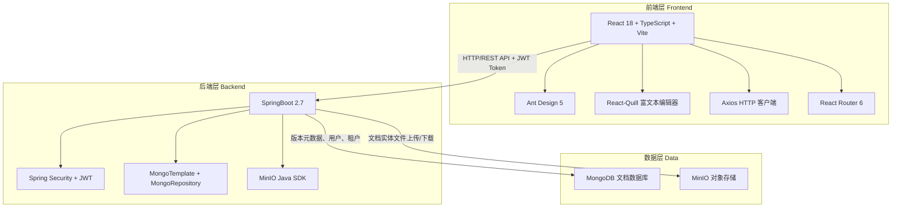
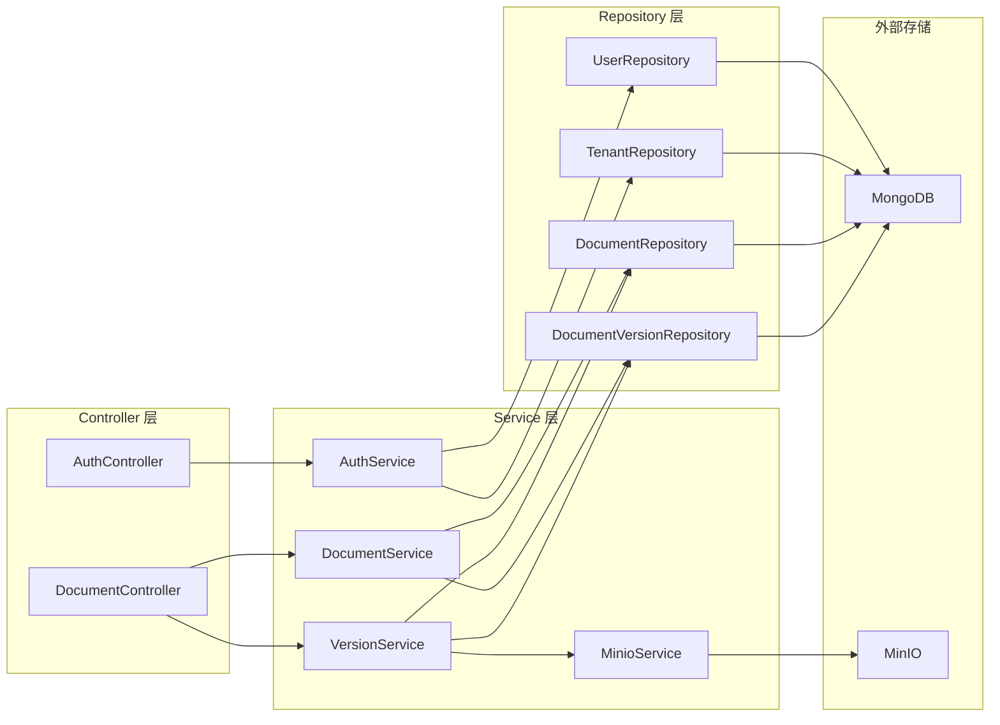

## 1. 架构设计



## 2. 技术说明

- 前端：React@18 + TypeScript + Vite@5 + Ant Design@5 + React-Quill + Axios
- 后端：SpringBoot@2.7 + Spring Security + Spring Data MongoDB + MinIO SDK@8.5
- 数据库：MongoDB（版本元数据、用户、租户、文档索引）
- 对象存储：MinIO（文档实体文件，按租户ID隔离目录）
- 认证：JWT（HS256签名），Token携带userId和tenantId
- 基础设施：Docker Compose 编排 MinIO + MongoDB + Mongo Express

## 3. 路由定义

| 路由 | 用途 |
|------|------|
| /login | 登录/注册页面 |
| /workspace | 租户工作台，文档列表 |
| /documents/:id/edit | 文档在线编辑 |
| /documents/:id/versions | 文档版本历史 |

## 4. API 定义

### 4.1 认证 API

```typescript
interface RegisterRequest {
  tenantId: string
  tenantName: string
  username: string
  email: string
  password: string
}

interface LoginRequest {
  email: string
  password: string
}

interface TokenResponse {
  token: string
  tokenType: string
  expiresIn: number
  user: UserDTO
}

interface UserDTO {
  id: string
  tenantId: string
  username: string
  email: string
  role: string
  status: number
  createdAt: string
  updatedAt: string
}

// POST /api/auth/register  -> TokenResponse
// POST /api/auth/login     -> TokenResponse
// GET  /api/auth/current   -> UserDTO
// GET  /api/auth/logout    -> { message: string }
```

### 4.2 文档 API

```typescript
interface DocumentCreateDTO {
  name: string
  description?: string
  fileName?: string
  mimeType?: string
}

interface DocumentDTO {
  id: string
  tenantId: string
  name: string
  description?: string
  currentVersionId?: string
  currentVersionNumber?: number
  createdBy: string
  createdAt: string
  updatedAt: string
}

// POST   /api/documents                    -> DocumentDTO（需要 X-Tenant-Id, X-User-Id Header）
// GET    /api/documents                    -> DocumentDTO[]
// GET    /api/documents/:documentId        -> DocumentDTO
// PUT    /api/documents/:documentId        -> DocumentDTO（params: name, description）
// DELETE /api/documents/:documentId        -> void
```

### 4.3 版本 API

```typescript
interface DocumentVersionDTO {
  id: string
  documentId: string
  tenantId: string
  versionNumber: number
  fileName: string
  filePath: string
  fileSize: number
  mimeType: string
  snapshotHash: string
  changeLog?: string
  createdBy: string
  createdAt: string
  isLatest: boolean
}

// POST   /api/documents/:documentId/versions           -> DocumentVersionDTO（multipart: file, changeLog）
// GET    /api/documents/:documentId/versions           -> DocumentVersionDTO[]
// GET    /api/documents/:documentId/versions/latest    -> DocumentVersionDTO
// GET    /api/documents/:documentId/versions/:versionNumber -> DocumentVersionDTO
// DELETE /api/documents/versions/:versionId            -> void
```

### 4.4 文件下载 API（需新增）

```typescript
// GET /api/documents/:documentId/versions/:versionNumber/download -> 文件流（binary）
```

## 5. 服务端架构图



## 6. 数据模型

### 6.1 数据模型定义

```mermaid
erDiagram
    Tenant {
        String id PK
        String tenantId UK
        String tenantName
        String email UK
        String password
        Integer status
        DateTime createdAt
        DateTime updatedAt
    }

    User {
        String id PK
        String tenantId IDX
        String username
        String email UK
        String password
        String role
        Integer status
        DateTime createdAt
        DateTime updatedAt
    }

    Document {
        String id PK
        String tenantId
        String name
        String description
        String currentVersionId
        String createdBy
        DateTime createdAt
        DateTime updatedAt
    }

    DocumentVersion {
        String id PK
        String documentId
        String tenantId IDX
        Integer versionNumber
        String fileName
        String filePath
        Long fileSize
        String mimeType
        String snapshotHash
        String changeLog
        String createdBy
        DateTime createdAt
        Boolean isLatest
    }

    Tenant ||--o{ User : "拥有多个用户"
    Tenant ||--o{ Document : "拥有多个文档"
    Document ||--o{ DocumentVersion : "拥有多个版本"
```

### 6.2 数据定义语言

```javascript
// MongoDB Collections - 索引定义

// tenants 集合
db.tenants.createIndex({ "tenantId": 1 }, { unique: true })
db.tenants.createIndex({ "email": 1 }, { unique: true })

// users 集合
db.users.createIndex({ "tenantId": 1, "username": 1 }, { unique: true })
db.users.createIndex({ "email": 1 }, { unique: true })
db.users.createIndex({ "tenantId": 1 })

// documents 集合
db.documents.createIndex({ "tenantId": 1, "name": 1 }, { unique: true })
db.documents.createIndex({ "tenantId": 1 })

// document_versions 集合
db.document_versions.createIndex({ "documentId": 1, "versionNumber": 1 }, { unique: true })
db.document_versions.createIndex({ "tenantId": 1 })
db.document_versions.createIndex({ "documentId": 1, "tenantId": 1, "isLatest": 1 })
```

## 7. 前端目录结构

```
document-collab-frontend/src/
├── api/
│   ├── request.ts          # Axios 封装
│   ├── auth.ts             # 认证 API
│   ├── document.ts         # 文档 API
│   └── version.ts          # 版本 API
├── components/
│   ├── Layout/
│   │   ├── AppLayout.tsx   # 主布局（侧边栏+顶栏+内容）
│   │   ├── Sidebar.tsx     # 侧边导航
│   │   └── Header.tsx      # 顶部导航
│   ├── DocumentCard.tsx    # 文档卡片
│   └── VersionTimeline.tsx # 版本时间线
├── pages/
│   ├── Login/
│   │   └── index.tsx       # 登录/注册页
│   ├── Workspace/
│   │   └── index.tsx       # 租户工作台
│   ├── DocumentEdit/
│   │   └── index.tsx       # 文档编辑页
│   └── VersionHistory/
│       └── index.tsx       # 版本历史页
├── store/
│   └── useAuthStore.ts     # Zustand 认证状态
├── App.tsx
└── main.tsx
```
