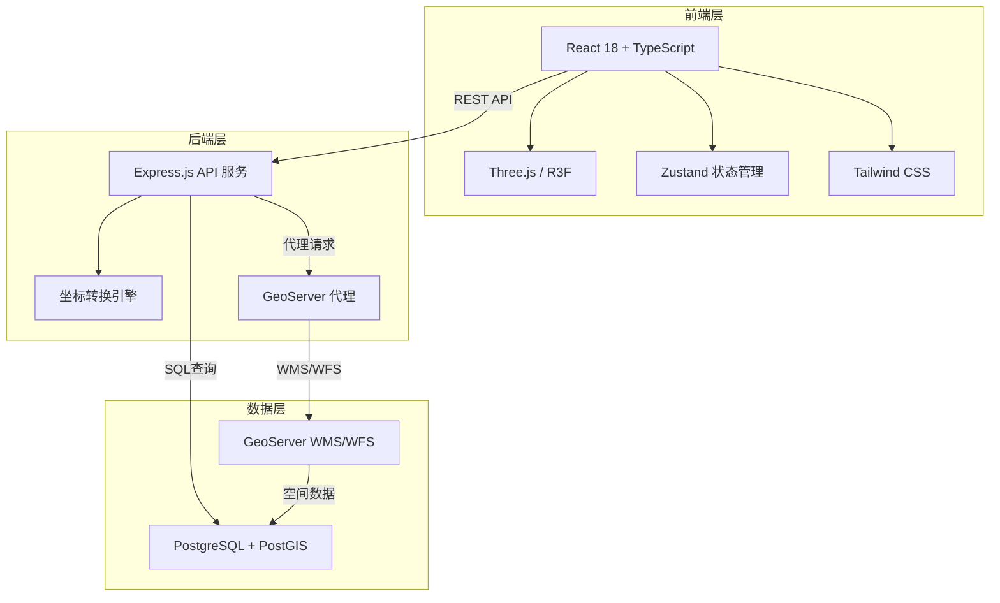
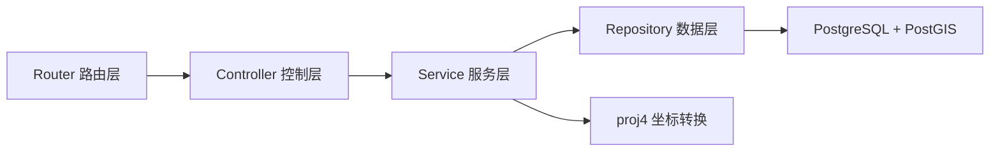
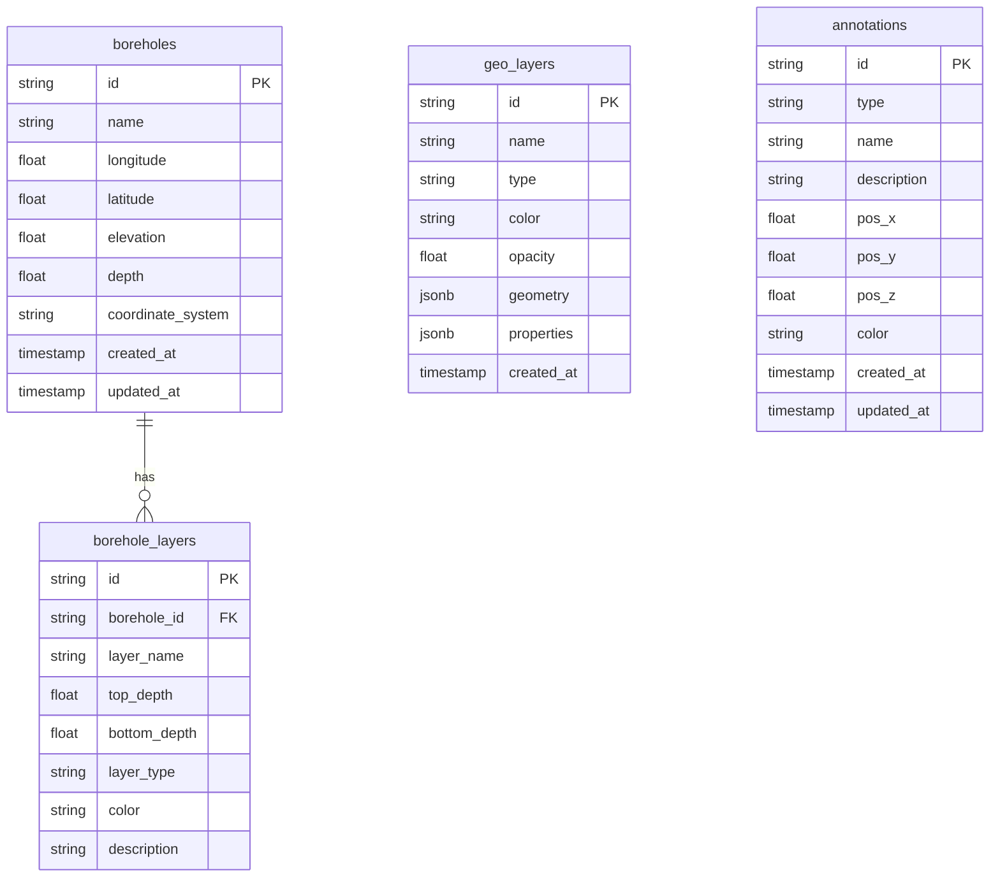

## 1. 架构设计



## 2. 技术说明

- 前端：React@18 + Three.js (via @react-three/fiber + @react-three/drei) + Tailwind CSS@3 + Zustand + Vite
- 初始化工具：vite-init（react-express-ts 模板）
- 后端：Express@4 + TypeScript (ESM)
- 数据库：PostgreSQL + PostGIS 扩展（开发阶段使用 mock 数据模拟）
- 地图服务：GeoServer（WMS/WFS 发布矢量数据，开发阶段使用本地 GeoJSON 模拟）

### 核心依赖

| 类别 | 依赖 | 用途 |
|------|------|------|
| 3D渲染 | three, @react-three/fiber, @react-three/drei, @react-three/postprocessing | 3D地形建模与渲染 |
| 地理数据 | proj4, @turf/turf | 坐标转换与地理计算 |
| 后端 | express, cors, pg | API服务与数据库连接 |
| UI组件 | lucide-react, tailwindcss | 图标与样式 |

## 3. 路由定义

| 路由 | 用途 |
|------|------|
| / | 主页面 - 3D地形建模交互场景 |
| /data | 数据管理页 - 勘探数据列表与管理 |

## 4. API 定义

### 4.1 勘探点位数据 API

```typescript
interface Borehole {
  id: string;
  name: string;
  longitude: number;
  latitude: number;
  elevation: number;
  depth: number;
  coordinateSystem: string;
  layers: BoreholeLayer[];
}

interface BoreholeLayer {
  id: string;
  boreholeId: string;
  layerName: string;
  topDepth: number;
  bottomDepth: number;
  layerType: string;
  color: string;
  description: string;
}

// GET /api/boreholes - 获取勘探点位列表
// Query: { page, pageSize, keyword?, coordinateSystem? }
// Response: { data: Borehole[], total: number, page: number, pageSize: number }

// GET /api/boreholes/:id - 获取勘探点位详情
// Response: Borehole

// POST /api/boreholes - 创建勘探点位
// Body: Omit<Borehole, 'id'>

// POST /api/boreholes/import - 批量导入勘探数据
// Body: FormData (CSV/GeoJSON file)
// Response: { success: number, failed: number, errors: string[] }
```

### 4.2 地层矢量数据 API

```typescript
interface GeoLayer {
  id: string;
  name: string;
  type: string;
  color: string;
  opacity: number;
  geometry: GeoJSON.Geometry;
  properties: Record<string, unknown>;
}

// GET /api/layers - 获取地层列表
// Response: GeoLayer[]

// GET /api/layers/:id - 获取地层详情（含几何数据）
// Response: GeoLayer
```

### 4.3 坐标转换 API

```typescript
interface CoordinateTransformRequest {
  coordinates: number[][];  // [longitude, latitude, elevation?]
  fromSystem: string;       // WGS84 | GCJ02 | BD09 | XIAN80 | BJ54
  toSystem: string;
}

interface CoordinateTransformResponse {
  coordinates: number[][];
  fromSystem: string;
  toSystem: string;
}

// POST /api/coordinate/transform - 坐标转换
// Body: CoordinateTransformRequest
// Response: CoordinateTransformResponse

// GET /api/coordinate/systems - 获取支持的坐标系列表
// Response: { id: string, name: string, description: string }[]
```

### 4.4 标注数据 API

```typescript
interface Annotation {
  id: string;
  type: 'pin' | 'label' | 'area';
  name: string;
  description: string;
  position: [number, number, number];
  color: string;
  createdAt: string;
}

// GET /api/annotations - 获取标注列表
// POST /api/annotations - 创建标注
// PUT /api/annotations/:id - 更新标注
// DELETE /api/annotations/:id - 删除标注
```

### 4.5 DEM 高程数据 API

```typescript
// GET /api/terrain/dem - 获取DEM高程数据
// Query: { bounds: string } // "minLon,minLat,maxLon,maxLat"
// Response: { width: number, height: number, elevations: number[] }

// GET /api/terrain/texture - 获取地形纹理
// Query: { bounds: string }
// Response: Image (PNG)
```

## 5. 服务端架构图



## 6. 数据模型

### 6.1 数据模型定义



### 6.2 数据定义语言

```sql
CREATE EXTENSION IF NOT EXISTS postgis;

CREATE TABLE boreholes (
    id UUID PRIMARY KEY DEFAULT gen_random_uuid(),
    name VARCHAR(255) NOT NULL,
    longitude DOUBLE PRECISION NOT NULL,
    latitude DOUBLE PRECISION NOT NULL,
    elevation DOUBLE PRECISION NOT NULL,
    depth DOUBLE PRECISION NOT NULL,
    coordinate_system VARCHAR(50) NOT NULL DEFAULT 'WGS84',
    geom GEOMETRY(Point, 4326),
    created_at TIMESTAMP DEFAULT CURRENT_TIMESTAMP,
    updated_at TIMESTAMP DEFAULT CURRENT_TIMESTAMP
);

CREATE INDEX idx_boreholes_geom ON boreholes USING GIST(geom);
CREATE INDEX idx_boreholes_name ON boreholes(name);

CREATE TABLE borehole_layers (
    id UUID PRIMARY KEY DEFAULT gen_random_uuid(),
    borehole_id UUID NOT NULL REFERENCES boreholes(id) ON DELETE CASCADE,
    layer_name VARCHAR(255) NOT NULL,
    top_depth DOUBLE PRECISION NOT NULL,
    bottom_depth DOUBLE PRECISION NOT NULL,
    layer_type VARCHAR(100) NOT NULL,
    color VARCHAR(7) NOT NULL DEFAULT '#888888',
    description TEXT,
    created_at TIMESTAMP DEFAULT CURRENT_TIMESTAMP
);

CREATE INDEX idx_borehole_layers_borehole ON borehole_layers(borehole_id);

CREATE TABLE geo_layers (
    id UUID PRIMARY KEY DEFAULT gen_random_uuid(),
    name VARCHAR(255) NOT NULL,
    type VARCHAR(50) NOT NULL,
    color VARCHAR(7) NOT NULL DEFAULT '#4299e1',
    opacity DOUBLE PRECISION NOT NULL DEFAULT 1.0,
    geometry JSONB,
    properties JSONB,
    created_at TIMESTAMP DEFAULT CURRENT_TIMESTAMP
);

CREATE TABLE annotations (
    id UUID PRIMARY KEY DEFAULT gen_random_uuid(),
    type VARCHAR(20) NOT NULL CHECK (type IN ('pin', 'label', 'area')),
    name VARCHAR(255) NOT NULL,
    description TEXT,
    pos_x DOUBLE PRECISION NOT NULL,
    pos_y DOUBLE PRECISION NOT NULL,
    pos_z DOUBLE PRECISION NOT NULL,
    color VARCHAR(7) NOT NULL DEFAULT '#e87c3e',
    created_at TIMESTAMP DEFAULT CURRENT_TIMESTAMP,
    updated_at TIMESTAMP DEFAULT CURRENT_TIMESTAMP
);

-- 初始示例数据
INSERT INTO boreholes (id, name, longitude, latitude, elevation, depth, coordinate_system, geom) VALUES
('a0000001-0000-0000-0000-000000000001', 'ZK-001', 116.3912, 39.9075, 52.3, 150.0, 'WGS84', ST_SetSRID(ST_MakePoint(116.3912, 39.9075), 4326)),
('a0000001-0000-0000-0000-000000000002', 'ZK-002', 116.4012, 39.9175, 48.7, 200.0, 'WGS84', ST_SetSRID(ST_MakePoint(116.4012, 39.9175), 4326)),
('a0000001-0000-0000-0000-000000000003', 'ZK-003', 116.3812, 39.8975, 55.1, 180.0, 'WGS84', ST_SetSRID(ST_MakePoint(116.3812, 39.8975), 4326)),
('a0000001-0000-0000-0000-000000000004', 'ZK-004', 116.4112, 39.9275, 45.9, 220.0, 'WGS84', ST_SetSRID(ST_MakePoint(116.4112, 39.9275), 4326)),
('a0000001-0000-0000-0000-000000000005', 'ZK-005', 116.3712, 39.8875, 51.6, 170.0, 'WGS84', ST_SetSRID(ST_MakePoint(116.3712, 39.8875), 4326));

INSERT INTO borehole_layers (borehole_id, layer_name, top_depth, bottom_depth, layer_type, color, description) VALUES
('a0000001-0000-0000-0000-000000000001', '表土层', 0, 5, 'soil', '#8B7355', '第四系表土'),
('a0000001-0000-0000-0000-000000000001', '砂层', 5, 25, 'sand', '#F4D03F', '细砂夹中砂'),
('a0000001-0000-0000-0000-000000000001', '泥岩', 25, 60, 'mudstone', '#7B7D7D', '紫红色泥岩'),
('a0000001-0000-0000-0000-000000000001', '砂岩', 60, 120, 'sandstone', '#D4AC0D', '灰色中砂岩'),
('a0000001-0000-0000-0000-000000000001', '石灰岩', 120, 150, 'limestone', '#AEB6BF', '深灰色石灰岩'),
('a0000001-0000-0000-0000-000000000002', '表土层', 0, 8, 'soil', '#8B7355', '含砾表土'),
('a0000001-0000-0000-0000-000000000002', '黏土层', 8, 30, 'clay', '#E59866', '可塑黏土'),
('a0000001-0000-0000-0000-000000000002', '页岩', 30, 90, 'shale', '#616A6B', '黑色页岩'),
('a0000001-0000-0000-0000-000000000002', '石灰岩', 90, 200, 'limestone', '#AEB6BF', '厚层石灰岩'),
('a0000001-0000-0000-0000-000000000003', '表土层', 0, 3, 'soil', '#8B7355', '薄层表土'),
('a0000001-0000-0000-0000-000000000003', '砂层', 3, 20, 'sand', '#F4D03F', '粗砂层'),
('a0000001-0000-0000-0000-000000000003', '花岗岩', 20, 180, 'granite', '#D5D8DC', '微风化花岗岩'),
('a0000001-0000-0000-0000-000000000004', '表土层', 0, 6, 'soil', '#8B7355', '含有机质表土'),
('a0000001-0000-0000-0000-000000000004', '砂砾层', 6, 35, 'gravel', '#DC7633', '砂砾石层'),
('a0000001-0000-0000-0000-000000000004', '泥岩', 35, 80, 'mudstone', '#7B7D7D', '灰色泥岩'),
('a0000001-0000-0000-0000-000000000004', '煤层', 80, 95, 'coal', '#2C3E50', '无烟煤'),
('a0000001-0000-0000-0000-000000000004', '砂岩', 95, 220, 'sandstone', '#D4AC0D', '石英砂岩'),
('a0000001-0000-0000-0000-000000000005', '表土层', 0, 4, 'soil', '#8B7355', '黄土状表土'),
('a0000001-0000-0000-0000-000000000005', '黏土层', 4, 22, 'clay', '#E59866', '硬塑黏土'),
('a0000001-0000-0000-0000-000000000005', '砂岩', 22, 70, 'sandstone', '#D4AC0D', '粉砂岩'),
('a0000001-0000-0000-0000-000000000005', '石灰岩', 70, 170, 'limestone', '#AEB6BF', '鲕粒灰岩');
```
